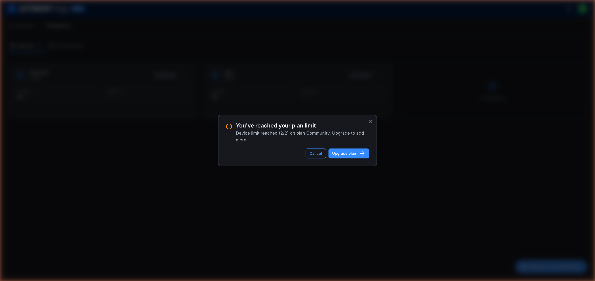

# Plan limits

Each plan caps how much of certain resources you can use. When you hit a cap, the platform shows a modal explaining the limit and offers an **Upgrade plan** button.

## The limits

| Resource | Community | Education | Pro | Teams | Enterprise |
|---|---|---|---|---|---|
| **Orchestrators** | 1 | 1 | 20 | 5 / seat | Unlimited |
| **vPLC devices** (across all orchestrators) | 2 | 10 / seat | 100 | 20 / seat | Unlimited |
| **Private projects** | 0 | ✓ | ✓ | ✓ | ✓ |
| **Members per org** | 1 (only you) | per Education agreement | n/a (personal) | per seats purchased | per contract |
| **ACUs (AI Engineer) / month** | 0 | 1,125 | 6,125 | 12,375 / seat | Custom |

"Unlimited" means there's no hard cap; usage is governed by your contract.

## How limits apply per workspace

Limits are scoped to the **workspace** (slug):

- Your **personal slug** has its own limits, governed by your personal plan.
- Each **organization slug** has its own limits, governed by that organization's plan.

So a Pro user (personal) who belongs to a Teams organization has Pro limits in their own slug *and* Teams limits in the org slug. The two pools are independent.

## What happens when you hit a limit

The platform blocks the creation that would exceed the limit, and shows a modal:

> **You've reached your plan limit.** {Resource} limit reached ({used} / {total}) on plan {Plan}. Upgrade to add more.

Buttons: **Cancel** (dismisses) and **Upgrade plan** (jumps to the pricing page).

Examples:

- Trying to create a 2nd orchestrator on Community → orchestrator limit modal.
- Trying to create a 3rd vPLC on Community → device limit modal.
- Trying to make a project private on Community → private-projects limit message during the New Project wizard.

## Grandfathering

If your plan **decreases** (downgrade, trial ends, subscription cancellation), the platform doesn't delete your over-quota items. Instead it:

- Lets them keep working.
- Blocks you from creating *new* items over the limit until you're back under.

Example: you were on Pro with 5 private projects. You downgrade to Community (0 private projects). The 5 stay private and you can keep using them. You just can't create a 6th private project until you upgrade again.

You can confirm your current state in **[Settings → Usage](../account/settings/usage)**.

## When the limit count looks wrong

If the usage page shows a number that doesn't match what you see:

- Click the small refresh icon at the top right of the Usage card to force a recount.
- Verify you're looking at the right workspace — limits are workspace-scoped.
- Recently deleted items may take a few seconds to drop from the count.

If it still looks wrong, contact support via the **Feedback** action in the user menu.

## Where to next

- **Upgrade to lift a limit** → **[Upgrading and downgrading](upgrading-and-downgrading)**.
- **Current quotas** → **[Settings → Usage](../account/settings/usage)**.
- **AI credit semantics** → **[AI Credit Units](ai-credit-units)**.
