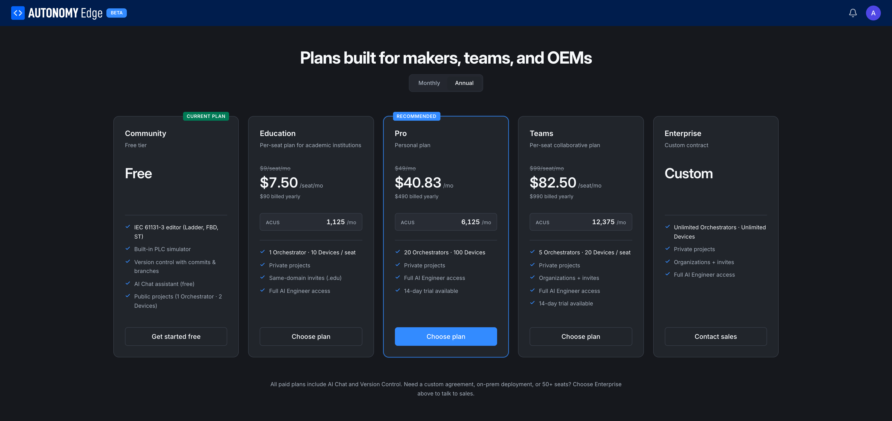
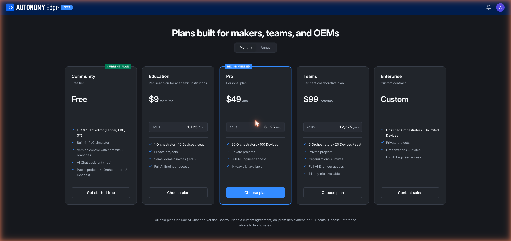

# Pricing

Autonomy Edge has five plans: **Community**, **Education**, **Pro**, **Teams**, and **Enterprise**. The public [Pricing page](https://edge.autonomylogic.com/pricing) includes a Monthly / Annual toggle.

## The plans at a glance

Prices below are the **annual** rates (the lower per-month figure). Monthly billing is roughly 20% higher.

| Plan | Price (annual) | ACUs/mo | Orchestrators | Devices | Private projects | AI Engineer | Trial | Best for |
|---|---|---|---|---|---|---|---|---|
| **Community** | Free | – | 1 | 2 | 0 | – | – | Trying things out, hobby, public sharing |
| **Education** | $7.50/seat/mo | 1,125 | 1 | 10 / seat | ✓ | ✓ | – | Classrooms, training centers (.edu) |
| **Pro** *(recommended)* | $40.83/mo | 6,125 | 20 | 100 | ✓ | ✓ | 14 days | Individuals running real production setups |
| **Teams** | $82.50/seat/mo | 12,375 | 5 / seat | 20 / seat | ✓ | ✓ | 14 days | Multi-person teams, OEMs, integrators |
| **Enterprise** | Custom | Custom | Unlimited | Unlimited | ✓ | ✓ | – | Large orgs, special agreements, on-prem |

## What each plan includes

### Community (free)

- IEC 61131-3 editor with Ladder, FBD, and Structured Text.
- Built-in PLC simulator for testing without hardware.
- Version control with commits, branches, history.
- **AI Chat assistant** (the in-page chat panel: different from AI Engineer).
- **Public projects only.** No private projects.
- 1 Orchestrator, 2 Devices.

Everyone starts here. Stay here as long as the limits work for you.

### Education

For schools and training centers. Same features as Pro for individual seats, plus:

- **Same-domain invites (.edu)**: invite members within your educational domain.
- Designed for classrooms; the per-seat pricing scales with how many students you bring on.
- 1 Orchestrator, 10 Devices per seat.

Verification of educational use may be required.

### Pro (recommended)

A personal plan for solo professionals who need more than the Community limits:

- **Private projects.**
- **Full AI Engineer access**: the ACU-driven automation features.
- 20 Orchestrators, 100 Devices.
- 6,125 ACUs/month.
- 14-day trial.

This is the recommended plan for one-person shops, freelance integrators, and serious hobbyists.

### Teams

A collaborative plan for organizations. Note that this is what unlocks **organization member management**:

- Everything in Pro.
- **Organizations + invitations** (members, invite links, teams).
- 5 Orchestrators per seat, 20 Devices per seat.
- 12,375 ACUs/month per seat.
- 14-day trial.

Seat-priced, like SaaS. Add seats as your team grows.

### Enterprise

For large organizations, OEMs with custom agreements, on-prem deployments:

- **Unlimited orchestrators and devices.**
- Custom contract terms.
- Same organization features as Teams, expanded.
- Full AI Engineer access.
- "Contact sales": no self-serve checkout.

Reach out to sales for pricing.

## Picking a plan

Decision tree:

- **Just exploring or running one device at home** → Community.
- **Need private projects or more than 2 vPLCs as one person** → Pro.
- **Classroom or training program** → Education.
- **2+ people who need shared workspaces and member management** → Teams.
- **Large fleet, special contract needs, on-prem** → Enterprise.

## How billing works

- **Monthly** vs **Annual**: annual cycles are ~20% cheaper. Pick what works for your finance flow.
- **Per-seat plans** (Education, Teams) bill based on the number of members in your organization. Add seats as you invite people; the platform pro-rates the charge.
- **Personal vs organization plans are separate.** Your Pro plan doesn't extend to an org you belong to.

## Footer

A note under the plan cards:

> *All paid plans include AI Chat and Version Control. Need a custom agreement, on-prem deployment, or 50+ seats? Choose Enterprise above to talk to sales.*

## Where to next

- **What each plan limits in practice** → **[Plan limits](plan-limits)**.
- **AI credits in depth** → **[AI Credit Units](ai-credit-units)**.
- **Upgrade/downgrade/cancel** → **[Upgrading and downgrading](upgrading-and-downgrading)**.
- **Apply a plan to an org** → **[Org billing](../platform/organizations/billing)**.
