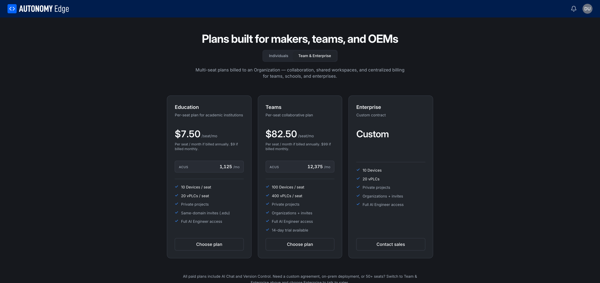
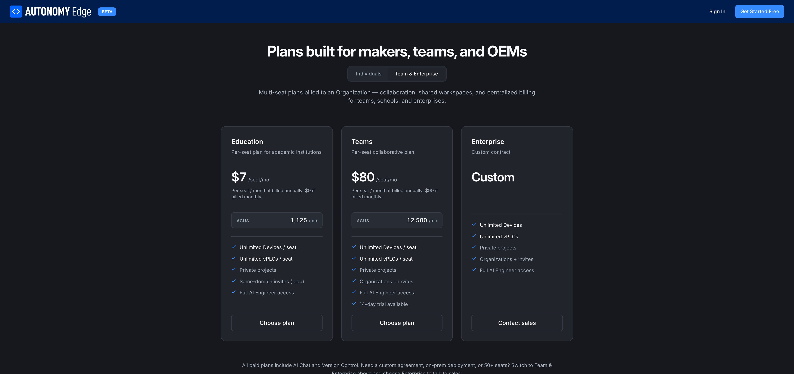

# Pricing

Autonomy Edge has six plans in two groups. The public [Pricing page](https://edge.autonomylogic.com/pricing) switches between them with two tabs:

- **Individuals**: personal plans billed to a single account: **Community**, **Starter** and **Pro**.
- **Team & Enterprise**: multi-seat plans billed to an organization: **Education**, **Teams** and **Enterprise**.

## The plans at a glance

Each card shows the per-month price when billed **annually**, with the monthly-billing price in the line below it.

| Plan | Group | Annual (per month) | Monthly | ACUs/mo | Devices | vPLCs | Private projects | AI Engineer | Trial |
|---|---|---|---|---|---|---|---|---|---|
| **Community** | Individuals | Free | Free | 600 | 1 | 2 | – | – | – |
| **Starter** | Individuals | $15/mo | $20/mo | 2,500 | 4 | 20 | ✓ | – | – |
| **Pro** *(recommended)* | Individuals | $40/mo | $49/mo | 6,000 | 50 | 250 | ✓ | ✓ | 14 days |
| **Education** | Team & Enterprise | $7/seat/mo | $9/seat/mo | 1,125 | Unlimited / seat | Unlimited / seat | ✓ | ✓ | – |
| **Teams** | Team & Enterprise | $80/seat/mo | $99/seat/mo | 12,500 | Unlimited / seat | Unlimited / seat | ✓ | ✓ | 14 days |
| **Enterprise** | Team & Enterprise | Custom | Custom | Custom | Unlimited | Unlimited | ✓ | ✓ | – |

## What each plan includes

### Community (free)

- IEC 61131-3 editor with Ladder, FBD, and Structured Text.
- Built-in PLC simulator for testing without hardware.
- Version control with commits, branches, history.
- **AI Chat assistant** (the in-page chat panel: different from AI Engineer).
- **Public projects only.** No private projects.
- 1 Device, 2 vPLCs.
- 600 ACUs.

Everyone starts here. Stay here as long as the limits work for you.

### Starter

A personal plan for makers who have outgrown Community but do not need the AI Engineer:

- **Private projects.**
- AI Chat assistant.
- 4 Devices, 20 vPLCs.
- 2,500 ACUs/month.

### Education

For schools and training centers, billed per seat to an organization:

- **Same-domain invites (.edu)**: invite members within your educational domain.
- **Full AI Engineer access.**
- Designed for classrooms; the per-seat pricing scales with how many students you bring on.
- Unlimited Devices and vPLCs per seat.
- 1,125 ACUs/month.

Verification of educational use may be required.

### Pro (recommended)

A personal plan for solo professionals who need more than the Community limits:

- **Private projects.**
- **Full AI Engineer access**: the ACU-driven automation features.
- 50 Devices, 250 vPLCs.
- 6,000 ACUs/month.
- 14-day trial.

This is the recommended plan for one-person shops, freelance integrators, and serious hobbyists.

### Teams

A collaborative plan for organizations. Note that this is what unlocks **organization member management**:

- Everything in Pro.
- **Organizations + invitations** (members, invite links, teams).
- Unlimited Devices and vPLCs per seat.
- 12,500 ACUs/month.
- 14-day trial.

Seat-priced, like SaaS. Add seats as your team grows.

### Enterprise

For large organizations, OEMs with custom agreements, on-prem deployments:

- **Unlimited Devices and vPLCs.**
- Custom contract terms.
- Same organization features as Teams, expanded.
- Full AI Engineer access.
- "Contact sales": no self-serve checkout.

Reach out to sales for pricing.

## Picking a plan

Decision tree:

- **Just exploring or running one vPLC at home** → Community.
- **Need private projects or more than 2 vPLCs as one person** → Starter, or Pro if you also need the AI Engineer or more than 4 Devices.
- **Classroom or training program** → Education.
- **2+ people who need shared workspaces and member management** → Teams.
- **Large fleet, special contract needs, on-prem** → Enterprise.

## How billing works

- **Monthly** vs **Annual**: annual billing is cheaper on every paid plan; each card shows both prices. Pick what works for your finance flow.
- **Per-seat plans** (Education, Teams) bill based on the number of members in your organization. Add seats as you invite people; the platform pro-rates the charge.
- **Personal vs organization plans are separate.** Your Pro plan doesn't extend to an org you belong to.

## Footer

A note under the plan cards:

> *All paid plans include AI Chat and Version Control. Need a custom agreement, on-prem deployment, or 50+ seats? Switch to Team & Enterprise above and choose Enterprise to talk to sales.*

## Where to next

- **What each plan limits in practice** → **[Plan limits](plan-limits)**.
- **AI credits in depth** → **[AI Credit Units](ai-credit-units)**.
- **Upgrade/downgrade/cancel** → **[Upgrading and downgrading](upgrading-and-downgrading)**.
- **Apply a plan to an org** → **[Org billing](../platform/organizations/billing)**.
