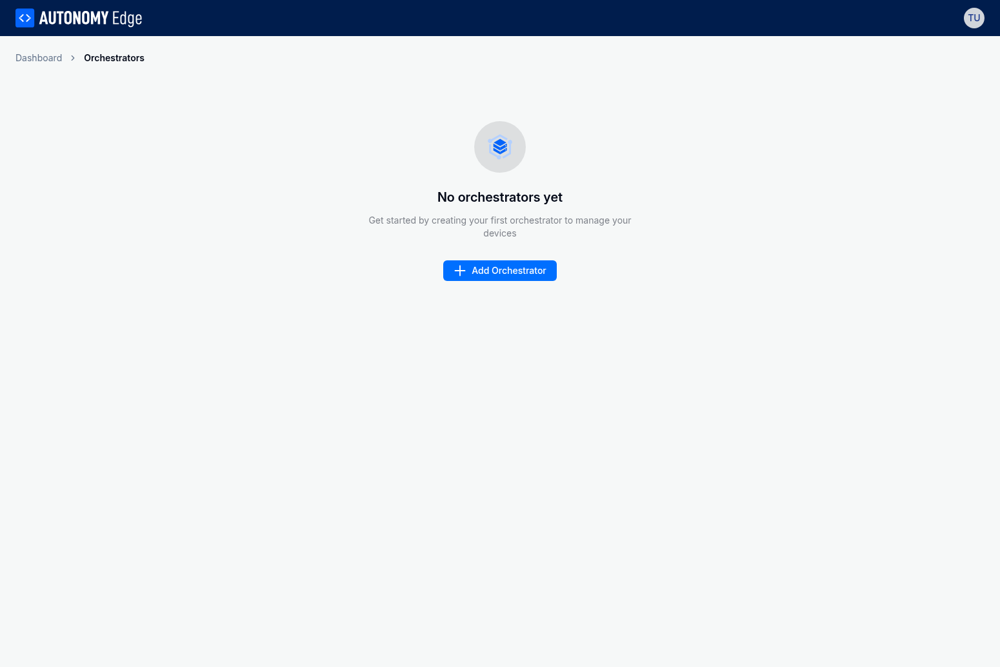

# Adding Orchestrators

Adding an orchestrator to your Autonomy Edge account is a three-step process that involves naming your orchestrator, running an installation script on your target machine, and linking the orchestrator to your account. This guide walks you through each step.

## Before You Begin

Ensure your target machine meets the system requirements described in [Understanding Orchestrators](understanding-orchestrators). You will need a Linux machine with root or sudo access and an internet connection.

## Step 1: Start the Add Orchestrator Wizard

Navigate to the Orchestrators page in the Autonomy Edge platform. If you don't have any orchestrators yet, you'll see an empty state with an "Add Orchestrator" button.



Click the **Add Orchestrator** button to open the orchestrator setup wizard.

## Step 2: Enter Orchestrator Details

In the first step of the wizard, provide a name and optional description for your orchestrator. Choose a descriptive name that helps you identify this orchestrator later, especially if you plan to manage multiple orchestrators across different locations or purposes.


Enter the following information:

- **Name**: A descriptive name for your orchestrator (required)
- **Description**: Additional details about this orchestrator's purpose or location (optional)

Click **Next** to proceed to the installation step.

## Step 3: Install the Orchestrator Agent

The second step displays the installation command that you need to run on your target Linux machine.


Copy the installation command by clicking the copy button next to it:

```bash
curl https://getedge.me | bash
```

Open a terminal on your target Linux machine and run the command exactly as shown above. The installation script automatically detects if it needs elevated privileges and will prompt for your sudo password if required. You do not need to add `sudo` before the command.

**Note**: If the script prompts for a sudo password, enter it when requested. If your user account does not have sudo privileges, you will need to run the command as root or contact your system administrator.

The installer will perform the following actions automatically:

1. Check for and install required dependencies (curl, jq, openssl, docker)
2. Create a shared Docker volume for inter-container communication
3. Deploy the network monitor container
4. Pull and deploy the orchestrator agent container
5. Generate a unique orchestrator ID
6. Create mTLS certificates for secure communication
7. Register the orchestrator with the Autonomy Edge provisioning service

When the installation completes successfully, you'll see output similar to:

```
============================================
Orchestrator ID: xxxx-xxxx-xxxx
Certificate expires: [date]
============================================
```

**Important**: Copy the Orchestrator ID displayed at the end of the installation. You will need this ID in the next step to link the orchestrator to your account.

Click **Next** in the wizard to proceed to the linking step.

## Step 4: Link the Orchestrator to Your Account

In the final step, enter the Orchestrator ID that was displayed at the end of the installation process.


Paste the Orchestrator ID into the input field and click **Link Orchestrator**. The platform will verify that:

- The ID is valid and was generated by a legitimate installation
- The orchestrator has uploaded its certificate to the provisioning service
- The certificate has not expired

If verification succeeds, your orchestrator will be linked to your account and will appear in your orchestrators list.

## Verifying the Connection

After linking, your orchestrator will appear in the orchestrators list. Initially, it may show as "inactive" while the orchestrator agent establishes its connection to the cloud.


Within a few moments, the status should change to "active" and you'll see real-time metrics including CPU usage, memory consumption, and uptime. Click on the orchestrator name to view detailed information and manage devices.

## Troubleshooting

If you encounter issues during installation or linking, check the following:

**Installation fails with permission errors**: The installer automatically elevates to root privileges using sudo. If you see permission errors, ensure your user account has sudo privileges and that you entered the correct password when prompted. Alternatively, you can run the command directly as the root user.

**Installation fails to download images**: Verify that your machine has internet access and can reach Docker Hub and the GitHub Container Registry.

**Linking fails with "Invalid ID"**: Double-check that you copied the complete Orchestrator ID from the installation output. The ID format is `xxxx-xxxx-xxxx`.

**Linking fails with "Expired"**: The orchestrator ID and certificate have a limited validity period. If too much time has passed since installation, you may need to reinstall the orchestrator.

**Orchestrator stays inactive**: Ensure the target machine has ongoing internet access. Check that Docker containers are running with `docker ps`. The orchestrator-agent and autonomy-netmon containers should both be running.

For more information about monitoring and managing your orchestrators, see [Orchestrator Overview](orchestrator-overview).
