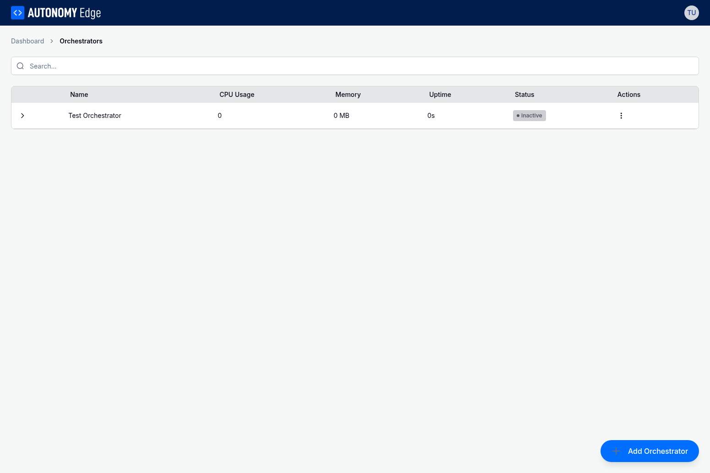
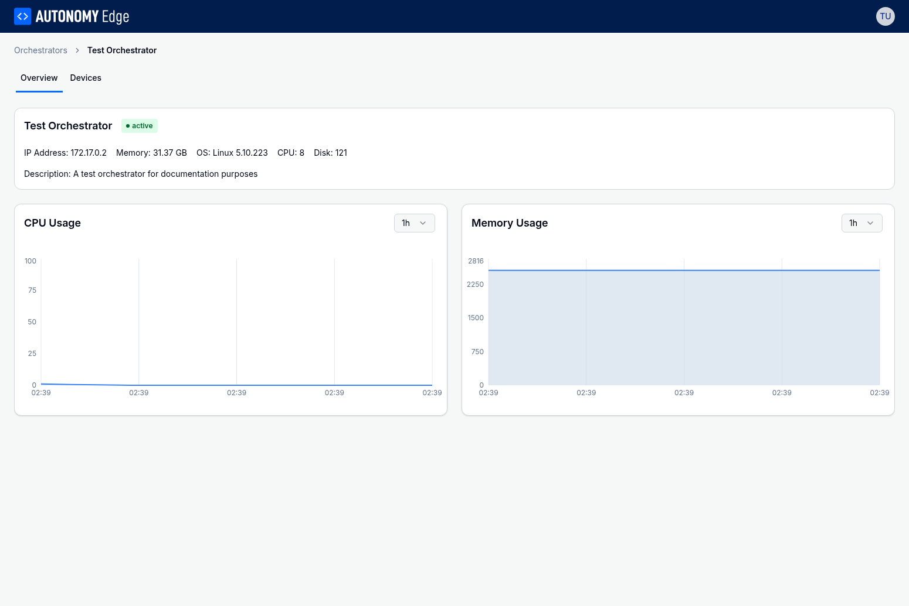
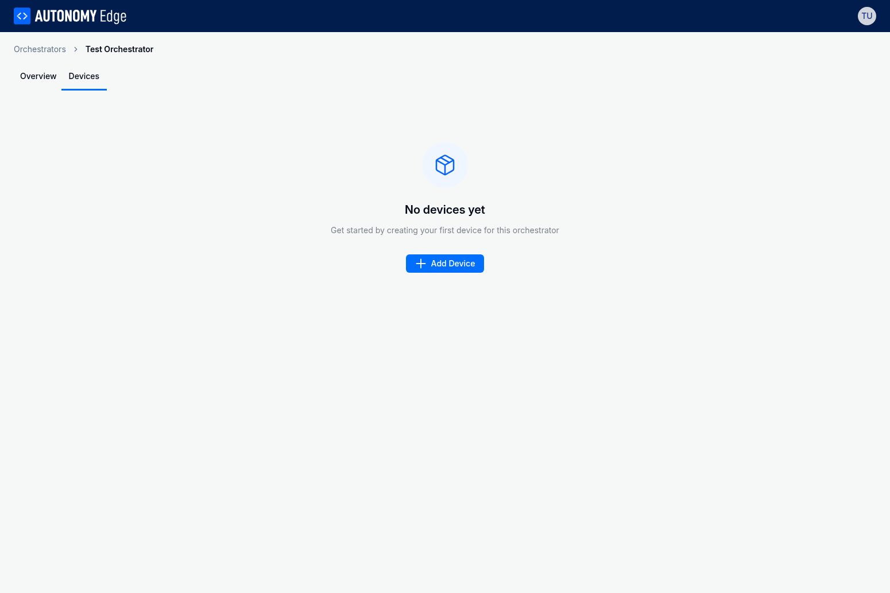

# Orchestrator Overview

Once you have added orchestrators to your account, you can monitor their status, view system metrics, and manage the devices they control from the Autonomy Edge platform. This page explains how to use the orchestrator management features.

## Viewing Your Orchestrators

The Orchestrators page displays a list of all orchestrators linked to your account. Each row shows key information at a glance:

- **Name**: The name you assigned during setup
- **Status**: Current connection state (active or inactive)
- **CPU**: Current CPU utilization percentage
- **Memory**: Current memory usage
- **Uptime**: How long the orchestrator has been running

An orchestrator shows as "active" when it is connected to the cloud and sending regular heartbeat updates. If an orchestrator loses its connection or stops running, its status changes to "inactive".

You can search for specific orchestrators using the search box at the top of the list. This is helpful when managing many orchestrators across different locations.

## Orchestrator Detail View

Click on any orchestrator in the list to view its detailed information. The detail view has two tabs: Overview and Devices.

### Overview Tab

The Overview tab displays comprehensive information about the orchestrator and its host system.

**Orchestrator Information Card**: At the top of the page, you'll see the orchestrator's name, current status, and key system details including:

- **IP Address**: The network address of the orchestrator
- **Memory**: Total system memory available
- **OS**: Operating system and kernel version
- **CPU**: Number of CPU cores
- **Disk**: Total disk space

**CPU Usage Chart**: A time-series chart showing CPU utilization over time. Use the dropdown menu to select different time ranges (1 hour, 6 hours, 12 hours, 24 hours, or 48 hours) to analyze usage patterns.

**Memory Usage Chart**: A time-series chart showing memory consumption over time. Like the CPU chart, you can adjust the time range to view historical data.

These charts help you identify performance trends, detect resource constraints, and plan capacity for your automation workloads.

### Devices Tab

The Devices tab shows all virtual PLC devices (vPLCs) managed by this orchestrator.

If no devices have been created yet, you'll see an empty state with an "Add Device" button. Devices are the virtual PLC containers that run your automation programs. Each device can be configured with its own network settings and can run independently on the orchestrator's host machine.

For more information about creating and managing devices, see the vPLC Device Management section of this documentation.

## Managing Orchestrators

### Renaming an Orchestrator

You can rename an orchestrator at any time to better reflect its purpose or location. Click on the orchestrator name in the detail view or use the context menu in the list view to access the rename option.

### Deleting an Orchestrator

To remove an orchestrator from your account, use the delete option in the context menu. Deleting an orchestrator will:

- Remove the orchestrator from your account
- Stop all devices running on that orchestrator
- Remove all associated network configurations

**Warning**: Deleting an orchestrator is a permanent action. Make sure you have backed up any important data or configurations before proceeding.

## Monitoring Best Practices

To get the most out of your orchestrator monitoring:

**Regular Status Checks**: The platform automatically polls orchestrator status every few seconds, but you should periodically review the orchestrators list to ensure all your edge devices are connected and healthy.

**Resource Monitoring**: Use the CPU and memory charts to establish baseline usage patterns for your workloads. Sudden spikes or sustained high usage may indicate issues that need attention.

**Capacity Planning**: Monitor resource utilization over time to determine when you might need to add more orchestrators or upgrade the hardware on existing ones.

**Network Connectivity**: If an orchestrator shows as inactive, check the network connectivity of the host machine. The orchestrator requires a stable internet connection to maintain its cloud connection.

## Troubleshooting

**Orchestrator shows inactive**: Verify that the host machine has internet access and that Docker containers are running. Use `docker ps` on the host to check that both the orchestrator-agent and autonomy-netmon containers are running.

**Metrics not updating**: If CPU and memory charts are not showing new data, the orchestrator may be experiencing connectivity issues. Check the network connection and restart the orchestrator containers if necessary.

**High resource usage**: If you notice consistently high CPU or memory usage, review the number and complexity of devices running on the orchestrator. Consider distributing workloads across multiple orchestrators.

For information about adding new orchestrators, see [Adding Orchestrators](adding-orchestrators). For details about what orchestrators are and how they work, see [Understanding Orchestrators](understanding-orchestrators).
