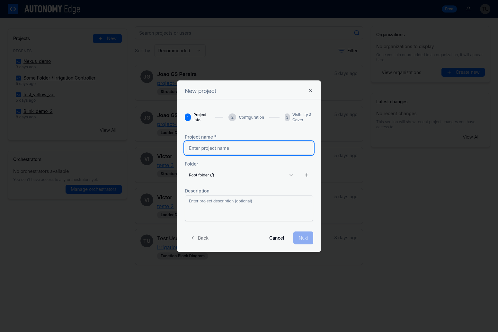
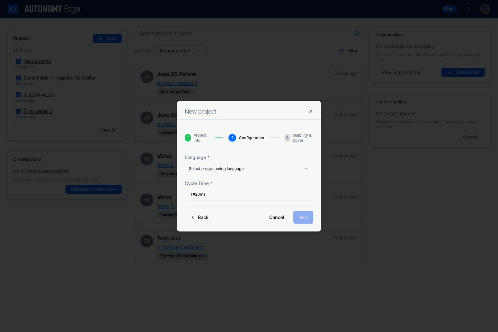
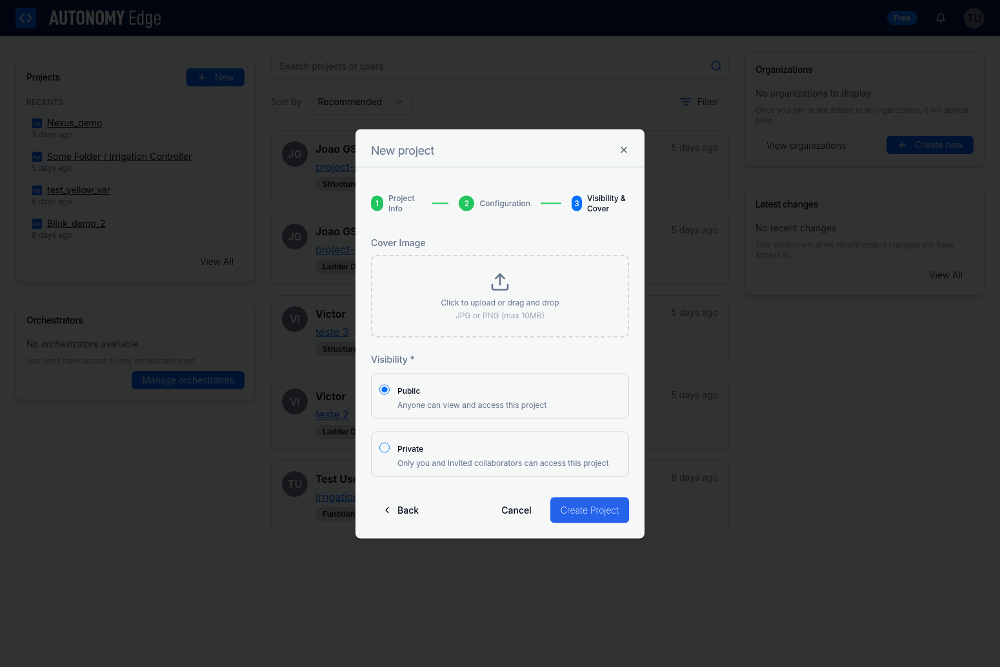

# Creating Projects

Creating a new project in Autonomy Edge is a straightforward process that guides you through a 3-step wizard. This wizard helps you configure all essential project settings including basic information, programming language configuration, and visibility settings.

## Starting a New Project

You can create a new project from multiple locations in the platform:

1. **From the Dashboard**: Click the "New" button in the left sidebar under the "Projects" section
2. **From the Projects Page**: Click the "Create new" button in the top-left corner

Both options will open the same project creation wizard.

## Step 1: Project Information

The first step collects basic information about your project.

### Required Fields

- **Project name**: Enter a descriptive name for your project. This field is required and will be used to identify your project throughout the platform.

### Optional Fields

- **Folder**: Select a folder to organize your project. You can choose:
  - **Root folder (/)**: The default location for projects without a specific folder
  - **Existing folder**: Select from your previously created folders
  - **Create new folder**: Click the "+" button next to the folder dropdown to create a new folder on the fly

- **Description**: Add an optional description to provide context about your project's purpose and functionality.

### Creating a Folder During Project Creation

If you need to create a new folder while creating a project:

1. Click the "+" button next to the Folder dropdown
2. Enter a folder name in the modal that appears
3. Click "Create" to save the folder
4. The new folder will be automatically selected for your project

Once you've entered the required information, click "Next" to proceed to the configuration step.

## Step 2: Configuration

The second step configures the technical settings for your project.

### Programming Language Selection

Choose the primary programming language for your project from the IEC 61131-3 standard languages:

- **LD (Ladder Diagram)**: Visual programming using relay logic symbols
- **ST (Structured Text)**: High-level text-based programming language
- **IL (Instruction List)**: Low-level assembly-like programming language
- **FBD (Function Block Diagram)**: Visual programming using function blocks

The language you select here will be the default language for your project, though you can use multiple languages within the same project through the IDE.

### Cycle Time Configuration

The cycle time determines how frequently your PLC program executes. The default value is **T#20ms** (20 milliseconds), which is suitable for most applications.

You can select from predefined cycle times or enter a custom value. Common cycle times include:
- T#10ms - Fast response applications
- T#20ms - Standard applications (default)
- T#50ms - Slower, less time-critical applications
- T#100ms - Monitoring and data collection applications

Click "Next" to proceed to the final step.

## Step 3: Visibility & Cover

The final step configures project visibility and allows you to add a cover image.

### Cover Image (Optional)

You can upload a custom cover image to make your project more visually distinctive:

1. Click the upload area or drag and drop an image file
2. Supported formats: JPG, PNG
3. Maximum file size: 10MB

The cover image will be displayed on project cards throughout the platform.

### Visibility Settings

Choose who can access your project:

#### Public
- **Access**: Anyone can view and access this project
- **Use case**: Open-source projects, educational content, community contributions
- **Visibility**: Project will appear in community search results and activity feeds

#### Private
- **Access**: Only you and invited collaborators can access this project
- **Use case**: Proprietary projects, work-in-progress, confidential applications
- **Visibility**: Project will only be visible to you and explicitly invited users

The default visibility setting is **Public**. You can change the visibility setting later from the project settings.

## Creating the Project

Once you've configured all settings:

1. Review your selections across all three steps
2. Click "Create Project" to finalize the creation
3. The platform will create your project and redirect you to the project view

You can use the "Back" button at any time to return to previous steps and modify your selections.

## After Project Creation

After successfully creating your project, you can:

- Open the project in the integrated OpenPLC Editor to start programming
- Share the project with collaborators (for private projects)
- Organize the project into folders
- Configure additional project settings
- Deploy the project to virtual PLC devices

## Best Practices

- **Use descriptive names**: Choose project names that clearly indicate the project's purpose
- **Organize with folders**: Group related projects together using folders for better organization
- **Add descriptions**: Include helpful descriptions to document the project's purpose and functionality
- **Choose appropriate visibility**: Use private visibility for proprietary work and public for community contributions
- **Select the right language**: Choose the programming language that best fits your application and team's expertise
