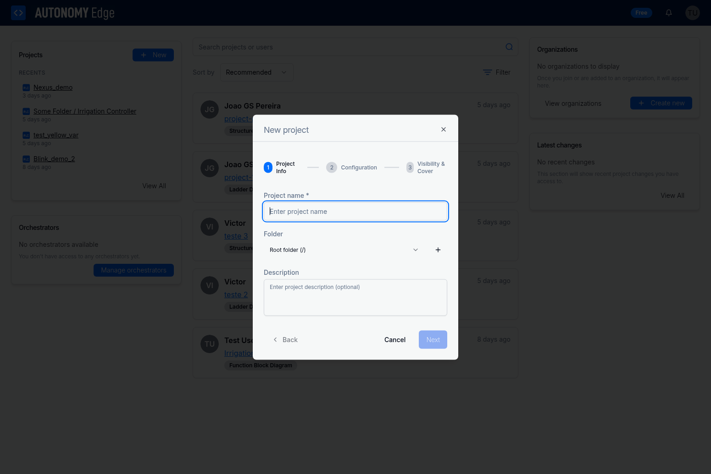
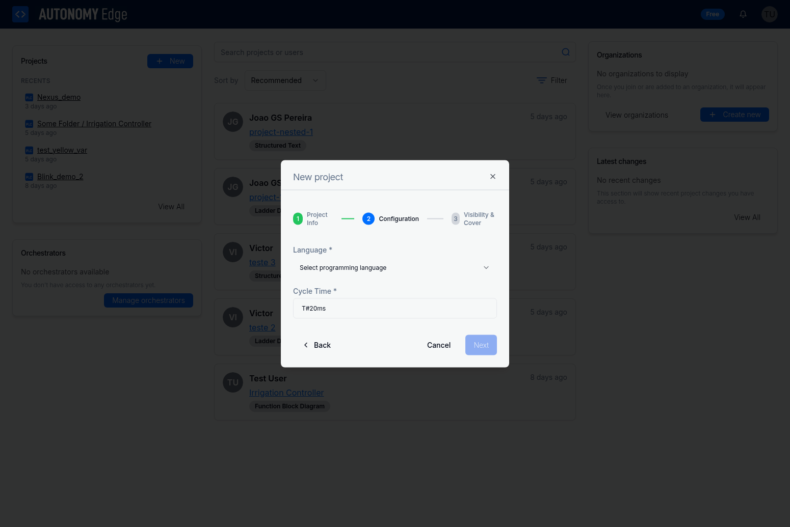
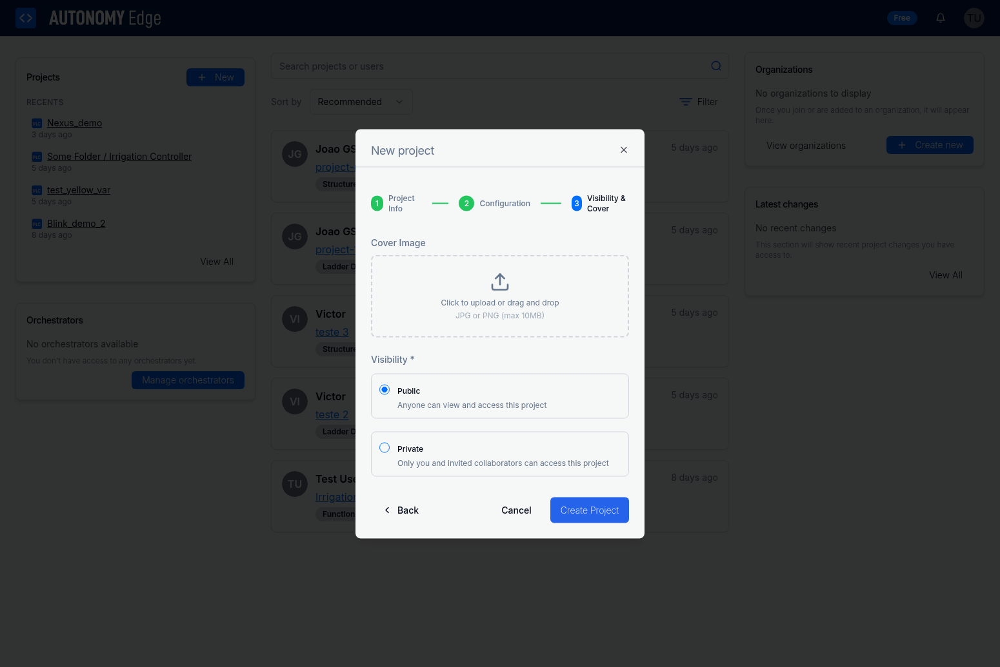

# Creating Projects

A project is the home for your PLC program on Autonomy Edge. Each project holds your source code, variable definitions, task configuration, and device mappings. This guide walks you through the 3-step creation wizard.

---

## Where to Start

You can create a new project from two places:

- **From the Dashboard**: Click the **New** button (with a `+` icon) in the Projects card in the left sidebar.
- **From the Projects Page**: Click the **New** dropdown button in the sidebar and select **New Project**.

Both paths open the same three-step wizard modal.

---

## Step 1 of 3: Project Info

### Project Name (Required)

Give your project a descriptive, unique name. This name appears on project cards, in the sidebar folder tree, and in URLs for public projects. You can't have two projects with the same name.

**Examples:** `Traffic Light Controller`, `Motor Speed PID`, `Conveyor Belt Logic`.

### Select Folder

Choose where to store the project. The dropdown displays your entire folder hierarchy with indentation showing nesting levels:

- **Root (/)**: The top-level folder. If you haven't created any folders, this is your only option.
- **Subfolders**: Any folders you've created appear below Root with tree-style indentation.

You can move projects between folders later. See [Organizing Projects](organizing-projects).

### Description (Optional)

A short description of the project. This appears in the project detail view and helps you remember what it's for.

Click **Next** to proceed.

---

## Step 2 of 3: Configuration

### Select Language (Required)

Choose the IEC 61131-3 programming language for your project's main Program Organization Unit (POU):

| Code | Language | Description |
|---|---|---|
| **ST** | Structured Text | Textual, Pascal-like syntax. Best for complex logic, math, and algorithms. |
| **LD** | Ladder Diagram | Graphical, based on relay logic. Familiar to electricians and traditional PLC programmers. |
| **FBD** | Function Block Diagram | Graphical, based on signal flow. Ideal for data processing and control loops. |
| **IL** | Instruction List | Textual, assembly-like. Compact and low-level. |

Click a language card to select it.

> **Tip:** New to PLC programming? **Structured Text (ST)** is the most versatile choice. If you come from a traditional electrical/relay background, **Ladder Diagram (LD)** will feel familiar.

### Cycle Time (Required)

The cycle time defines how frequently the runtime executes your program's scan cycle. Click the field to open the **Set Interval** modal.

You can set a precise time value using fields for days, hours, minutes, seconds, milliseconds, and microseconds. The result is displayed in IEC 61131-3 `T#` format (e.g., `T#20ms`).

The **default is `T#20ms`** (20 milliseconds). The runtime executes your program 50 times per second. This works for most general-purpose applications.

Click **Next** to proceed.

---

## Step 3 of 3: Visibility

### Cover Image (Optional)

Upload a `.jpg` or `.png` image as the project's preview image. This appears on project cards in the dashboard and Projects page. If you skip this, a default placeholder is used.

### Visibility (Required)

Choose who can access your project:

- **Public**: Anyone on the platform can view and fork this project. Choose this for open-source projects, learning examples, or community sharing.
- **Private**: Only you can access this project. Private projects don't appear in the activity feed or other users' searches.

The default is **Private**.

### Create the Project

Click **Create Project** to finish. When complete:

- A success notification appears: *"Project created successfully!"*
- The modal closes.
- Your new project appears in the Projects page and the dashboard's Recent Projects list.

---

## Navigation Tips

- **Back**: Steps 2 and 3 have a Back button to return to the previous step without losing your data.
- **Cancel**: Available on every step. Closes the modal and discards all entered data.
- The **Steps indicator** at the top shows your progress.

---

## Quick Reference

| Field | Required | Default | Notes |
|---|---|---|---|
| Project name | Yes |. | Must be unique per user |
| Folder | Yes | Root (/) | Can be changed later |
| Description | No |. | Short text |
| Language | Yes |. | ST, LD, FBD, or IL |
| Cycle time | Yes | `T#20ms` | IEC 61131-3 time format |
| Cover image | No | Placeholder | `.jpg` or `.png` |
| Visibility | Yes | Private | Public or Private |

---

## What's Next?

Now that you've created a project, learn how to open it in the IDE and start editing:

➡️ [Opening and Editing Projects](opening-editing)
