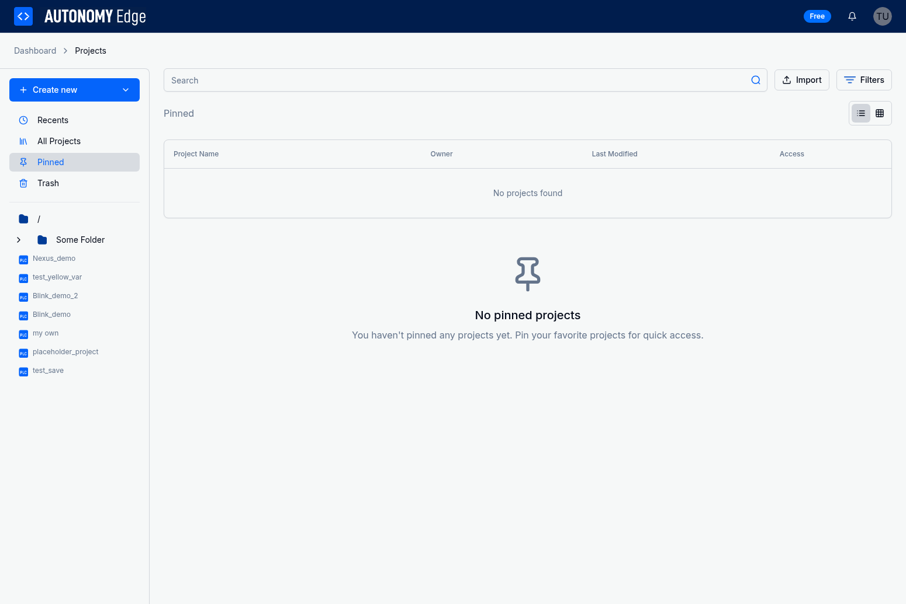

# Managing Projects - Pinning, Recents, and Trash

Autonomy Edge provides several features to help you organize and manage your project portfolio efficiently. Beyond folders, the platform offers quick access shortcuts through Recents, Pinned projects, and a Trash system for archiving projects you no longer need.

## Project Categories

The Projects page sidebar organizes your projects into several categories for easy access:


### Available Categories

- **Recents**: Your most recently accessed projects
- **All Projects**: Complete list of all active projects
- **Pinned**: Projects you've marked as favorites for quick access
- **Trash**: Archived projects that can be restored or permanently deleted

## Recents

The Recents section provides quick access to projects you've recently worked on.

### How Recents Work

- **Automatic tracking**: Projects are automatically added to Recents when you open them
- **Chronological order**: Projects are sorted by last access time, with the most recent at the top
- **Limited display**: Typically shows the 10 most recently accessed projects
- **Cross-device sync**: Your recent projects are synced across all your devices

### Accessing Recent Projects

**From the Dashboard:**


1. Navigate to the Dashboard
2. Look at the left sidebar under "Recents"
3. Click on any project to open it immediately
4. Projects show their name, folder location (if applicable), and last access time

**From the Projects Page:**

1. Navigate to the Projects page
2. Click "Recents" in the sidebar
3. View a table of your recent projects with details
4. Click on any project name to open it

### Recents Best Practices

- **Quick access**: Use Recents for projects you're actively working on
- **Context switching**: Easily switch between multiple active projects
- **No manual management**: Recents updates automatically based on your activity
- **Temporary organization**: Don't rely on Recents for long-term organization; use folders and pinning instead

## Pinned Projects

Pinning allows you to mark important projects as favorites for persistent quick access, regardless of when you last opened them.

### Understanding Pinned Projects



- **Manual control**: You explicitly choose which projects to pin
- **Persistent access**: Pinned projects remain accessible until you unpin them
- **Position-based ordering**: Pinned projects maintain a specific order
- **User-specific**: Each user has their own set of pinned projects

### Pinning a Project

To pin a project for quick access:

1. Navigate to the Projects page
2. Locate the project you want to pin
3. Click the three-dot menu (⋯) on the project row
4. Select "Pin project" from the menu
5. The project will appear in your Pinned section

**Alternative method:**
- Hover over a project card on the Dashboard
- Click the pin icon that appears
- The project is immediately added to your Pinned section

### Viewing Pinned Projects

To view all your pinned projects:

1. Navigate to the Projects page
2. Click "Pinned" in the sidebar
3. View all projects you've pinned
4. Projects are displayed in the order they were pinned

If you haven't pinned any projects yet, you'll see a message: "No pinned projects. You haven't pinned any projects yet. Pin your favorite projects for quick access."

### Unpinning Projects

To remove a project from your pinned list:

1. Navigate to the Projects page
2. Go to the Pinned section
3. Locate the project you want to unpin
4. Click the three-dot menu (⋯) on the project row
5. Select "Unpin project" from the menu
6. The project will be removed from your Pinned section

The project remains in your project list; it's just no longer pinned for quick access.

### Reordering Pinned Projects

Pinned projects are stored with position-based ordering:

- Projects are ordered by when they were pinned (newest pins appear last)
- The platform maintains the pin order automatically
- Future updates may allow manual reordering of pinned projects

### When to Use Pinning

**Ideal use cases:**
- **Critical projects**: Projects you access frequently and need immediate access to
- **Active development**: Projects you're currently working on
- **Reference projects**: Template or reference projects you consult regularly
- **Client priorities**: High-priority client projects that need quick access
- **Long-term projects**: Projects you work on consistently over extended periods

**Not ideal for:**
- Projects you only access occasionally
- Temporary test projects
- Completed projects you rarely need to access
- Projects you're actively working on today (use Recents instead)

## Trash

The Trash system allows you to archive projects without permanently deleting them, providing a safety net for project management.

### Understanding Trash


- **Soft delete**: Projects in Trash are archived, not permanently deleted
- **Recoverable**: Archived projects can be restored at any time
- **Hidden from main views**: Trash projects don't appear in Recents, Pinned, or All Projects
- **Permanent deletion**: You can permanently delete projects from Trash when ready

### Moving Projects to Trash

To archive a project:

1. Navigate to the Projects page
2. Locate the project you want to archive
3. Click the three-dot menu (⋯) on the project row
4. Select "Move to trash" from the menu
5. Confirm the action if prompted
6. The project will be moved to the Trash section

**What happens when you move a project to Trash:**
- The project is marked as archived in the database (`is_archived = true`)
- It disappears from all active project views
- It's removed from Recents and Pinned sections
- It remains accessible in the Trash section
- All project data is preserved

### Viewing Trash

To view archived projects:

1. Navigate to the Projects page
2. Click "Trash" in the sidebar
3. View all projects you've archived
4. Projects show their name, type, and last modified date

The Trash section displays:
- Project name
- Project type (Project or Folder)
- Last modified date
- Action menu for each item

### Restoring Projects from Trash

To restore an archived project:

1. Navigate to the Projects page
2. Click "Trash" in the sidebar
3. Locate the project you want to restore
4. Click the three-dot menu (⋯) on the project row
5. Select "Restore" from the menu
6. The project will be restored to its original location

**After restoration:**
- The project returns to its original folder
- It becomes visible in All Projects and other views
- Recent access history is preserved
- The project can be pinned again if desired

### Permanently Deleting Projects

To permanently delete a project from Trash:

1. Navigate to the Projects page
2. Click "Trash" in the sidebar
3. Locate the project you want to delete permanently
4. Click the three-dot menu (⋯) on the project row
5. Select "Delete permanently" from the menu
6. Confirm the deletion (this action cannot be undone)

**Warning:** Permanent deletion removes all project data including:
- All PLC code and configurations
- Project settings and metadata
- Version history (if available)
- Associated files and resources

### Emptying Trash

To delete all projects in Trash at once:

1. Navigate to the Projects page
2. Click "Trash" in the sidebar
3. Click the "Empty Trash" button at the top of the page
4. Confirm the action (this cannot be undone)
5. All projects in Trash will be permanently deleted

**Use with caution:** This action permanently deletes all archived projects and cannot be reversed.

### Trash Best Practices

**When to use Trash:**
- **Completed projects**: Projects that are finished but you want to keep for reference
- **Obsolete projects**: Projects replaced by newer versions
- **Test projects**: Experimental projects you might want to reference later
- **Client projects**: Completed client work you want to archive but not delete
- **Uncertain deletion**: Projects you're not sure about deleting permanently

**When to permanently delete:**
- **Duplicate projects**: Accidental duplicates that aren't needed
- **Failed experiments**: Test projects with no value
- **Outdated work**: Projects that are no longer relevant
- **Storage cleanup**: When you need to free up storage space
- **After review period**: After keeping archived projects for a reasonable time

## Combining Organization Features

Use all organization features together for optimal project management:

### Recommended Workflow

1. **Create with folders**: Organize new projects into folders from the start
2. **Pin critical projects**: Pin 3-5 most important projects for quick access
3. **Use Recents for active work**: Let Recents automatically track your current projects
4. **Archive completed work**: Move finished projects to Trash
5. **Review periodically**: Regularly review and clean up your project organization

### Example Organization Strategy

```
Active Projects:
├── Pinned (3-5 critical projects)
├── Recents (10 most recent projects)
└── Folders (organized by client/application)
    ├── Client A - Production
    ├── Client B - Development
    └── Internal - Templates

Archived:
└── Trash (completed/obsolete projects)
    ├── Completed - Client A
    ├── Old Tests
    └── Superseded Versions
```

## Keyboard Shortcuts and Quick Actions

While the platform primarily uses mouse/touch interaction, some quick actions are available:

- **Click project name**: Open project in editor
- **Three-dot menu**: Access all project actions
- **Search bar**: Quickly find projects across all categories
- **Sidebar navigation**: Switch between categories with single clicks

## Troubleshooting

### Common Issues

**Q: A project disappeared from my Recents**
- Recents only shows the 10 most recently accessed projects
- Open the project again to add it back to Recents
- Consider pinning the project if you need persistent access
- Check the All Projects view to find any project

**Q: I can't pin more projects**
- There may be a limit on the number of pinned projects
- Unpin less critical projects to make room
- Use folders for additional organization
- Check platform documentation for current limits

**Q: I accidentally moved a project to Trash**
- Navigate to the Trash section
- Find the project and click "Restore"
- The project will return to its original location
- No data is lost when moving to Trash

**Q: I permanently deleted a project by mistake**
- Permanent deletion cannot be undone
- Contact support immediately if the project is critical
- Check if you have local backups or exports
- Implement regular backup procedures to prevent data loss

**Q: My pinned projects are in the wrong order**
- Pinned projects are ordered by when they were pinned
- Manual reordering may not be available in the current version
- Unpin and re-pin projects to change their order
- Monitor platform updates for reordering features

## Best Practices Summary

### Daily Workflow

- **Use Recents** for projects you're actively working on today
- **Check Pinned** for your most important ongoing projects
- **Search when needed** to find specific projects quickly
- **Archive completed work** to keep your active project list clean

### Weekly Maintenance

- **Review Pinned projects**: Ensure pinned projects are still relevant
- **Clean up Recents**: Archive or organize projects you're done with
- **Check Trash**: Restore any accidentally archived projects
- **Organize new projects**: Ensure new projects are in appropriate folders

### Monthly Cleanup

- **Review Trash**: Permanently delete projects you no longer need
- **Audit folders**: Reorganize projects if your folder structure has changed
- **Update pins**: Adjust pinned projects based on current priorities
- **Archive old work**: Move completed projects to Trash

### Long-term Strategy

- **Maintain folder structure**: Keep your folder organization up to date
- **Document organization**: Keep notes on your organizational system
- **Regular backups**: Export important projects periodically
- **Review and adapt**: Adjust your organization strategy as your needs evolve

## Advanced Tips

### Power User Techniques

1. **Strategic pinning**: Pin template projects for quick duplication
2. **Folder + Pin combo**: Use folders for organization, pins for quick access
3. **Trash as archive**: Use Trash as a long-term archive before permanent deletion
4. **Search mastery**: Learn to use search effectively to find any project instantly
5. **Consistent naming**: Use consistent project naming to improve searchability

### Team Collaboration

When working with teams:

- **Shared naming conventions**: Agree on project naming standards
- **Folder structure**: Maintain consistent folder organization
- **Pin critical projects**: Ensure team members pin shared priority projects
- **Communication**: Notify team before moving shared projects to Trash
- **Documentation**: Document your organization system for new team members

## Future Features

The platform is continuously evolving. Planned enhancements include:

- **Custom categories**: Create your own project categories beyond the default ones
- **Smart collections**: Automatically group projects based on criteria
- **Bulk operations**: Move, pin, or archive multiple projects at once
- **Advanced search**: Filter projects by multiple criteria simultaneously
- **Project tags**: Add custom tags for additional organization
- **Reorder pins**: Manually reorder your pinned projects

Stay updated with platform announcements for new features and improvements.
