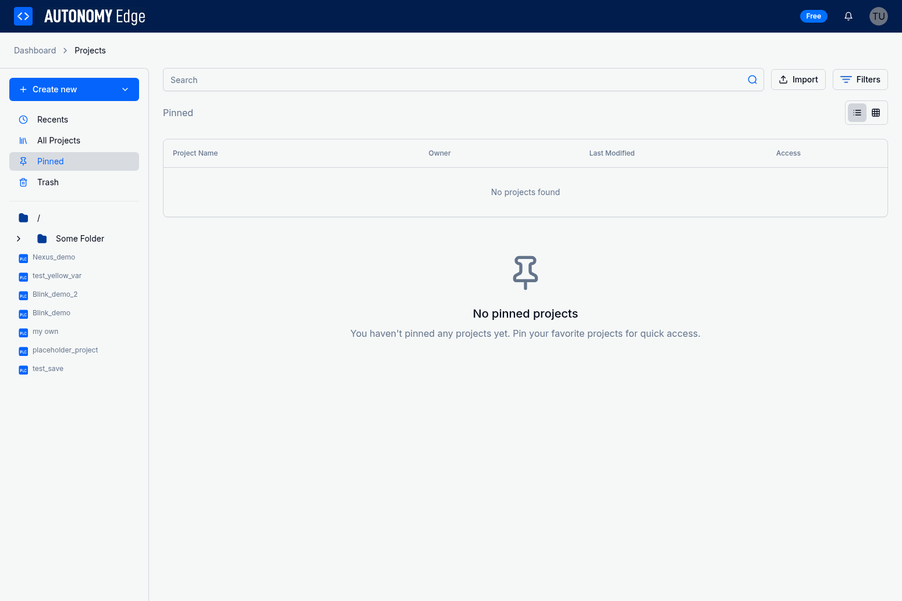
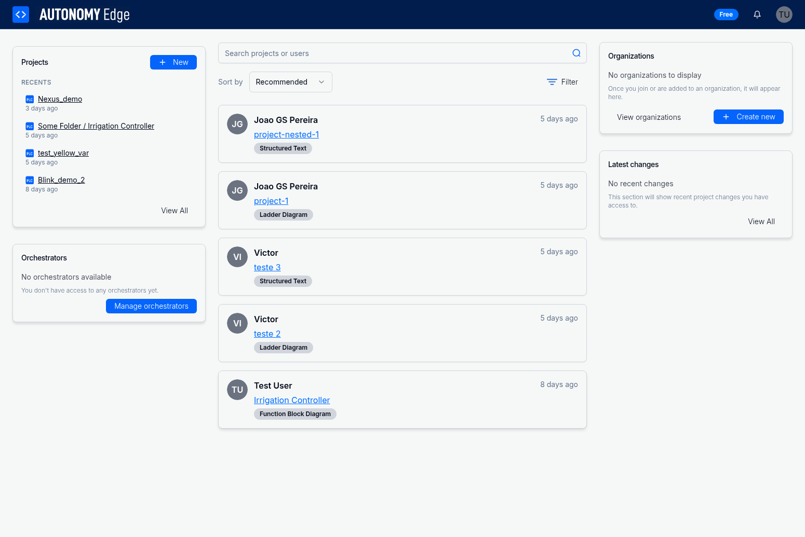
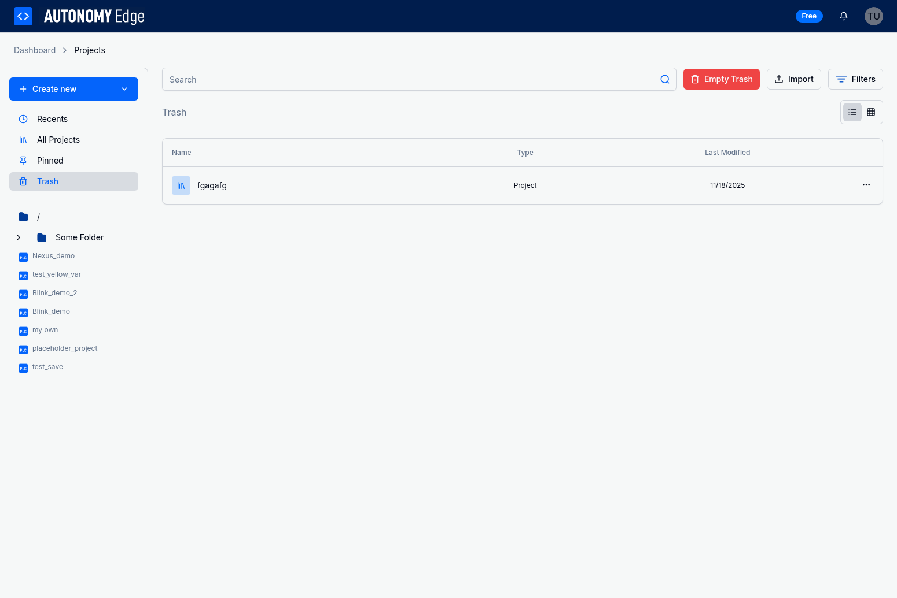

# Managing Projects

Beyond creating and editing, Autonomy Edge gives you tools to manage your projects day to day. Pinning favorites, downloading backups, forking copies, and handling deletion through a soft-delete trash system.

---

## Pinning Projects

Pinning marks important projects so they're always easy to find.

### How to Pin

**From the project card (Card view):** Click the **pin icon** in the action bar at the bottom of the card. When pinned, the icon fills with color and a **"Pinned"** badge appears.

**From the options menu (Card or List view):** Open the three-dot menu (⋯) and select **Pin** (or **Unpin** if already pinned).

### Viewing Pinned Projects

In the Projects page sidebar, click **Pinned** to see only your pinned projects. If you have none, the empty state reads: *"No pinned projects. Pin your favorite projects to see them here."*

---

## Recent Projects

The **Recent** view (the default on the Projects page) shows your projects sorted by most recently updated. The Dashboard also shows your 5 most recent projects in the Projects card.

---

## Downloading a Project

You can download any project you own as a `.zip` archive. Useful for backups, sharing, or importing into another account.

**Card view:** Click the **download icon** (↓) in the card's action bar.

**List view:** Open the three-dot menu (⋯) and select **Download**.

The ZIP contains all your project files: `project.json` (metadata), POU source files, and any additional configuration files. The file is named after your project (e.g., `motor-control.zip`).

> **Tip:** For more details on the ZIP format and how to re-import, see [Importing and Exporting](importing-exporting).

---

## Forking (Cloning) a Project

Forking creates an independent copy of a project. You can fork your own projects (to create variations) or other users' public projects.

### How to Fork

1. Open the project's options menu (three-dot menu ⋯).
2. Select **Fork**.
3. In the **Fork Project** modal, click the destination folder.

The fork is created immediately with the name `<Original Name> (Fork)`. It's always **Private**, and all files are copied from the original.

For more details on forking, see [Project Visibility](project-visibility).

---

## Trash System

Autonomy Edge uses a two-stage deletion system: projects are first moved to the trash (soft delete), then can be restored or permanently deleted.

### Moving to Trash

1. Open the project's options menu (⋯).
2. Select **Move to trash**.
3. The project moves to the trash immediately.

The project disappears from your regular views but is preserved in the trash.

### Viewing Trashed Projects

**From the Projects page sidebar:** Click **Trash** to see trashed projects.

**From the Trash page:** Navigate to the dedicated Trash page for a comprehensive management interface with:
- Filter tabs (all items, projects only, folders only)
- **Empty trash** button to permanently delete everything at once
- A table with name, type, deletion date, and action buttons

### Restoring a Project

From the Trash view, open the options menu on the trashed project and select **Restore**. The project returns to its original location.

### Permanently Deleting a Project

From the Trash view, select **Delete permanently** from the options menu. A confirmation modal warns this can't be undone.

> **Warning:** Permanent deletion removes the project and all its files forever. Make sure you no longer need the project before confirming.

### Emptying the Entire Trash

Click the red **Empty trash** button to permanently delete all trashed items at once. A confirmation modal shows what will be deleted.

---

## Folder Trash Behavior

Folders follow the same trash pattern as projects:

- **Move to trash**: From the sidebar, use the three-dot menu on a folder and select **Delete**.
- **Restore**: Bring it back with all its contents.
- **Delete permanently**: Removes the folder and everything inside it forever.

---

## Quick Reference: Project Actions

| Action | Where | Effect |
|---|---|---|
| **Pin / Unpin** | Card action bar, options menu | Adds to / removes from Pinned view |
| **Download** | Card action bar (↓), options menu | Downloads project as `.zip` |
| **Rename** | Options menu → Rename | Changes project name |
| **Move to...** | Options menu → Move to... | Moves project to another folder |
| **Fork** | Options menu → Fork | Creates an independent copy |
| **Move to trash** | Options menu → Move to trash | Soft-deletes the project |
| **Restore** | Trash view → Restore | Brings project back from trash |
| **Delete permanently** | Trash view → Delete permanently | Irreversibly removes the project |
| **Empty trash** | Trash view → Empty trash button | Permanently deletes all trashed items |

---

## What's Next?

Learn how to import and export projects:

➡️ [Importing and Exporting](importing-exporting)
