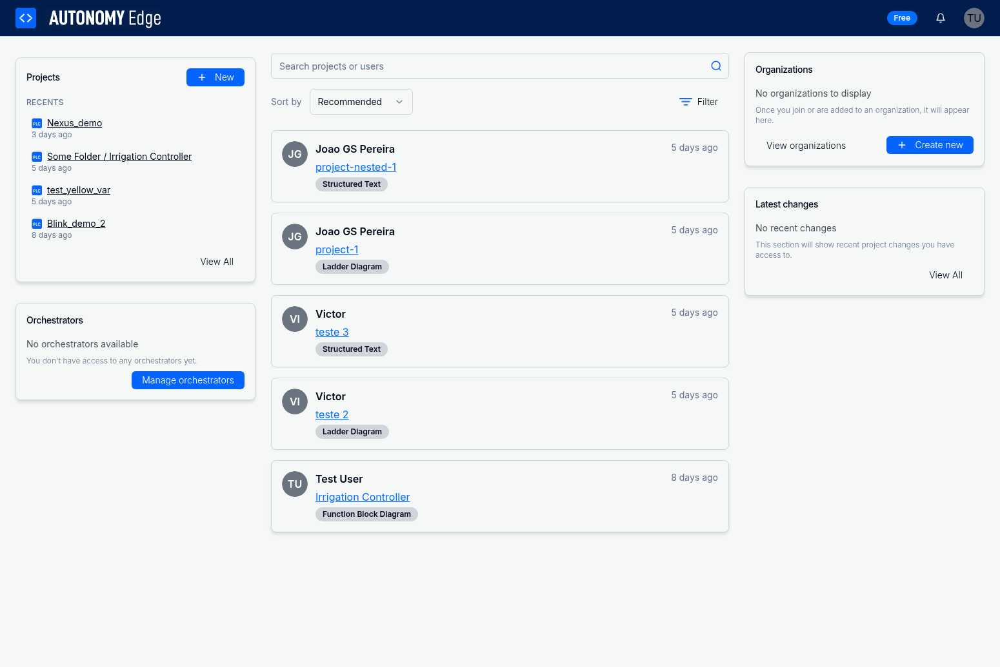
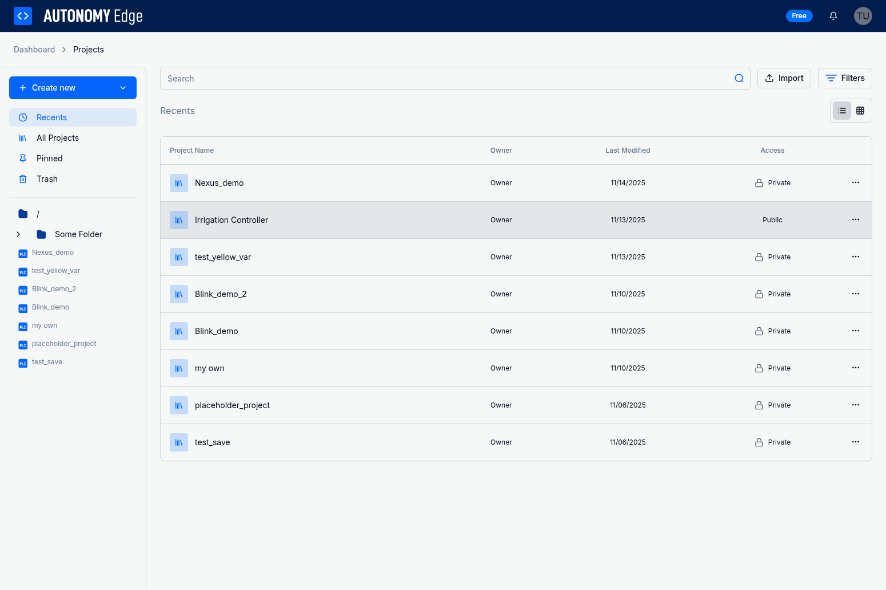

# Opening and Editing Projects

Once you've created a project, you'll want to open it in the integrated OpenPLC Editor to develop your automation logic. Autonomy Edge provides seamless integration with the OpenPLC Editor, allowing you to program directly in your browser without installing any additional software.

## Opening a Project

There are multiple ways to open a project for editing:

### From the Dashboard

The dashboard displays your recently accessed projects for quick access:

1. Navigate to the Dashboard from the main navigation
2. Locate your project in the "Recents" section on the left sidebar
3. Click on the project name or thumbnail
4. The project will open in the integrated OpenPLC Editor

### From the Projects Page

The Projects page provides a comprehensive view of all your projects:

1. Navigate to the Projects page
2. Locate your project in the list (use search or folder navigation if needed)
3. Click on the project name in the table
4. The project will open in the integrated OpenPLC Editor

### From Project Cards

In the dashboard's main content area, projects are displayed as cards:

1. Locate the project card you want to open
2. Click anywhere on the card
3. The project will open in the integrated OpenPLC Editor

## The Integrated OpenPLC Editor

When you open a project, it launches in the integrated OpenPLC Editor, which is embedded directly in the browser:

### Editor Interface

The OpenPLC Editor provides a complete IEC 61131-3 development environment:

- **Project Explorer**: Navigate through POUs, data types, and configurations
- **Code Editor**: Write and edit your automation logic
- **Toolbar**: Access common functions like save, compile, and run
- **Console**: View compilation messages and debugging output
- **Properties Panel**: Configure POU and variable properties

### Editor Integration

The editor is integrated via an iframe that loads the OpenPLC web interface:

- **Seamless experience**: The editor feels like a native part of the platform
- **Project context**: The editor automatically loads your selected project
- **Auto-save**: Changes are automatically saved to the cloud
- **Session persistence**: Your work is preserved across browser sessions

## Working with Projects

### Editing Project Code

Once your project is open in the editor:

1. **Navigate to POUs**: Use the Project Explorer to find the Program Organization Unit you want to edit
2. **Open the editor**: Double-click on a POU to open it in the code editor
3. **Write your code**: Use the appropriate language editor (LD, ST, IL, FBD, or SFC)
4. **Save your changes**: Click the Save button or use Ctrl+S (Cmd+S on Mac)
5. **Compile**: Click the Compile button to check for errors

### Adding New POUs

To add new Program Organization Units:

1. Right-click in the Project Explorer
2. Select "Add POU"
3. Choose the POU type (Program, Function Block, or Function)
4. Select the programming language
5. Enter a name for the POU
6. Click OK to create the POU

### Managing Variables

The editor provides tools for managing variables:

- **Local Variables**: Define variables within individual POUs
- **Global Variables**: Create variables accessible across the entire project
- **Variable Editor**: Use the dedicated variable editor for bulk management
- **Data Types**: Create custom data types for structured data

### Configuring Tasks

Tasks control the execution of your PLC program:

1. Navigate to the Task Configuration section
2. Create or edit tasks
3. Assign programs to tasks
4. Configure task cycle times
5. Set task priorities

## Saving and Auto-Save

The platform provides multiple save mechanisms:

### Manual Save

- Click the Save button in the toolbar
- Use the keyboard shortcut Ctrl+S (Cmd+S on Mac)
- Save before compiling or closing the project

### Auto-Save

- The editor automatically saves your work periodically
- Changes are saved to the cloud in real-time
- No need to worry about losing work due to browser crashes

### Save Indicators

- **Unsaved changes**: Indicated by a marker or asterisk in the editor
- **Saving in progress**: Visual feedback during save operations
- **Save complete**: Confirmation when changes are successfully saved

## Compiling Projects

Before deploying your project, you need to compile it:

### Compilation Process

1. Click the "Compile" button in the toolbar
2. The compiler checks your code for errors
3. Compilation messages appear in the console
4. Review any errors or warnings
5. Fix issues and recompile as needed

### Compilation Messages

The console displays different types of messages:

- **Errors**: Critical issues that prevent compilation (shown in red)
- **Warnings**: Potential issues that don't prevent compilation (shown in yellow)
- **Info**: General information about the compilation process (shown in blue)

### Common Compilation Errors

- **Syntax errors**: Incorrect language syntax
- **Type mismatches**: Incompatible data types in operations
- **Undefined variables**: References to variables that don't exist
- **Missing declarations**: POUs or functions used but not declared

## Closing Projects

When you're done editing:

### Saving Before Closing

1. Ensure all changes are saved (check for unsaved indicators)
2. Click the Save button if needed
3. Wait for the save operation to complete

### Returning to the Platform

To return to the main platform:

1. Click the Autonomy Edge logo in the top-left corner
2. Or use the browser's back button
3. Your project will be closed and you'll return to the dashboard or projects page

### Session Persistence

- Your editing session is preserved
- Reopening the project will restore your last position
- Unsaved changes are retained (but should be saved before closing)

## Keyboard Shortcuts

The OpenPLC Editor supports various keyboard shortcuts:

### Common Shortcuts

- **Ctrl+S / Cmd+S**: Save project
- **Ctrl+Z / Cmd+Z**: Undo
- **Ctrl+Y / Cmd+Y**: Redo
- **Ctrl+C / Cmd+C**: Copy
- **Ctrl+V / Cmd+V**: Paste
- **Ctrl+X / Cmd+X**: Cut
- **Ctrl+F / Cmd+F**: Find
- **Ctrl+H / Cmd+H**: Find and replace

### Editor-Specific Shortcuts

- **F5**: Compile project
- **F6**: Build project
- **F7**: Run simulation
- **Ctrl+Space**: Code completion (in ST editor)

## Best Practices

### Project Organization

- **Use meaningful names**: Name POUs, variables, and functions descriptively
- **Comment your code**: Add comments to explain complex logic
- **Modularize**: Break complex programs into smaller, reusable function blocks
- **Follow conventions**: Use consistent naming and formatting conventions

### Development Workflow

- **Save frequently**: Don't rely solely on auto-save; save manually at key points
- **Compile regularly**: Compile often to catch errors early
- **Test incrementally**: Test small changes before adding more functionality
- **Version control**: Use the platform's version history features (when available)

### Performance Optimization

- **Optimize cycle times**: Choose appropriate task cycle times for your application
- **Minimize global variables**: Use local variables when possible
- **Efficient algorithms**: Write efficient code to minimize execution time
- **Profile your code**: Identify and optimize performance bottlenecks

## Troubleshooting

### Common Issues

**Q: The editor won't load or shows a blank screen**
- Refresh the browser page
- Clear your browser cache
- Check your internet connection
- Try a different browser (Chrome, Firefox, or Edge recommended)

**Q: My changes aren't being saved**
- Check for error messages in the console
- Verify you have a stable internet connection
- Try manually saving with Ctrl+S
- Check if you have sufficient storage quota

**Q: I can't compile my project**
- Review compilation errors in the console
- Check for syntax errors in your code
- Ensure all required POUs and variables are defined
- Verify your project configuration is complete

**Q: The editor is slow or unresponsive**
- Close other browser tabs to free up memory
- Refresh the page to restart the editor
- Check your internet connection speed
- Consider simplifying complex projects

**Q: I accidentally closed the editor without saving**
- Reopen the project immediately
- Check if auto-save preserved your changes
- If changes are lost, use the undo feature after reopening
- Contact support if critical work is lost

## Advanced Features

### Multi-Language Projects

The OpenPLC Editor supports mixing multiple IEC 61131-3 languages in a single project:

- Use LD for relay logic and simple control
- Use ST for complex calculations and algorithms
- Use FBD for signal processing and data flow
- Use IL for low-level optimization
- Use SFC for sequential processes

### Custom Function Blocks

Create reusable function blocks:

1. Define the function block interface (inputs, outputs, in/outs)
2. Implement the function block logic
3. Test the function block independently
4. Use the function block in multiple programs

### Hardware Configuration

Configure hardware settings for deployment:

1. Navigate to the Hardware Configuration section
2. Select your target PLC hardware
3. Configure I/O mappings
4. Set communication parameters
5. Save the hardware configuration

## Next Steps

After editing your project:

- **Deploy to vPLC**: Deploy your compiled project to a virtual PLC device
- **Test and debug**: Use simulation and debugging tools to verify functionality
- **Share with team**: Collaborate with team members on project development
- **Export project**: Export your project as XML for backup or external use
