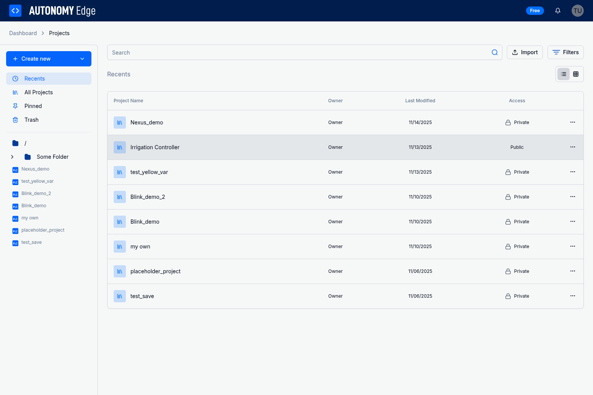

# Organizing Projects

As your collection of projects grows, folders help you keep everything structured and easy to find. You can create folders, nest them, rename them, move them around, and move projects between folders at any time.

---

## The Folder Sidebar

The **Projects page** has a resizable left sidebar that displays your folder tree.

### Action Buttons

At the top of the sidebar:

- **New** dropdown. Create a **New Project**, **New Folder**, or **New Library** (libraries coming soon).
- **Recent**: Shows your most recently updated projects across all folders.
- **Pinned**: Shows only projects you've pinned (see [Managing Projects](managing-projects)).
- **Trash**: Shows projects and folders that have been moved to the trash.

### Folder Tree

Below the buttons, the sidebar displays your full folder hierarchy as a collapsible tree:

- **Root (/)**: The top-level folder. Always exists, can't be renamed or deleted.
- **Subfolders**: Folders you create, shown as children of Root or nested inside other folders.
- **Projects**: Shown inside their parent folder with a project icon.

Click a **folder** to filter the main content area to show only projects in that folder. Click a **project** to open it in the IDE.

---

## Creating a Folder

1. Click the **New** dropdown button in the sidebar.
2. Select **New Folder**.
3. In the modal:
   - **Folder Name** (required): Enter a name.
   - **Parent Folder**: Choose where to create it. Default is Root (/).
4. Click **Create Folder**.

The new folder appears in the sidebar tree.

---

## Renaming a Folder

1. Hover over the folder in the sidebar tree. A three-dot menu (⋯) appears.
2. Click the menu and select **Rename**.
3. Enter the new name and click **Save changes**.

> **Tip:** The Root folder can't be renamed.

---

## Moving a Folder

1. Hover over the folder and click the three-dot menu (⋯).
2. Select **Move**.
3. In the modal, click the destination folder. The move happens immediately.

Moving a folder moves everything inside it. All subfolders and projects come along.

---

## Moving a Project Between Folders

1. Open the project's **options menu** (three-dot menu ⋯):
   - **Card view:** Hover over the card to reveal the menu.
   - **List view:** Click the menu at the end of the row.
2. Select **Move to...**.
3. Click the destination folder. The move happens immediately.

---

## Deleting a Folder

### Move to Trash

1. Hover over the folder in the sidebar and click the three-dot menu (⋯).
2. Select **Delete**.
3. Confirm in the modal.

The folder moves to the trash but can be restored.

### Permanent Deletion

1. Switch to the **Trash** view.
2. Use the three-dot menu on the trashed folder and select **Delete Permanently**.
3. Confirm that you want to permanently remove it.

> **Warning:** Permanently deleting a folder removes it and everything inside it forever. This can't be undone.

---

## Folder Rules

- Folders can be nested to any practical depth.
- Every project lives inside exactly one folder. You choose the folder at creation and can move it later.
- **Root (/)** can't be renamed, moved, or deleted.

---

## Searching for Projects

The Projects page has a **search bar** above the project grid/list. Type a project name (or part of it) to filter. You can combine search with folder filtering: select a folder in the sidebar, then search within it.

To clear the folder filter, click the **×** on the folder badge next to the page heading.

---

## View Modes

Toggle between two view modes using buttons in the top-right corner of the Projects page.

### Card View

Projects displayed as a responsive grid of cards showing:

- Preview image (or placeholder)
- Pinned badge (if pinned)
- Project name, folder, and last modified date
- Action buttons: open in editor, visibility icon, star count, share, pin, download
- Three-dot options menu (on hover)

### List View

Projects displayed as table rows with columns:

| Column | Content |
|---|---|
| **Project Name** | Thumbnail, name (clickable), and star count |
| **Folder** | The folder the project belongs to |
| **Last modified** | When the project was last updated |
| **Access** | Lock (private) or globe (public) icon with label |
| **Actions** | Three-dot menu (⋯) |

Both views support infinite scroll. More projects load as you scroll down.

---

## What's Next?

Learn about public and private projects:

➡️ [Project Visibility](project-visibility)
