# Creating vPLC Devices

This guide walks you through creating a new vPLC device on an orchestrator and uploading your first program using the built-in OpenPLC Editor.

## Prerequisites

Before creating a vPLC, ensure you have:

- An active orchestrator linked to your account (see [Adding Orchestrators](../orchestrator-management/adding-orchestrators))
- The orchestrator showing "active" status in the platform

## Creating a New vPLC

### Step 1: Navigate to the Orchestrator

From the Autonomy Edge dashboard, click on **Orchestrators** in the left sidebar to view your list of orchestrators. Click on the orchestrator where you want to create the vPLC.

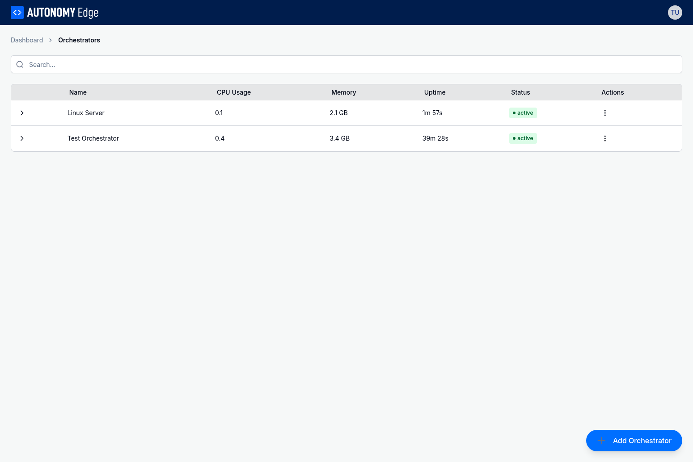

### Step 2: Open the Devices Tab

In the orchestrator detail view, click on the **Devices** tab to see existing vPLC devices or create new ones. If this is your first device, you'll see an empty state with an "Add Device" button.

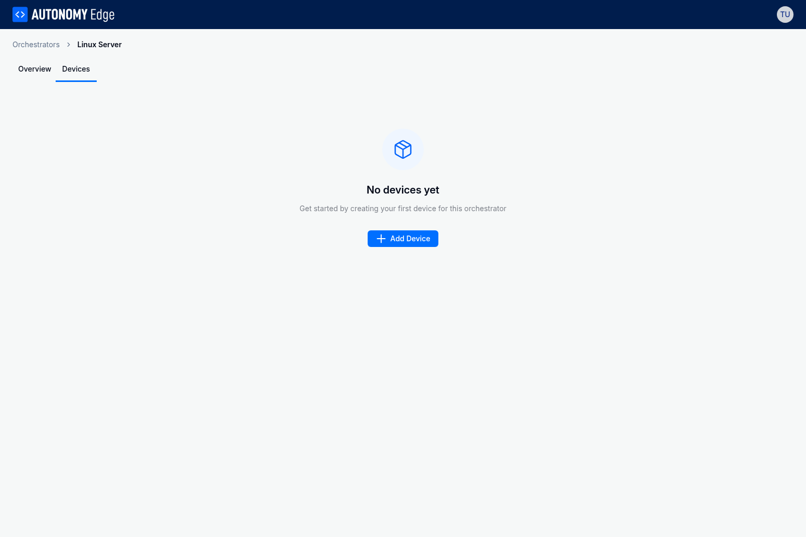

### Step 3: Click Add Device

Click the **Add Device** button to open the device creation dialog. This dialog allows you to configure the basic settings for your new vPLC.

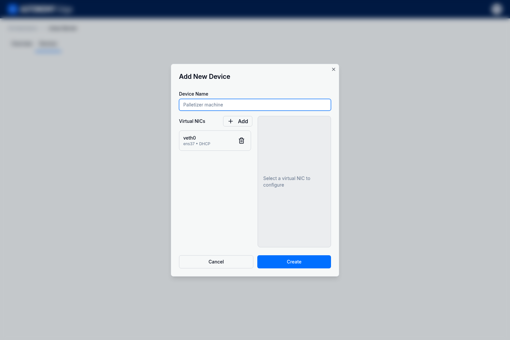

### Step 4: Configure Device Settings

Enter the following information for your vPLC:

- **Device Name**: A descriptive name for your vPLC (e.g., "Production Line Controller", "Demo vPLC")
- **Description** (optional): Additional details about the device's purpose

### Step 5: Configure Network Settings

Click on the network configuration section to set up the virtual network interface (vNIC) for your vPLC. You have two options:

**DHCP**: The vPLC will automatically obtain an IP address from your network's DHCP server. This is the simplest option for most setups.

**Static IP**: Manually specify the IP address, subnet mask, gateway, and DNS servers. Use this option when you need a fixed IP address for your vPLC.


For this example, we'll use DHCP to automatically assign an IP address.

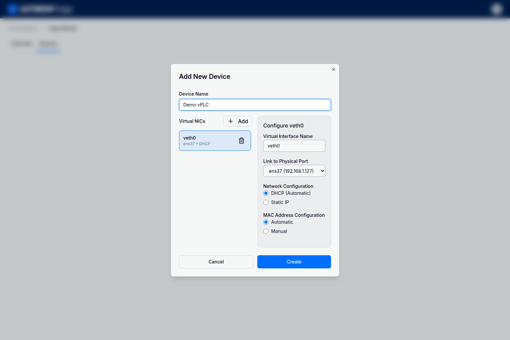

### Step 6: Create the Device

Click the **Create** button to create your vPLC. The orchestrator agent will provision a new Docker container with the OpenPLC Runtime.

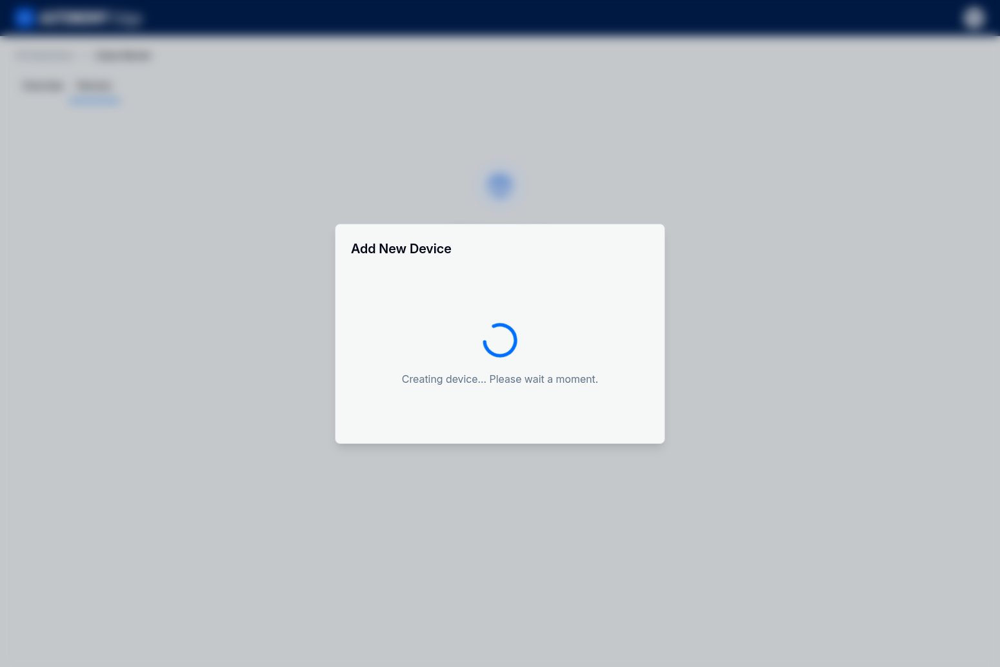

You'll see a brief loading state while the container is being created. This typically takes just a few seconds.

### Step 7: Verify Device Creation

Once the device is created, you'll see a success message and the new vPLC will appear in the devices list with a "running" status.


Your vPLC is now running and ready to receive programs!


## Uploading Programs

Now that your vPLC is running, you can upload a program using the built-in OpenPLC Editor on Autonomy Edge.

### Step 1: Open the OpenPLC Editor

From the Autonomy Edge dashboard, click on a project to open it in the OpenPLC Editor, or navigate to the **Projects** page (via "View all projects" on the dashboard) to see all your projects. You can create a new project or open an existing one.

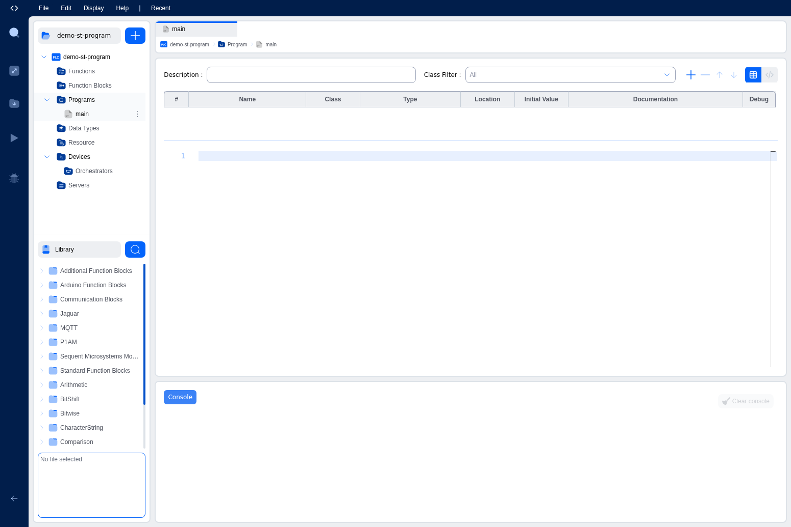

### Step 2: Create Your Program

For this example, we'll create a simple Structured Text program that increments a counter variable on each scan cycle.

Create a new program called "main" and add a local variable:
- **Name**: LocalVar
- **Type**: DINT (32-bit integer)
- **Class**: Local

Then add the following Structured Text code:

```
LocalVar := LocalVar + 1;
```

This simple program increments the LocalVar variable by 1 on every scan cycle, demonstrating the basic operation of a PLC program.

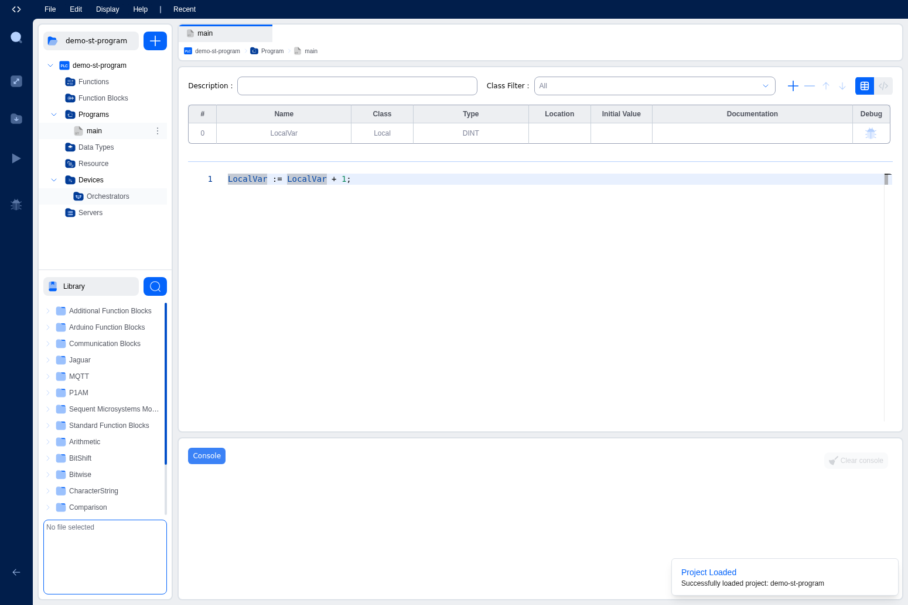

### Step 3: Connect to Your vPLC

In the project tree on the left side, expand **Devices** and click on **Orchestrators**. This opens the Device Orchestrators panel where you can see all your orchestrators and their vPLC devices.

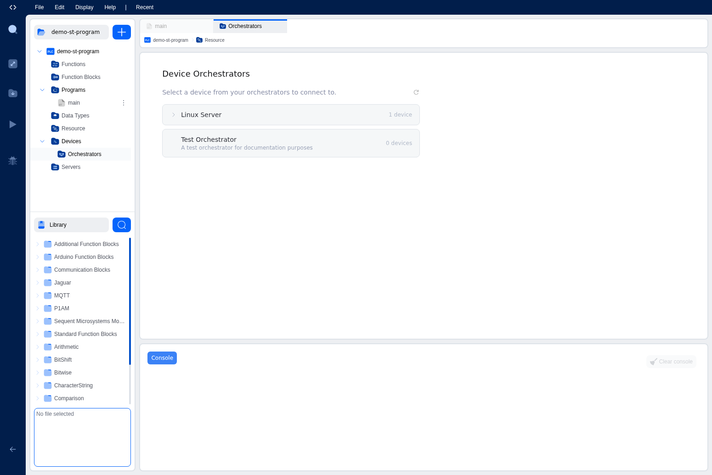

Expand your orchestrator to see the available vPLC devices. Each device shows its current status (running, stopped, etc.).

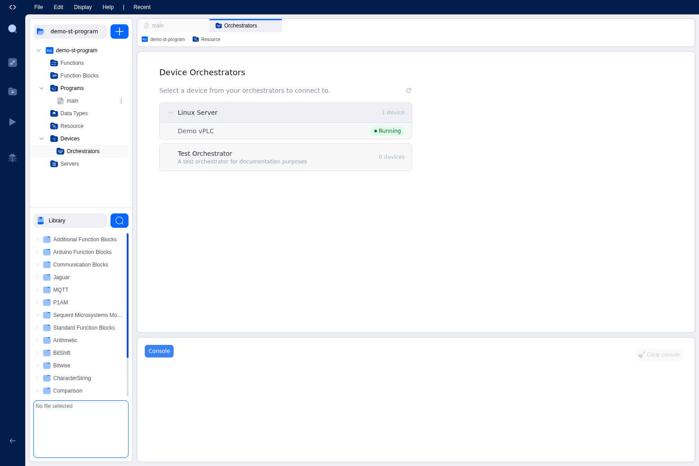

Click on your vPLC device to select it, then click the **Connect** button.

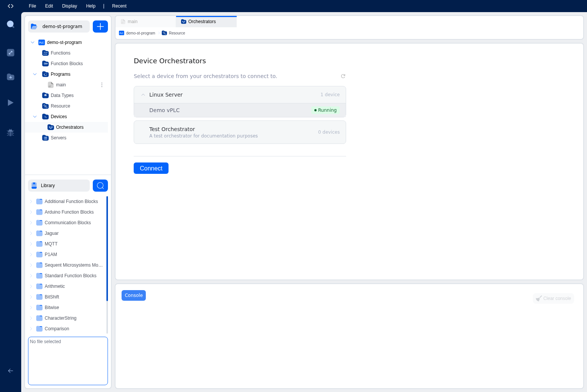

### Step 4: Create First User (First Connection Only)

If this is the first time connecting to a new vPLC, you'll be prompted to create the first user account for the OpenPLC Runtime. This is a security feature that ensures only authorized users can access the runtime.

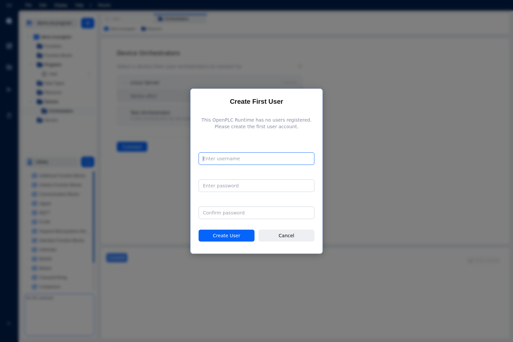

Enter a username and password, then click **Create User**. These credentials are stored locally on the vPLC and are used for all future connections.

### Step 5: Verify Connection

Once connected, you'll see the connection status change to "Connected" and the PLC Status will show "EMPTY" (indicating no program is loaded yet).

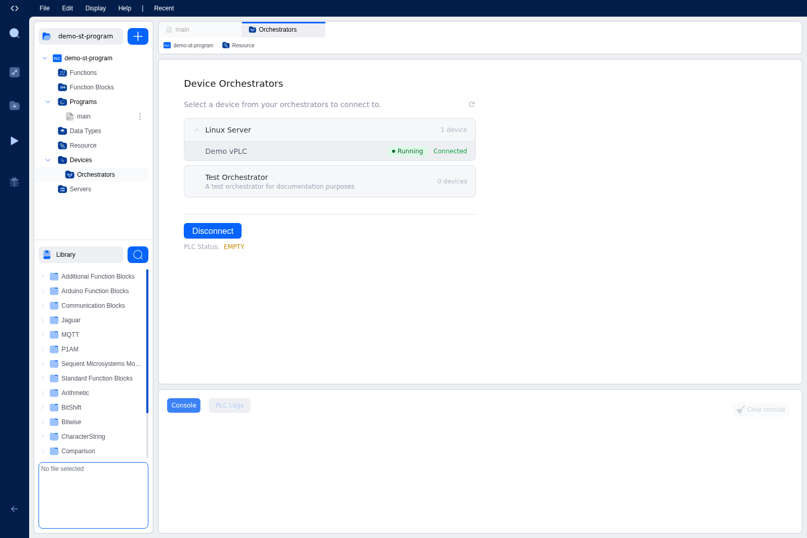

The Console panel at the bottom shows connection logs and will display build output when you upload a program.

### Step 6: Upload Your Program

With your vPLC connected, click the **Download** button (down arrow icon) in the left toolbar to compile and upload your program to the vPLC.

The Console panel shows the build process in real-time:

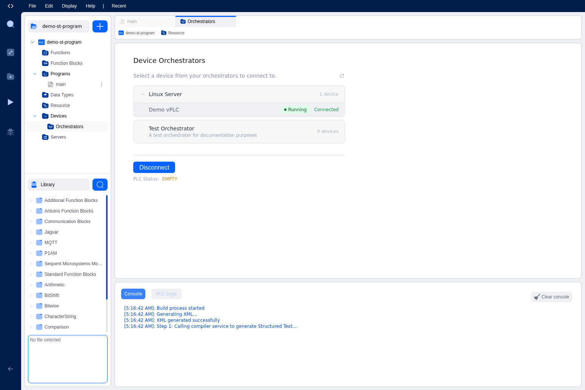

The build process includes several steps:
1. Generating XML from your project
2. Compiling Structured Text to C files
3. Generating debug files
4. Creating the upload package
5. Uploading to the runtime
6. Compiling on the runtime

### Step 7: Program Running

Once the upload completes successfully, the PLC Status changes to "RUNNING" and you'll see the Scan Cycle Statistics panel showing real-time performance metrics:

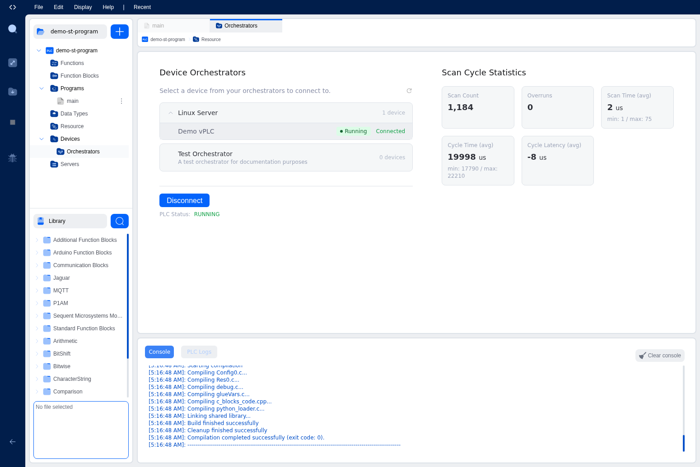

The statistics include:
- **Scan Count**: Number of scan cycles completed
- **Overruns**: Number of times the scan exceeded the cycle time
- **Scan Time (avg)**: Average time to execute the program logic
- **Cycle Time (avg)**: Average total cycle time including I/O
- **Cycle Latency (avg)**: Timing accuracy of the cycle

Your program is now running on the vPLC! The LocalVar variable is incrementing on every scan cycle.

## Next Steps

Now that you have a running vPLC with a program, you can:

- [Monitor your vPLC status](managing-status) and view detailed runtime statistics
- Create more complex programs using Ladder Diagram, Function Block Diagram, or other IEC 61131-3 languages
- Add Modbus communication to interact with remote I/O devices
- Create additional vPLCs on the same or different orchestrators
