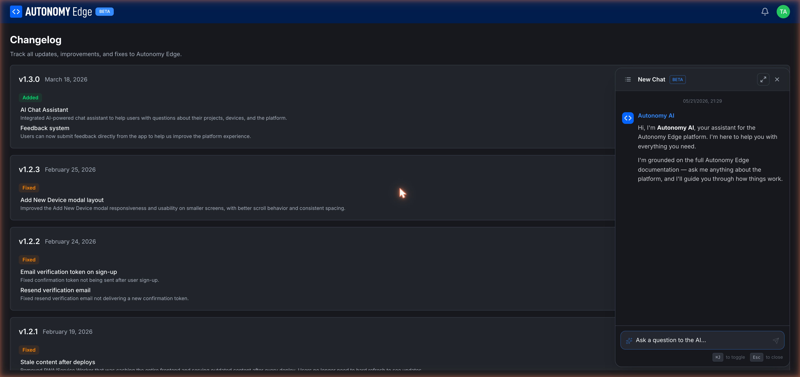

# Autonomy AI assistant

Every protected page has a sparkle button (✨) in the bottom-right. Click it (or press **⌘J** on macOS / **Ctrl+J** on Windows and Linux) to open the **Autonomy AI** assistant — an in-app chat trained on the platform's own documentation.

## What the assistant can do

The assistant is grounded on:

- These docs (every page you're reading).
- The Autonomy Edge platform itself (current screens, current state of your workspace where you've granted it permission).
- The OpenPLC v4 runtime documentation.
- IEC 61131-3 reference material.

It's designed to:

- **Explain a screen.** "What does the Devices tab on my orchestrator do?"
- **Walk you through a flow.** "How do I create a private project?" "How do I invite someone to my organization?"
- **Help with PLC programming.** "How do I write a TON timer in Structured Text?" "What's the difference between %IX and %QX?"
- **Diagnose problems.** "My vPLC is stuck in Stopped. What should I check?"

## What the assistant cannot do

- **Take actions for you.** It can tell you how to create a project, but it doesn't click the buttons.
- **Access private data it shouldn't.** It can see your own workspace because you authenticated; it can't see anyone else's private projects.
- **Make up information confidently.** If it doesn't know, it'll say so or point you to the docs to read directly. (Pay attention if it volunteers something with too much certainty — sanity-check unusual claims.)

## Opening and closing

- **Open**: click the sparkle button, or press **⌘J** / **Ctrl+J**.
- **Close**: click **×** in the panel header, press **Esc**, or press the shortcut again.
- **Expand to full screen**: click the corner-expand icon next to the **×**.

The shortcut works from anywhere — the dashboard, a project, the editor, the forum.

## The chat panel

When opened, the panel docks to the right side of the screen.

- **Header** — *New Chat* (with a BETA badge), a chat-history icon, expand, and close.
- **Chat history icon** — list of your prior conversations.
- **Conversation area** — your messages on the right, assistant responses on the left.
- **Input field** — *Ask a question to the AI…*, with a send button.

The assistant's first message in a fresh chat is a brief intro:

> Hi, I'm **Autonomy AI**, your assistant for the Autonomy Edge platform. I'm here to help you with everything you need. I'm grounded on the full Autonomy Edge documentation — ask me anything about the platform, and I'll guide you through how things work.

The conversation persists in your chat history so you can come back later.

## Cost and credits

The AI Chat assistant (this in-panel assistant) is **free on every plan, including Community.**

The **AI Engineer** features (deeper code generation, multi-step automation jobs that consume AI Credit Units) are tied to paid plans:

| Plan | AI Chat | AI Engineer |
|---|---|---|
| Community | ✓ | – |
| Education | ✓ | ✓ |
| Pro | ✓ | ✓ |
| Teams | ✓ | ✓ |
| Enterprise | ✓ | ✓ |

ACU consumption from AI Engineer jobs is tracked in **[Settings → Usage](../account/settings/usage)**. The plain chat assistant does not consume ACUs.

## Tips for getting good answers

- **Be specific.** "How do I configure a static IP on a vPLC?" beats "network help".
- **Mention what you've tried.** "I set the IP to 192.168.1.50 with mask 255.255.255.0 but the device shows N/A in Internal IP after restart."
- **Ask for short answers when you want short.** "In one sentence: …" or "Just the steps, no explanation."
- **Copy errors verbatim.** Paste the exact error text from the editor or the platform — the assistant matches them against the docs.

## Where to next

- **Browse these docs directly** → **[Index](../index)**.
- **Open an issue if the assistant is wrong** → **Feedback** in the user menu.
- **Track new AI features** → **[Changelog (in-app)](changelog-link)**.
