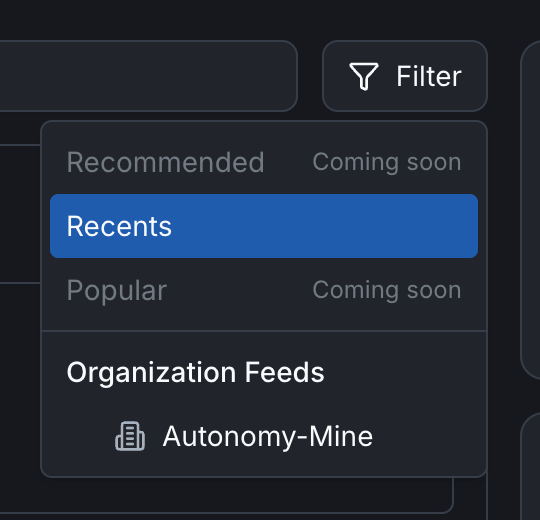

# Feed

The **feed** is the center column of your dashboard. It's a stream of recent activity from across the platform, projects being created, people joining the community, organization settings being updated.

## What appears in the feed

Activity entries the feed surfaces today:

- **{user} created a public project**: with a card linking to the project. You can star the project directly from the entry.
- **{user} joined the community**: a Welcome card with a wave emoji.
- **{user} updated organization settings**: when an org admin changes the org profile.

Each entry has the actor's avatar, name, action, relative timestamp ("1 weeks ago"), and the relevant card (project, user, or org).

Private activity (private projects, internal org events) never appears in feeds.

## The filter

Top right of the feed area is the **Filter** button. It opens a dropdown:

- **Recommended**: coming soon. Personalized recommendations based on what you star, follow, and view.
- **Recents** (default): the global activity stream, newest first.
- **Popular**: coming soon. Activity weighted by stars, comments, and views.
- **Organization Feeds**: one entry per organization you belong to. Picking one scopes the feed to that org's activity only.

The choice is saved per-session and reflected in the URL.

## Search

Above the feed, the **Search projects or users** box lets you full-text search across:

- Public project names and descriptions.
- User display names and usernames.
- Org names and descriptions.

Results appear as cards in the feed area, replacing the activity stream until you clear the search. Hit **Esc** or click the **×** in the search box to return to the feed.

## Interacting with feed items

You can:

- **Star** a project directly from its feed card (the star button on the right).
- **Click into** a project, user, or org to see its full page.
- **Reply** is not available in the feed itself: the feed is a discovery surface, not a comment thread. Comments live in the forum.

## How the feed is sourced

- **Recents** pulls activity from the platform globally and trims to public/shareable entries.
- **Organization Feeds** filters that stream to activity within a specific org slug, including private activity that you have permission to see.
- Refreshing the dashboard refreshes the feed. The feed itself doesn't push live updates today, new entries appear after a page reload.

## Where to next

- **Find specific projects** → use the search box, or the **[projects list](../projects/projects-list)**.
- **See forum activity instead** → **[Forum](../forum/overview)** or the **[Trending Topics](trending-topics)** widget on the right column.
- **Curate what you see** → the *Recommended* and *Popular* filters will help once they ship; until then, **[following users and projects](following-users-and-projects)** shapes what you see in the Recents feed.
