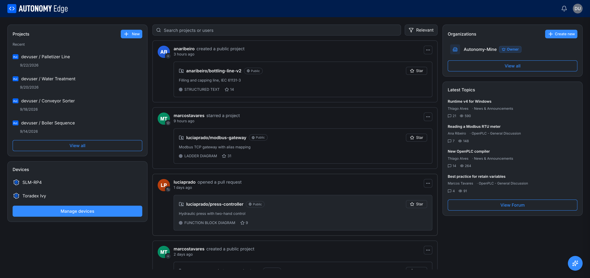
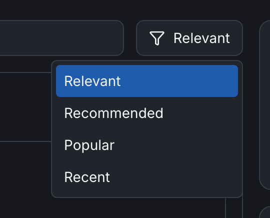

# Feed

The **feed** is the center column of your dashboard. It's a stream of recent activity from across the platform: projects being created and updated, projects getting stars, pull requests being opened, people joining the community.

## What appears in the feed

Activity entries the feed surfaces today:

- **{user} created a public project**: with a card linking to the project. You can star the project directly from the entry.
- **{user} updated the project**: a project card for a public project that changed.
- **{user} starred a project**: the starred project's card.
- **{user} opened a pull request**: the project card, for a pull request opened on a public project.
- **{user} joined the community**: a Welcome card with a wave emoji.

Each entry has the actor's avatar, name, action, relative timestamp ("1 weeks ago"), and the relevant card (project, user, or org).

Private activity (private projects, internal org events) never appears in feeds.

## The filter

Top right of the feed area is the **Filter** button, labelled with the current choice. It opens a dropdown:

- **Relevant** (default)
- **Recommended**
- **Popular**
- **Recent**

An organization's dashboard has its own feed, scoped to that organization, with **Relevant**, **Recommended** and **Popular**. To see it, switch to the organization's workspace.

The choice is saved per-session and reflected in the URL.

## Search

Above the feed, the **Search projects or users** box lets you full-text search across:

- Public project names and descriptions.
- User display names and usernames.
- Org names and descriptions.

Results appear as cards in the feed area, replacing the activity stream until you clear the search. Hit **Esc** or click the **×** in the search box to return to the feed.

## Interacting with feed items

You can:

- **Star** a project directly from its feed card (the star button on the right).
- **Click into** a project, user, or org to see its full page.
- **Reply** is not available in the feed itself: the feed is a discovery surface, not a comment thread. Comments live in the forum.

## How the feed is sourced

- The personal feed pulls activity from the platform globally and trims to public/shareable entries.
- The **organization feed**, on an organization's dashboard, is limited to that organization's activity.
- Refreshing the dashboard refreshes the feed. The feed itself doesn't push live updates today, new entries appear after a page reload.

## Where to next

- **Find specific projects** → use the search box, or the **[projects list](../projects/projects-list)**.
- **See forum activity instead** → **[Forum](../forum/overview)** or the **[Latest Topics](trending-topics)** card on the right column.
- **Curate what you see** → switch the **Filter** between *Relevant*, *Recommended*, *Popular* and *Recent*, and **[follow users and projects](following-users-and-projects)** you care about.
