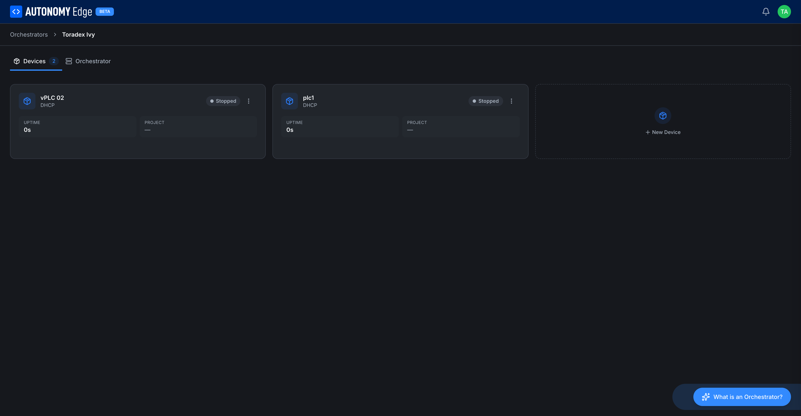
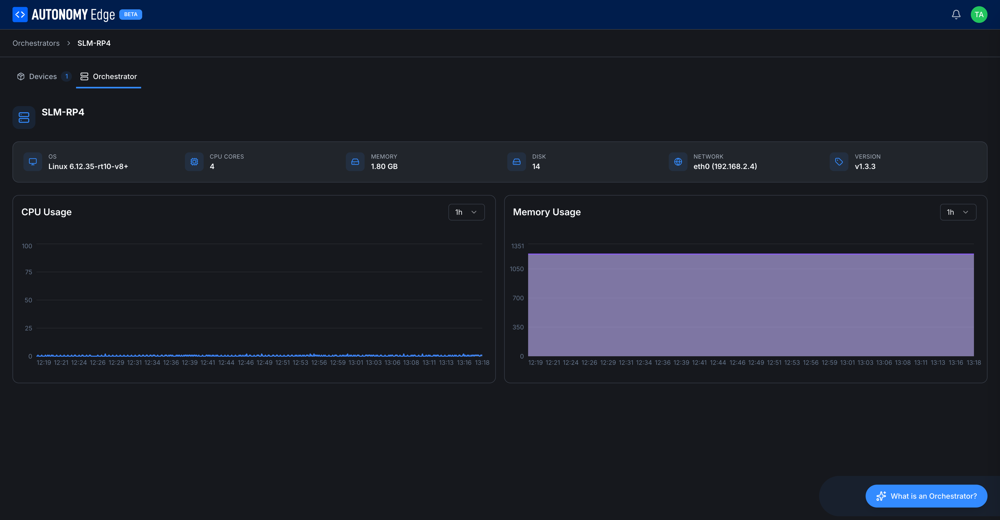

# Device detail

Clicking a Device card from the **[Devices list](devices-list)** opens its detail page. The page has two tabs: **vPLCs** (default) and **Device**.

## vPLCs tab

The vPLCs tab is a grid of every vPLC running (or stopped) on this Device, plus a **+ New vPLC** tile to add another.

Each vPLC card shows:

| Element | Description |
|---|---|
| **Icon** | Cube icon, always blue. |
| **Name** | The name you gave when you created the vPLC. |
| **Subtitle** | Network mode (`DHCP` or `Static`). |
| **Status badge** | `Running`, `Stopped`, or `Inactive`. |
| **3-dot menu** | Per-vPLC actions: start, stop, restart, edit, delete. |
| **UPTIME** | How long this vPLC has been up since its last start. |
| **PROJECT** | The project this vPLC is currently running, if any. |

Click anywhere on a card body to open **[vPLC detail](../vplcs/vplc-detail)**.

The **+ New vPLC** tile launches the **[New vPLC wizard](../vplcs/creating-a-vplc)**.

## Device tab

The Device tab is a read-only view of the edge device's specs and current resource usage.

### Header row

- **Device name** and status badge (Inactive / Active).
- Quick stats: **OS**, **CPU CORES**, **MEMORY** (total), **DISK** (total), **NETWORK** (primary interface and IP), **VERSION** (agent version).

These come from the agent's first heartbeat and are refreshed periodically. On an **Inactive** Device they show `-` because no data has been reported yet.

### CPU Usage chart

Live CPU utilization over time. The dropdown at the top right of the chart (`1h` by default) lets you change the window: 15m / 1h / 6h / 24h / 7d. The chart is empty for Devices that haven't been connected long enough to accumulate data.

### Memory Usage chart

Same controls and behavior as the CPU chart, for memory.

These charts come from the periodic heartbeat the agent sends. If the agent is alive but the chart is flat, check that the **VERSION** matches the latest release, older agent versions may not stream as many metrics as newer ones.

## Switching tabs

The tabs are sticky inside the Device detail page. Refreshing the page keeps you on the same tab thanks to the URL.

## Breadcrumb

At the top of the page, a breadcrumb shows **Devices → {Device name}** so you can jump back to the **[list](devices-list)** with one click.

## Where to next

- **Add or manage vPLCs** → **[Creating a vPLC](../vplcs/creating-a-vplc)**, **[vPLC detail](../vplcs/vplc-detail)**.
- **Rename / delete / re-pair** → **[Managing devices](managing-devices)**.
- **Inspect vPLC-level network info** → **[Network modes](../vplcs/network-modes)**.
