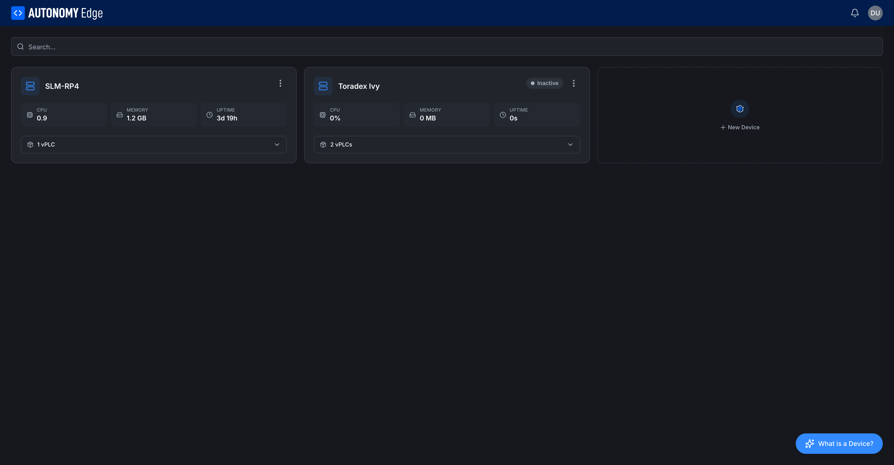
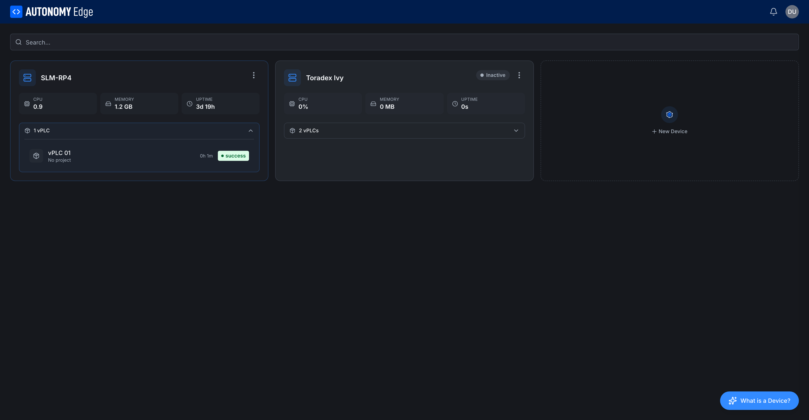

# Devices list

The Devices list shows every Device under the current workspace, one card per Device with live stats. Open it from the dashboard by clicking **Manage devices** on the **Devices** card.

## Toolbar

- **Search…**: filters cards by Device name as you type.
- **What is a Device?** floating button (bottom right): opens a short explainer modal. Same content as the **[overview](overview)** page.

## Device card

Each card shows:

| Element | Description |
|---|---|
| **Icon** (left) | A rack icon, always blue. |
| **Name** | The name you gave when you created it. |
| **Status badge** | **Inactive** (gray dot), **Active** (green dot, sometimes called **Connected**). |
| **3-dot menu** | Per-Device actions: **Rename**, **Update** (updates the Device Agent and the network monitor to the latest version; the vPLCs keep running) and **Delete**. See **[Managing devices](managing-devices)**. |
| **CPU** | Live CPU usage on the device, in cores (load average) or percent. |
| **MEMORY** | Live memory usage. Displayed in MB or GB depending on size. |
| **UPTIME** | How long the agent has been running. Resets if the agent restarts. |
| **N vPLCs** (expandable) | Number of vPLCs attached to this Device. Click to expand and see the list inline. |

Stats are blank or zero on an **Inactive** Device because the agent isn't reporting anything.

## Expanding the vPLCs list

Click the **N vPLCs** row at the bottom of any card to expand it inline:

Each vPLC row shows:

- vPLC icon.
- vPLC name (e.g. *vPLC 01*, *plc1*).
- Uptime.
- Project assignment (or *No project*).
- Status badge.

This is a quick way to see what's running on a given vPLC without leaving the list. To see a single vPLC's details, click its row, you'll land on the **[vPLC detail](../vplcs/vplc-detail)** page.

## Adding more Devices

The dashed **+ New Device** tile to the right of your existing cards opens the **[install wizard](installing-the-agent)**. The number of Devices you can have at once depends on your plan, see **[Plan limits](../../plans-and-billing/plan-limits)**.

## Sorting and filtering

Cards are listed in creation order. As more Devices are added, the search bar at the top is the fastest way to find one.

## Where to next

- **Click into a card** → **[Device detail](device-detail)**.
- **Add another Device** → **[Installing the Device Agent](installing-the-agent)**.
- **Rename or delete one** → **[Managing devices](managing-devices)**.
- **Add a vPLC** → **[Creating a vPLC](../vplcs/creating-a-vplc)**.
