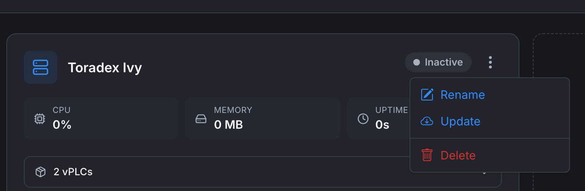

# Managing devices

Once a Device is paired you can rename it, update its agent, or delete it. All of these live in the Device card's **3-dot menu** on the **[Devices list](devices-list)**.

## Renaming a Device

1. On the Device card, click the **⋮** icon next to the status badge.
2. Choose **Rename**.
3. Enter a new name and confirm.

The name change is reflected immediately everywhere the Device is shown (cards, detail page, breadcrumbs, dropdowns in the editor).

The Device's ID and certificate are unchanged. The agent on the device continues to work without intervention.

## Updating the agent

Choose **Update** from the 3-dot menu. The platform pushes a command to the agent to pull the latest image and restart itself.

During the update:

- vPLCs that are running keep running. They reconnect to the agent after the restart.
- The Device's status briefly flips to **Inactive** while the agent restarts, then back to **Active**.
- The version shown on the Device's **Orchestrator** tab updates to the new version.

You can also re-run the install command on the device (`curl https://getedge.me | bash`) to upgrade manually if the cloud-side **Update** action fails.

## Deleting a Device

1. 3-dot menu → **Delete**.
2. Confirm the dialog. You may need to type the Device's name to confirm.

Deletion **permanently removes**:

- The Device entry and its certificate.
- All vPLC entries associated with it.
- Any historical metrics for that Device.

It does **not** automatically uninstall the agent on the device. If the device is still running the agent, it will keep retrying to connect with stale credentials and fail. Either:

- Uninstall the agent on the device (`curl https://getedge.me | bash -s -- --uninstall`), or
- Pair the device with a *new* Device entry by running the install command again.

## Disconnecting temporarily

There isn't a "pause" action today. To temporarily disconnect:

- Stop the agent container on the device (`docker stop orchestrator-agent`), the Device goes Inactive in the web app.
- Start it again (`docker start orchestrator-agent`), status returns to Active within a few seconds.

vPLCs that were running before the agent stopped keep running. They reconnect to the agent on restart automatically.

## Moving a vPLC between Devices

Not supported today. The vPLC entry is bound to its parent Device. To migrate workload:

1. Create a new vPLC on the destination Device (**[Creating a vPLC](../vplcs/creating-a-vplc)**).
2. Deploy the same project to it from the editor.
3. Delete the original vPLC from the source Device.

## Where to next

- **Add vPLCs to a renamed Device** → **[Creating a vPLC](../vplcs/creating-a-vplc)**.
- **Check on uptime and metrics** → **[Device detail](device-detail)**.
- **Connection issues** → **[Device not connecting](../../troubleshooting/device-not-connecting)**.
