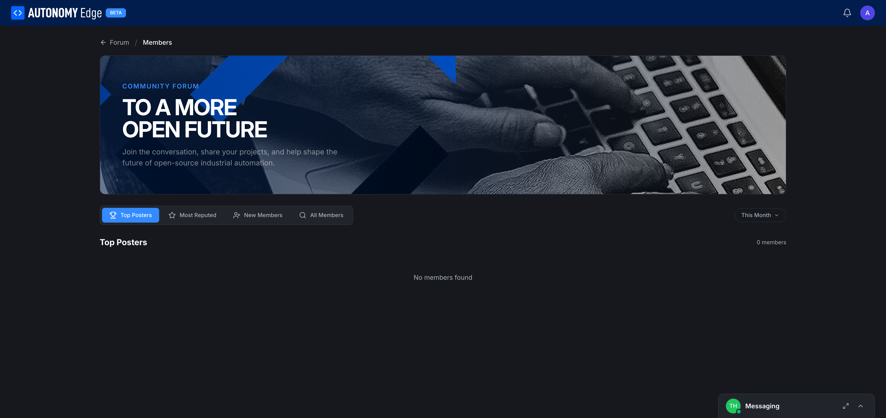

# Members directory

The forum has a public **Members directory**, a leaderboard-style view of everyone with a forum account.

URL: `edge.autonomylogic.com/forum/members`.

## Tabs

Across the top:

- **Top Posters** *(default)*: members with the most posts in the selected period.
- **Most Reputed**: members with the highest reputation score. Reputation comes from upvotes received on posts.
- **New Members**: most recent signups, newest first.
- **All Members**: full list, default sort by name.

Tabs are bookmarkable via URL parameters.

## Time-window selector

Top right of the table is a **This Month** dropdown. Other options:

- **This Week**
- **This Month** *(default)*
- **This Year**
- **All Time**

The selected window applies to Top Posters and Most Reputed. New Members and All Members ignore the window.

## What you see for each member

Each row shows:

- **Avatar** (clickable → profile).
- **Display name** and **@username** (clickable → profile).
- **Member title** (if they've earned one, e.g. *Regular*, *Trust Level 2*).
- **Post count** for the period.
- **Reputation** total.
- **Joined** date.
- (Some rows show extra badges for moderators, admins, or Patreons.)

A **Message** action appears on hover (or as part of the row's overflow menu), opens a DM to that person. See **[Messaging](messaging)**.

## Why use the directory

- **Find an expert.** If you're stuck on EtherCAT, sort by Top Posters in *OpenPLC Hardware* (if a category filter ships) or just scan reputed posters and DM them.
- **Greet new members.** New Members tab is a friendly place to welcome people. The platform values warm onboarding.
- **Look up someone you remember from a thread.** Faster than searching their post for their name.

## Sorting and search

- **Click a column header** to sort by that column.
- **Search by name/username** with the search field above the table (when populated).

## Privacy

- Every signed-in user is visible in the directory by default.
- There isn't a "hide me from the directory" toggle today. If you want to be invisible, the only option is not to post, once you post, you appear.

## Where to next

- **Open someone's profile** → click their avatar or name in any row.
- **DM someone** → hover row → **Message**, or use their profile's **Message** button.
- **Read what they've posted** → their profile's posts list.
