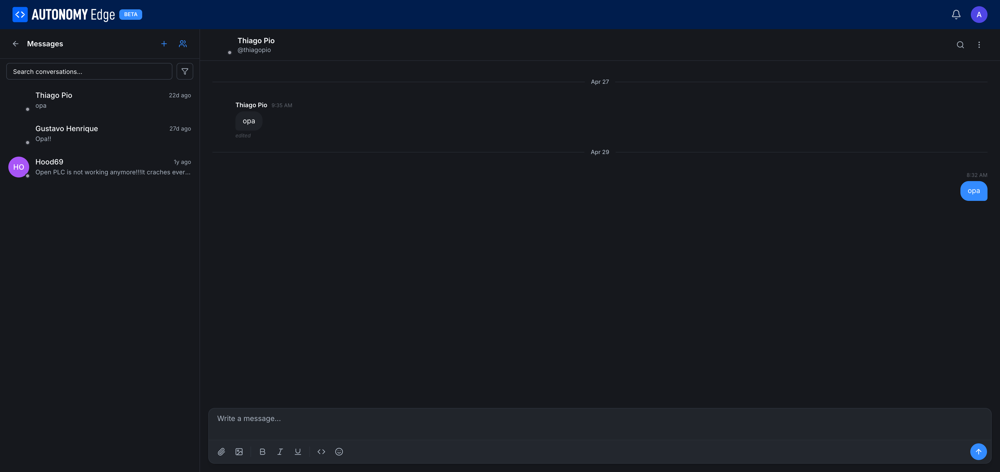

# Messaging

The forum has built-in **direct messaging**, one-to-one and group chats with anyone on the platform. It's the right tool when a conversation doesn't belong in a public thread.

URL: `edge.autonomylogic.com/forum/messages`.

## Layout

Two panes:

- **Left pane: conversation list.** A search box at the top, then the list of conversations sorted by most recent. Each entry shows the other participant's name (or a group label), the last message snippet, and a relative timestamp.
- **Right pane: chat.** The selected conversation. Other participant's name and online dot at the top. Message thread in the middle. Compose box at the bottom.

## Starting a new conversation

From the conversation list, click the **+** icon near the top. The platform asks for one or more recipients (autocompleted by username). Pick:

- **One recipient** → a 1:1 DM.
- **Multiple recipients** → a group chat.

Once selected, the chat panel opens and you can send your first message.

You can also start a DM from a user's profile via the **Message** button (when allowed by the recipient's privacy settings).

## Privacy and consent

Group chat invitations have a privacy setting: **Allow group chat invitations** in **[Settings → Privacy](../../account/settings/privacy)**.

- **On (default)**: anyone can include you in a group chat.
- **Off**: you stop appearing in the group-chat user picker and nobody can add you to a new group. Existing group chats are unaffected.

1:1 DMs are always allowed today; toggling the privacy setting only affects group chats.

## Composing a message

The compose box at the bottom of the chat pane has a rich-text toolbar:

| Icon | Action |
|---|---|
| 📎 | Attach a file (any type). |
| 🖼️ | Attach an image (with a preview before sending). |
| **B** / *I* / U | Bold / italic / underline. |
| `<>` | Inline code / code block. |
| 😀 | Emoji picker. |

Hit Enter to send. Shift+Enter inserts a newline.

## Message states

Each message has a small status indicator:

- **Sending**: message hasn't been delivered yet (briefly).
- **Sent**: delivered to the platform.
- **Delivered**: pushed to recipient(s).
- **Read**: at least one recipient has opened the chat since you sent.

In a 1:1 chat the "read" indicator is straightforward. In a group chat, "read" means at least one of the other participants has opened the chat after you sent.

## Editing and deleting

Hover a message you sent. The actions appear:

- **Edit**: within a short window after sending.
- **Delete**: removes the message for everyone. The thread shows a small "Message deleted" placeholder so nobody is confused by missing context.

You cannot edit or delete other people's messages.

## Searching across conversations

The search box at the top of the conversation list does a substring search across:

- Other participants' names.
- Message contents (full text).

Tapping a result jumps to that message in the relevant conversation.

## Notifications

You get a notification (in-app and email, controlled in **[Privacy settings](../../account/settings/privacy)**) when:

- A new DM arrives in any conversation you're in.
- Someone adds you to a group chat (the *first* message in the new group; subsequent messages follow the per-conversation setting).

## Limits

- **Group size** has a soft cap; group chats are intentionally small (typically up to 15–20 members) to keep conversations useful. Beyond that, a public forum thread or an organization is a better tool.
- **Attachment size**: typically up to 25 MB per file. For larger transfers, share a link.

## Where to next

- **Reply to threads publicly instead** → **[Replying and reactions](replying-and-reactions)**.
- **Find someone to message** → **[Members directory](members)**.
- **Adjust who can DM you** → **[Settings → Privacy](../../account/settings/privacy)**.
