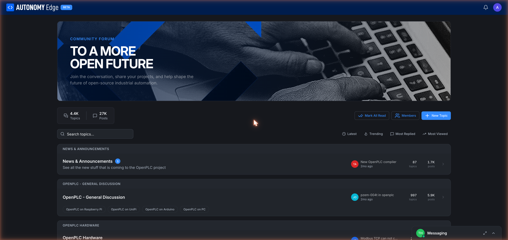

# Forum overview

The Autonomy Edge **forum** is a Discourse-style discussion board for everything OpenPLC and Autonomy Edge: news, project sharing, hardware help, bug reports, and general discussion. It's the busiest community surface on the platform.

URL: `edge.autonomylogic.com/forum`.

## The forum is global

Unlike projects and orchestrators, the forum is not workspace-scoped. There's one forum for everyone, regardless of which slug you're on. Posting in the forum uses your account identity (display name and avatar) directly.

## What the home page shows

**Hero banner.** A static banner: *Community Forum — To a more open future. Join the conversation, share your projects, and help shape the future of open-source industrial automation.*

**Toolbar.** Below the hero, a row of summary stats and actions:

- **N Topics** and **M Posts** — running totals.
- **Mark All Read** — clears all unread badges for you.
- **Members** — link to the **[Members directory](members)**.
- **+ New Topic** — opens the **[new topic editor](posting-a-topic)**.

**Search and sort.** Below the toolbar:

- **Search topics** — full-text search.
- **Latest** / **Trending** / **Most Replied** / **Most Viewed** — sort the topic feed.

**Categories.** The rest of the page is a list of categories. Each category card has:

- The category name (e.g. *News & Announcements*).
- A short description.
- A small avatar of the most recent poster.
- The latest topic title.
- "Xmo ago" timestamp.
- Topic and post counts.

Clicking a category opens its **[board page](reading-and-searching)** with that category's topics.

## Categories on the OpenPLC forum

Today's categories include:

- **News & Announcements** — official platform and runtime updates.
- **OpenPLC - General Discussion** — open-ended Q&A, with sub-tags for *Raspberry Pi*, *UniPi*, *Arduino*, *PC*.
- **OpenPLC Hardware** — hardware-specific questions.
- **OpenPLC Editor** — editor bugs, feature requests, usage tips.
- **Sample PLC Programs** — share programs you've written.
- **OpenPLC Projects** — long-form project showcases.
- **Custom Function Blocks** — share blocks written in Python or C++.
- **OpenPLC em Português** — Portuguese-language section.
- **Bug Reports** — formal bug reports against the platform.
- **Patreons Only** — gated category for Patreon supporters.

Categories are created and managed by platform admins; users post into existing ones.

## Reading without signing in

You can browse the forum and read every public thread without an account. To post, reply, star, or DM, you need to be signed in.

## Where to next

- **Browse a category** → **[Reading and searching](reading-and-searching)**.
- **Start a new topic** → **[Posting a topic](posting-a-topic)**.
- **Reply to an existing one** → **[Replying and reactions](replying-and-reactions)**.
- **Look up a specific person** → **[Members directory](members)**.
- **Send a private message** → **[Messaging](messaging)**.
- **Report a post** → **[Moderation](moderation)**.
