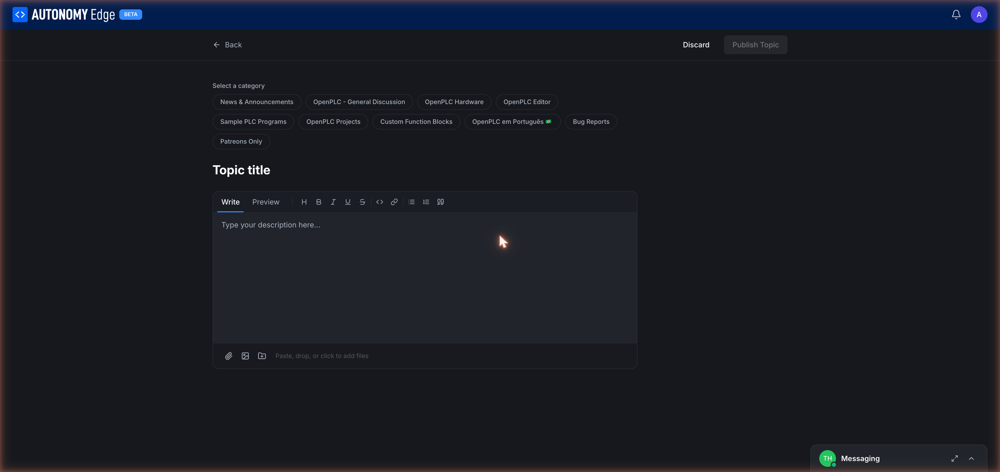

# Posting a topic

A **topic** is the unit of conversation in the forum. To start one, you need a signed-in account and a few minutes to write a clear title and body.

Reach the composer by clicking **+ New Topic** from the forum home or any board page.

## Pick a category

The first thing the page asks for is the category. A row of chips lists every available category:

- **News & Announcements**
- **OpenPLC - General Discussion**
- **OpenPLC Hardware**
- **OpenPLC Editor**
- **Sample PLC Programs**
- **OpenPLC Projects**
- **Custom Function Blocks**
- **OpenPLC em Português** (Portuguese-language)
- **Bug Reports**
- **Patreons Only**

If you arrived here from a board page, the category is pre-selected. You can change it.

Pick the most specific category that fits. The wrong category usually leads to fewer responses, wrong-category topics often get moved by moderators, but it costs an hour or two.

## Topic title

Below the categories, a large **Topic title** field. Some guidance:

- Be specific. "ModbusTCP server in OpenPLC won't accept connections from Schneider M580" beats "Modbus problem".
- Lead with the noun, not "Help with" or "Question about".
- 60–80 characters is a sweet spot: long enough to be descriptive, short enough to fit in the topic list.

## The editor

Below the title is a rich-text editor with two tabs:

- **Write**: markdown editor where you type your post.
- **Preview**: rendered view to verify formatting before publishing.

The toolbar across the top has the standard formatting actions:

| Icon | Action |
|---|---|
| **H** | Heading (h1/h2/h3 cycling). |
| **B** | Bold. |
| *I* | Italic. |
| U | Underline. |
| S | Strikethrough. |
| `<>` | Inline code or code block. |
| 🔗 | Insert link. |
| • | Bulleted list. |
| 1. | Numbered list. |
| `"` | Block quote. |

The editor accepts markdown syntax directly, typing `**bold**` produces bold without using the toolbar.

## Attaching files

Below the editor body is the attachment area: *Paste, drop, or click to add files.*

Three ways to attach:

- **Paste**: Cmd/Ctrl+V from the clipboard. Useful for screenshots.
- **Drag and drop**: drag files from your file manager into the area.
- **Click**: opens a file picker.

Common attachments:

- Screenshots of the editor or the platform showing the issue.
- Wiring diagrams.
- Small project zips (under 10 MB).
- Logs as `.txt` or `.log` files.

Large files (videos, big datasets), link out to YouTube, Google Drive, or GitHub instead of attaching.

## Publishing

Top right of the page:

- **Discard**: abandon the draft and go back.
- **Publish Topic**: publish and land on the thread page. The topic appears in its category immediately.

Drafts are not saved server-side today, if you close the browser without publishing, your work is lost. Save important drafts in a markdown file or paste them into a private note while writing.

## Good-topic checklist

Before clicking **Publish Topic**:

- [ ] Right category?
- [ ] Title is specific?
- [ ] Body says *what* you tried and *what* happened?
- [ ] Relevant version info included (runtime version, agent version, OS)?
- [ ] Attached the right files (screenshots, logs)?
- [ ] No private data (passwords, API keys, internal customer info) in screenshots or paste?

## Editing after publishing

You can edit your own topic for a limited window after publishing. The edit pencil appears on hover over your own post. After the window closes, you can still request edits by flagging the post with a "Please edit" reason or by asking a moderator.

## Where to next

- **Reply or react to threads you find** → **[Replying and reactions](replying-and-reactions)**.
- **Direct-message someone instead of posting publicly** → **[Messaging](messaging)**.
- **Browse what's already been asked** → **[Reading and searching](reading-and-searching)**.
