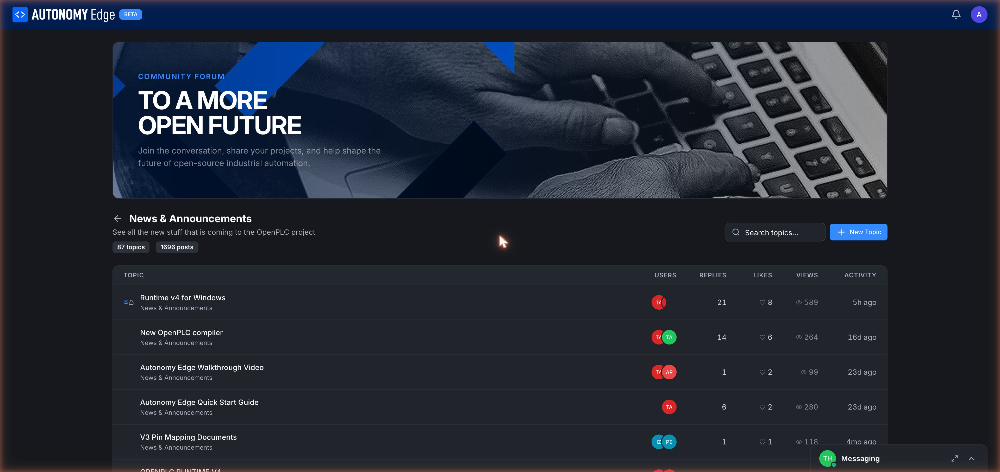
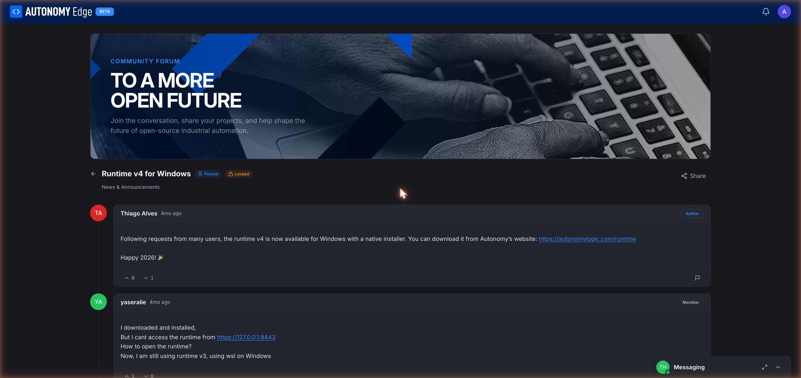

# Reading and searching

Once you're past the forum home, most of your time is spent on **board pages** (a category's topic list) and **thread pages** (a single conversation).

## Board pages

URL: `edge.autonomylogic.com/forum/board/{boardSlug}`. Click any category on the forum home to land here.

**Header.** A back arrow takes you to the forum home. The category name and description sit above the topic table. Stats — *87 topics · 1696 posts* — are right under the title.

**Toolbar.** Same actions you saw on the home page, scoped to this board:

- **Search topics** — searches within this category.
- **+ New Topic** — pre-fills the category when you start a new topic.

**Topic table.** Each row is a topic. Columns:

| Column | Notes |
|---|---|
| **TOPIC** | Title (link), with badges for **Pinned 📌** and **Locked 🔒** if applicable. The category name appears below the title. |
| **USERS** | A few avatars of recent participants. |
| **REPLIES** | Comment count. |
| **LIKES** | Likes count. |
| **VIEWS** | Eye icon and view count. |
| **ACTIVITY** | Relative time of the last activity (e.g. "5h ago", "16d ago"). |

Click any topic to open the thread.

## Sorting topics

Sort options live on the forum home and reuse the same sort across boards:

- **Latest** — by most recent activity (default).
- **Trending** — current platform-scored "hotness".
- **Most Replied** — highest reply count first.
- **Most Viewed** — highest view count first.

Bookmarkable: sorts are reflected as URL parameters.

## Thread pages

URL: `edge.autonomylogic.com/forum/thread/{threadSlug}`. Click a topic title from a board to land here.

**Header.** Back arrow → board. Topic title with badges. Category name below the title. **Share** button on the right (copy a direct URL to clipboard).

**Posts.** Each post in the thread is a card:

- Author avatar.
- Author display name (clickable → profile).
- Role badge: **Author** for the original poster, **Member** for normal users, **Moderator** / **Admin** for platform staff.
- Relative timestamp.
- Post body, with markdown rendering — links, code blocks, lists, images.
- **Up/down vote** counters at the bottom of the post.
- **Flag** icon to report the post (see **[Moderation](moderation)**).
- A reply/quote action on hover.

The original post is always at the top. Replies follow chronologically below it. Long threads paginate.

## Searching

Search exists at three levels:

1. **Site-wide** (header search on the dashboard) — searches projects and users, not forum content.
2. **Forum home** — full-text search across every topic in every category.
3. **Board** — full-text search within one category.

Search results show topic titles with a snippet of matching text and the category badge.

To navigate to a specific thread by URL when you know the slug, use `/forum/thread/<slug>` directly.

## Bookmarks and unread state

- **Read state** is tracked per topic. A topic with new posts since your last visit shows a small "new" badge.
- The **Mark All Read** action on the forum home clears the unread state for every topic.
- Per-topic, you can set notification preferences (Watching / Tracking / Normal / Muted) from the topic page's *Notifications* control once it lands. Today the default is Tracking — you'll see unread badges, you won't get push notifications.

## Where to next

- **Post your own topic** → **[Posting a topic](posting-a-topic)**.
- **Reply or react** → **[Replying and reactions](replying-and-reactions)**.
- **Find people, not topics** → **[Members directory](members)**.
- **Direct message** → **[Messaging](messaging)**.
