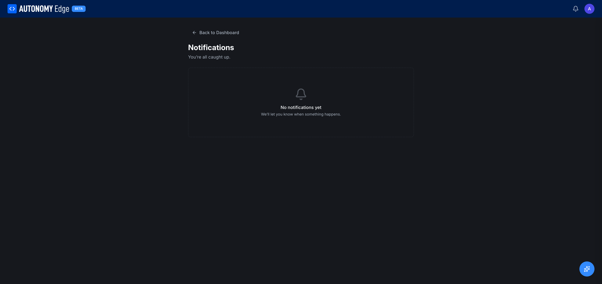

# Notifications

Notifications keep you in the loop about platform events that matter, replies to your topics, PRs awaiting your review, org invitations, plan limit warnings.

There are two surfaces:

1. **The bell icon** in the header on every protected page. A small dot appears when you have unread notifications.
2. **The notifications page** at `edge.autonomylogic.com/notifications`.

## What appears

Notifications come from these sources:

| Source | Examples |
|---|---|
| **Forum** | Replies to your topics, replies to your posts, @mentions, DM received. |
| **Projects** | PR review requested, PR comment, PR merged or closed. |
| **Organizations** | Invitation received, invitation accepted, role changed, removed from org. |
| **Billing** | Plan limit reached, payment failed, trial ending soon, subscription renewed. |
| **System** | Verification email status, security events (password changed, email changed), platform announcements. |

Each notification shows:

- An icon for the source.
- A short title.
- A snippet of context.
- Relative timestamp.
- A click-through link to the relevant page (the thread, the PR, the invitation, etc.).

## Reading and dismissing

- Clicking a notification opens its target and marks the notification as read.
- A **Mark all as read** action at the top of the page clears every unread state at once.
- Read notifications stay in the list for history; they just lose the unread visual indicator.

There's no per-notification delete today. Pruning happens server-side after a retention period.

## The bell badge

The header bell icon shows a small dot when you have unread notifications. Clicking the bell opens a popover preview of the most recent items, with a **See all** link to the full page.

You can also navigate to the full page directly: `edge.autonomylogic.com/notifications`.

## Email notifications vs in-app

In-app notifications are always on. Email notifications are opt-in/opt-out per category:

- **Weekly forum digest**: Monday-morning email summarizing the 15 most active forum topics from the past week. Off when you haven't visited the forum recently *and* the digest setting is on.
- **@mention emails**: when someone tags you with `@username` in a forum post.
- **Replies to topics you started**: when someone posts in your topic.
- **Group chat invitations**: when someone adds you to a new group chat.
- **Project / PR events**: review requests, comments on your PRs, merges.

Toggle all of these in **[Settings → Privacy](../account/settings/privacy)**.

## Notification volume

If you're getting too many notifications:

1. Turn off email categories that aren't critical (digest, replies, mentions).
2. Mute specific forum topics you no longer follow.
3. Leave organizations whose activity isn't relevant.

If you're getting too few:

1. Verify you're not in "Muted" notification mode on key topics.
2. Check that the verifying email isn't going to spam.
3. Confirm your email is verified, unverified accounts have notifications throttled.

## What's NOT here

- **Push notifications to mobile devices.** Not yet supported.
- **SMS notifications.** Not supported.
- **Slack / Teams integrations.** Future feature; track the changelog.

## Where to next

- **Tune what triggers email** → **[Settings → Privacy](../account/settings/privacy)**.
- **See the latest platform changes** → **[Changelog (in-app)](changelog-link)** or click *What's new* in the user menu.
- **DMs sit in the forum, not here** → **[Messaging](forum/messaging)**.
