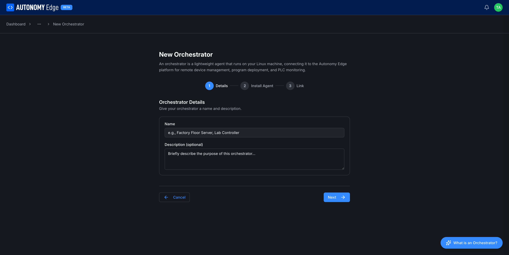
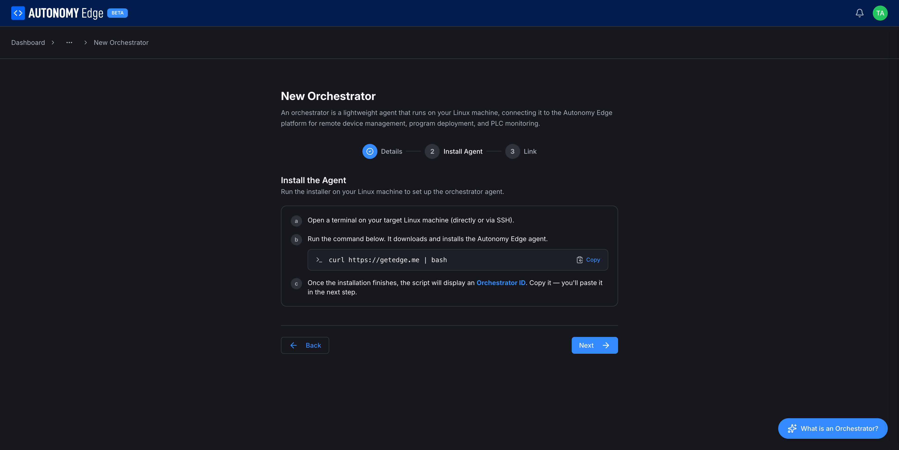
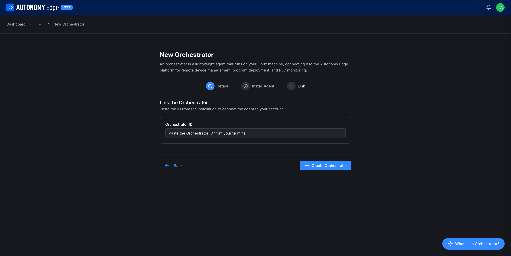

# Installing the agent

Adding an orchestrator is a three-step wizard. You'll work in two places: your browser (to create the orchestrator) and a terminal on your Linux edge device (to install the agent).

## What you need before you start

- A Linux edge device with:
  - 64-bit kernel.
  - Docker installed and running (the installer will offer to install it for you on supported distributions).
  - Network access to `edge.autonomylogic.com` over HTTPS/WebSocket.
  - Either root access or a user that can `sudo`.
- A browser session signed in to Autonomy Edge.
- An orchestrator slot available on your plan. See **[Plan limits](../../plans-and-billing/plan-limits)** if you've used your quota.

## Step 1, Open the wizard

In the web app, navigate to **[Orchestrators](orchestrators-list)** (`edge.autonomylogic.com/{slug}/orchestrators`). Click the **+ New Orchestrator** tile (the dashed card with a plus icon).

The wizard opens on a dedicated page at `/{slug}/orchestrators/create`.



At the top: a short summary of what an orchestrator is. Below it, a 3-step indicator: **1. Details** (selected), **2. Install Agent**, **3. Link**.

## Step 2, Enter details

| Field | Required | Notes |
|---|---|---|
| **Name** | Yes | Any human-readable name. Used to identify this orchestrator everywhere in the platform. Examples: *Factory Floor Server*, *Lab Controller*, *Toradex Ivy*, *Demo*. |
| **Description** *(optional)* | No | What this orchestrator is for. Helpful when you have several. |

Click **Next**. (You can also use **Cancel** to abort.)

## Step 3, Install the agent on your device

The wizard now shows three numbered steps (a, b, c) for the install.



The instructions:

> **a.** Open a terminal on your target Linux machine (directly or via SSH).
>
> **b.** Run the command below. It downloads and installs the Autonomy Edge agent.
>
> ```bash
> curl https://getedge.me | bash
> ```
>
> **c.** Once the installation finishes, the script will display an **Orchestrator ID**. Copy it, you'll paste it in the next step.

Click **Copy** next to the command to grab it to your clipboard, paste it into your terminal, and run.

The installer will:

1. Check prerequisites (Docker, networking, kernel features).
2. Pull the latest agent container image and the network-monitor sidecar.
3. Generate device-side TLS keys and certificates for the mTLS connection.
4. Display an **Orchestrator ID** in the terminal once it's running.

> The Orchestrator ID generated by the wizard **expires after 5 minutes**. If the install takes longer or you get distracted, just close the wizard and start step 1 again, there's no penalty for restarting.

Click **Next** when you have the ID.

## Step 4, Pair the agent with the cloud



A single field: **Orchestrator ID**. Paste the ID that was printed in the terminal.

Click **Create Orchestrator** at the bottom right. The platform:

- Validates the ID.
- Records the public certificate the agent sent over.
- Marks the orchestrator as paired.

A few seconds later the orchestrator's status flips to **Active** (or **Connected**) on the orchestrators list. You're done.

## What if the ID expired?

Run `curl https://getedge.me | bash` again on the device. The installer detects the existing install and offers to re-generate the registration ID. Paste the new one into the wizard.

If the wizard has already timed out, close it and start over from **+ New Orchestrator**.

## Verifying the install

After pairing, the orchestrator card on the **[Orchestrators list](orchestrators-list)** shows live CPU, memory, and uptime metrics that match what `top` shows on the device. If those numbers stay at zero or the status stays **Inactive**, see **[Orchestrator not connecting](../../troubleshooting/orchestrator-not-connecting)**.

You can now:

- Add a vPLC device → **[Creating a vPLC](../vplcs/creating-a-vplc)**.
- View detailed metrics → **[Orchestrator detail](orchestrator-detail)**.

## Uninstalling the agent

To remove the agent from a device:

```bash
curl https://getedge.me | bash -s -- --uninstall
```

This stops the agent and network-monitor containers, removes their images, and deletes the TLS material. The orchestrator entry in the web app is not automatically deleted; remove it from **[Managing orchestrators](managing-orchestrators)**.
