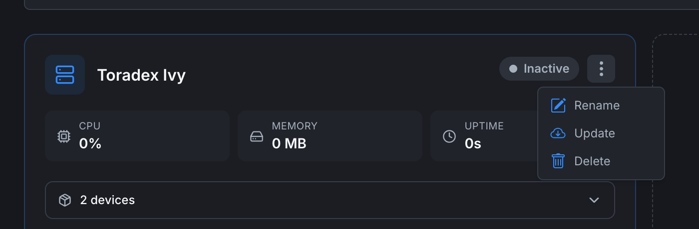

# Managing orchestrators

Once an orchestrator is paired you can rename it, update its agent, or delete it. All of these live in the orchestrator card's **3-dot menu** on the **[Orchestrators list](orchestrators-list)**.

## Renaming an orchestrator

1. On the orchestrator card, click the **⋮** icon next to the status badge.
2. Choose **Rename**.
3. Enter a new name and confirm.

The name change is reflected immediately everywhere the orchestrator is shown (cards, detail page, breadcrumbs, dropdowns in the editor).

The orchestrator's ID and certificate are unchanged. The agent on the device continues to work without intervention.

## Updating the agent

Choose **Update** from the 3-dot menu. The platform pushes a command to the agent to pull the latest image and restart itself.

During the update:

- vPLCs that are running keep running. They reconnect to the agent after the restart.
- The orchestrator's status briefly flips to **Inactive** while the agent restarts, then back to **Active**.
- The version shown on the orchestrator's **Orchestrator** tab updates to the new version.

You can also re-run the install command on the device (`curl https://getedge.me | bash`) to upgrade manually if the cloud-side **Update** action fails.

## Deleting an orchestrator

1. 3-dot menu → **Delete**.
2. Confirm the dialog. You may need to type the orchestrator's name to confirm.

Deletion **permanently removes**:

- The orchestrator entry and its certificate.
- All vPLC device entries associated with it.
- Any historical metrics for that orchestrator.

It does **not** automatically uninstall the agent on the device. If the device is still running the agent, it will keep retrying to connect with stale credentials and fail. Either:

- Uninstall the agent on the device (`curl https://getedge.me | bash -s -- --uninstall`), or
- Pair the device with a *new* orchestrator entry by running the install command again.

## Disconnecting temporarily

There isn't a "pause" action today. To temporarily disconnect:

- Stop the agent container on the device (`docker stop orchestrator-agent`), the orchestrator goes Inactive in the web app.
- Start it again (`docker start orchestrator-agent`), status returns to Active within a few seconds.

vPLCs that were running before the agent stopped keep running. They reconnect to the agent on restart automatically.

## Moving a vPLC between orchestrators

Not supported today. The vPLC entry is bound to its parent orchestrator. To migrate workload:

1. Create a new vPLC on the destination orchestrator (**[Creating a vPLC](../vplcs/creating-a-vplc)**).
2. Deploy the same project to it from the editor.
3. Delete the original vPLC from the source orchestrator.

## Where to next

- **Add devices to a renamed orchestrator** → **[Creating a vPLC](../vplcs/creating-a-vplc)**.
- **Check on uptime and metrics** → **[Orchestrator detail](orchestrator-detail)**.
- **Connection issues** → **[Orchestrator not connecting](../../troubleshooting/orchestrator-not-connecting)**.
