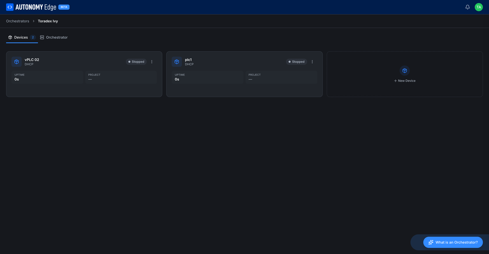
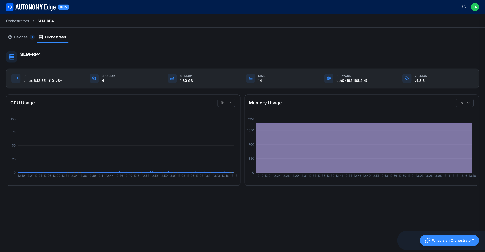

# Orchestrator detail

Clicking an orchestrator card from the **[Orchestrators list](orchestrators-list)** opens its detail page. The page has two tabs: **Devices** (default) and **Orchestrator**.

## Devices tab

The devices tab is a grid of every vPLC running (or stopped) on this orchestrator, plus a **+ New Device** tile to add another.

Each device card shows:

| Element | Description |
|---|---|
| **Icon** | Cube icon, always blue. |
| **Name** | The name you gave when you created the device. |
| **Subtitle** | Network mode (`DHCP` or `Static`). |
| **Status badge** | `Running`, `Stopped`, or `Inactive`. |
| **3-dot menu** | Per-device actions: start, stop, restart, edit, delete. |
| **UPTIME** | How long this vPLC has been up since its last start. |
| **PROJECT** | The project this vPLC is currently running, if any. |

Click anywhere on a card body to open **[vPLC detail](../vplcs/vplc-detail)**.

The **+ New Device** tile launches the **[Add Device wizard](../vplcs/creating-a-vplc)**.

## Orchestrator tab

The Orchestrator tab is a read-only view of the edge device's specs and current resource usage.

### Header row

- **Orchestrator name** and status badge (Inactive / Active).
- Quick stats: **OS**, **CPU CORES**, **MEMORY** (total), **DISK** (total), **NETWORK** (primary interface and IP), **VERSION** (agent version).

These come from the agent's first heartbeat and are refreshed periodically. On an **Inactive** orchestrator they show `-` because no data has been reported yet.

### CPU Usage chart

Live CPU utilization over time. The dropdown at the top right of the chart (`1h` by default) lets you change the window: 15m / 1h / 6h / 24h / 7d. The chart is empty for orchestrators that haven't been connected long enough to accumulate data.

### Memory Usage chart

Same controls and behavior as the CPU chart, for memory.

These charts come from the periodic heartbeat the agent sends. If the agent is alive but the chart is flat, check that the **VERSION** matches the latest release, older agent versions may not stream as many metrics as newer ones.

## Switching tabs

The tabs are sticky inside the orchestrator detail page. Refreshing the page keeps you on the same tab thanks to the URL.

## Breadcrumb

At the top of the page, a breadcrumb shows **Orchestrators → {orchestrator name}** so you can jump back to the **[list](orchestrators-list)** with one click.

## Where to next

- **Add or manage devices** → **[Creating a vPLC](../vplcs/creating-a-vplc)**, **[vPLC detail](../vplcs/vplc-detail)**.
- **Rename / delete / re-pair** → **[Managing orchestrators](managing-orchestrators)**.
- **Inspect device-level network info** → **[Network modes](../vplcs/network-modes)**.
