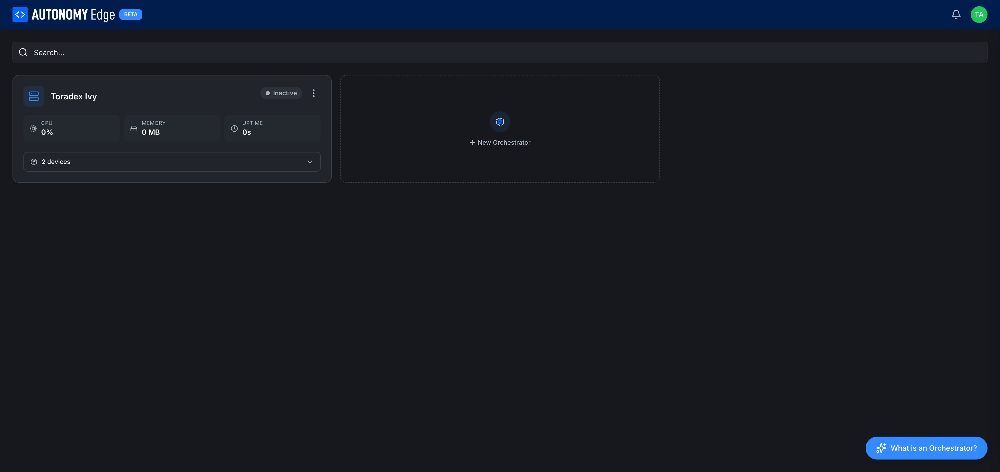
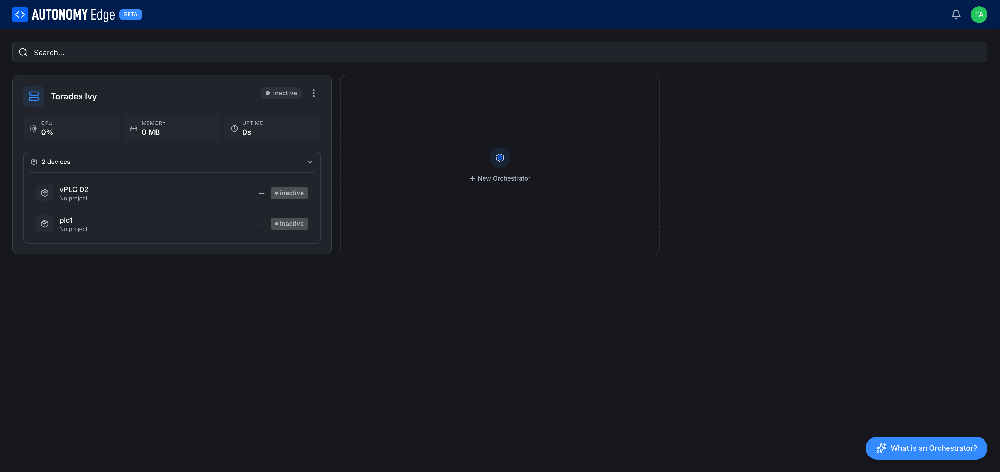

# Orchestrators list

URL: `edge.autonomylogic.com/{slug}/orchestrators`. This page lists every orchestrator under the current workspace. Each one is shown as a card with live stats.

## Toolbar

- **Search…**: filters cards by orchestrator name as you type.
- **What is an Orchestrator?** floating button (bottom right): opens a short explainer modal. Same content as the **[overview](overview)** page.

## Orchestrator card

Each card shows:

| Element | Description |
|---|---|
| **Icon** (left) | A rack icon, always blue. |
| **Name** | The name you gave when you created it. |
| **Status badge** | **Inactive** (gray dot), **Active** (green dot, sometimes called **Connected**). |
| **3-dot menu** | Per-orchestrator actions: rename, regenerate registration ID, delete. See **[Managing orchestrators](managing-orchestrators)**. |
| **CPU** | Live CPU usage on the device, in percent. |
| **MEMORY** | Live memory usage in MB. |
| **UPTIME** | How long the agent has been running. Resets if the agent restarts. |
| **N devices** (expandable) | Number of vPLC devices attached to this orchestrator. Click to expand and see the list inline. |

Stats are blank or zero on an **Inactive** orchestrator because the agent isn't reporting anything.

## Expanding the devices list

Click the **N devices** row at the bottom of the card to expand it inline. Each device row shows:

- Device icon.
- Device name (e.g. *vPLC 02*, *plc1*).
- Project assignment (or *No project*).
- Status badge (`active`, `inactive`, `stopped`, `running`).

This is a quick way to see what's running on a given device without leaving the list. To see a single device's details, click its row, you'll land on the **[vPLC detail](../vplcs/vplc-detail)** page.

## Adding more orchestrators

The dashed **+ New Orchestrator** tile to the right of your existing cards opens the **[install wizard](installing-the-agent)**.

If you're on the Community plan and have already used your one orchestrator slot, clicking the tile shows the plan-limit modal:

The modal explains the limit and offers an **Upgrade plan** button to go to **[Pricing](../../plans-and-billing/pricing)**. Click **Cancel** to dismiss.

## Sorting and filtering

There isn't an explicit sort dropdown on this page yet. Cards are listed in creation order. As more orchestrators are added, the search bar at the top is the fastest way to find one.

## Where to next

- **Click into a card** → **[Orchestrator detail](orchestrator-detail)**.
- **Add another orchestrator** → **[Installing the agent](installing-the-agent)**.
- **Rename or delete one** → **[Managing orchestrators](managing-orchestrators)**.
- **Add a vPLC** → **[Creating a vPLC](../vplcs/creating-a-vplc)**.
