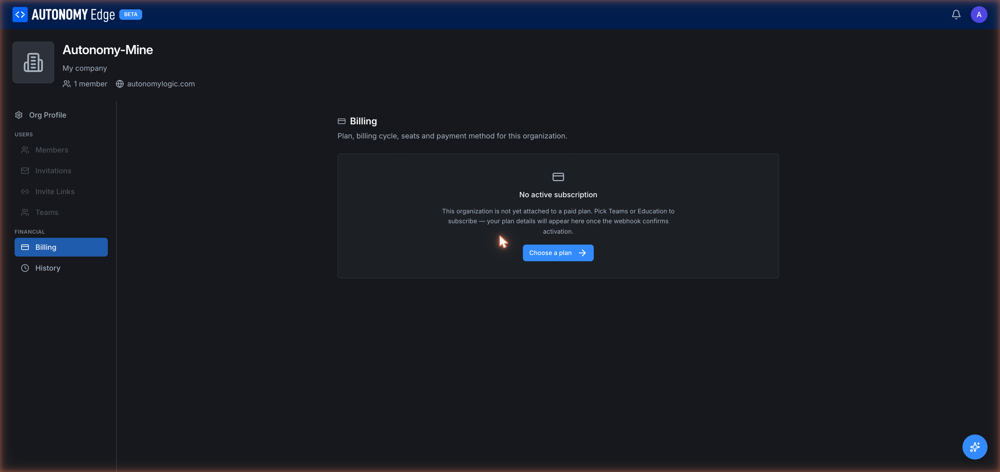

# Organization billing

Organization billing is separate from personal billing. Your personal plan governs your own workspace; an organization's plan governs the organization's workspace.

To open it, click your avatar in the top-right → **Organizations** → select your organization → **Billing** in the side-nav.

## States the page can be in

- **No active subscription.** Fresh org, or after a subscription was canceled. The page shows "No active subscription" with a **Choose a plan** button.
- **Trialing.** A trial is active; you'll see the trial end date and a payment-method warning.
- **Active.** The plan is paid; you see the plan name, billing cycle, next billing date, and any seat counts. This is the screenshot above.
- **Past due.** A payment failed; the platform shows a warning and asks you to update the payment method.

## Picking a plan

From the "No active subscription" state, click **Choose a plan**. You'll be redirected to the pricing page filtered to plans available for organizations (Education, Teams, Enterprise).

After picking a plan you'll go through checkout with seat count, billing cycle (monthly or annual), and payment details. Once the webhook confirms activation, the billing tab updates to the **Active** state.

## What you'll see on an active subscription

For an active Teams subscription:

| Field | Description |
|---|---|
| **Plan** | e.g. *Teams · Premium*. Includes the tier name. |
| **Billing cycle** | *Annual* or *Monthly*. Annual is cheaper per month. |
| **Annual cost** | e.g. *$19,800/yr*. |
| **Seats Active** | How many members are currently using a seat. |
| **Next billing date** | When the next charge will hit your payment method. |

Three actions at the bottom of the card:

- **Change plan** → switch to a different plan (upgrade or downgrade).
- **Manage payment method** → add, update, or remove cards.
- **Cancel subscription** → end at the next billing date.

## Adding seats

If you've hit your seat cap, the **Add seats** action lets you bump the count. The platform pro-rates the charge to the current billing cycle.

## Downgrading

From **Change plan** you can switch to a smaller plan. Downgrades take effect at the next billing cycle, not immediately. If the downgrade would put you below current usage (e.g. you have 12 members but the new plan allows 10), the platform prompts you to remove members first.

## Canceling

**Cancel subscription**:

- Sets the subscription to end at the next billing date.
- Keeps everything working until that date.
- Drops you to no-subscription state afterwards. Member management, private projects, and other paid features stop working at that point.

## Payment methods

The platform uses Paddle as its payment processor. Methods are managed inline: **Add card**, **Set as default**, **Remove**.

## Invoices

A list of past invoices with **Download PDF** for each. Each invoice has the line items, taxes, totals, and your billing address.

## Who can see billing

- **Owner**: full access.
- **Admin**: full access.
- **Member**: cannot see this tab. The side-nav hides it for them.

## Where to next

- **Plan comparison** → **[Pricing](../../plans-and-billing/pricing)**.
- **Plan limits per feature** → **[Plan limits](../../plans-and-billing/plan-limits)**.
- **Past invoices and audit log** → **[Org history](history)**.
