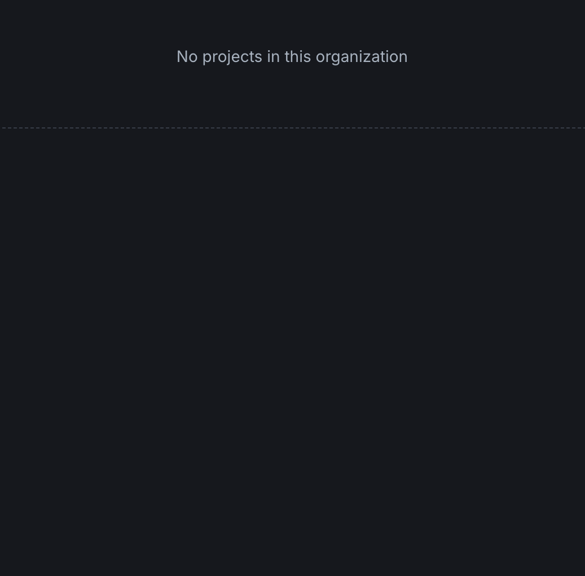

# Creating an organization

You can create an organization on any plan, including Community. The Community plan limits what you can do *inside* an org (no member management), but creating one and using it as a sandbox is free.

## Open the create dialog

Two entry points:

1. **From the dashboard.** The right column's **Organizations** card has a **+ Create new** button. Click it.
2. **From the organizations list.** Click your avatar in the top-right and choose **Organizations**, then click **+ New** in the toolbar.

The Create Organization dialog opens.

## Fields

| Field | Required | Notes |
|---|---|---|
| **Organization name** | Yes | Free text. Used as the display name. A short handle is derived from this automatically (for example, *Autonomy Mine* becomes `autonomy-mine`). |
| **Description** *(optional)* | No | A one-liner shown on the org's profile. You can edit it later. |
| **Website** *(optional)* | No | URL. Renders as a link on the org's profile. |

Click **Create Organization**.

## What happens next

- The org is created and you're added as the **Owner**.
- The dashboard right column adds a new card for this org with your role badge (**Owner**). Click that card to jump to the organization's dashboard.
- The activity feed records "{you} created the organization."

## Slug collisions

If the platform-derived handle is already taken (because someone else has a similarly named user or org), creation will fail with a message asking you to change the name. Pick a different name and try again.

## Next steps after creation

1. **Pick a plan if you need to collaborate.** Click **View plans** on the org dashboard's banner (or go to org → Billing tab) to pick **Teams** or **Education**. Until then, member management is locked.
2. **Customize the profile.** Upload a logo, fill in the description, add social/contact links. See **[Org profile](org-profile)**.
3. **Move or create projects.** On the org dashboard, click **+ New** on the Projects card, or fork an existing project into the org. (Cross-workspace moves require a project export/import; see **[Importing and forking](../projects/importing-and-forking)**.)
4. **Install an orchestrator for the org.** Same flow as personal, but performed while on the organization's dashboard. See **[Installing the agent](../orchestrators/installing-the-agent)**.

## Where to next

- **Configure the org** → **[Org profile](org-profile)**.
- **Invite teammates** → **[Invitations](invitations)** or **[Invite links](invite-links)** (paid plans).
- **Set up billing** → **[Org billing](billing)**.
