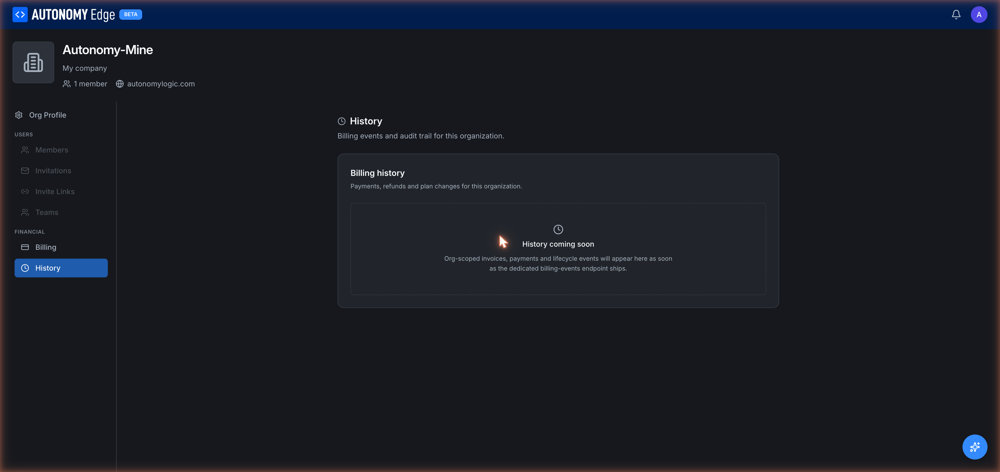

# Organization history

The **History** tab tracks billing events and audit-log entries for the organization.

URL: `edge.autonomylogic.com/organizations/{orgId}` → click **History** in the side-nav.

## What's here today

Today the page shows a single section, **Billing history**, with the placeholder:

> **History coming soon.** Org-scoped invoices, payments and lifecycle events will appear here as soon as the dedicated billing-events endpoint ships.

In the meantime, paid invoices are available from the **[Billing](billing)** tab → Invoices list.

## What will be here

When the dedicated history endpoint is live, you can expect:

- **Billing events** — every plan change, seat addition, invoice paid, payment failed, refund issued.
- **Membership audit** — who was invited, who joined, who was promoted/demoted, who left or was removed.
- **Settings audit** — every change to the org profile, name, description, social links.
- **Resource audit** — orchestrators registered, vPLCs created/deleted, projects moved into or out of the org.

Each entry will have:

- Timestamp.
- Actor (the user who performed the action, or *System* for automated events).
- Action type.
- Target (which entity it touched).
- Diff (for change events that have a meaningful before/after).

## Who can see history

- **Owner** — yes.
- **Admin** — yes.
- **Member** — no. The tab is hidden from members.

## Where to next

- **Current invoices** → **[Billing](billing)** tab.
- **Day-to-day member management** → **[Members and roles](members-and-roles)**.
- **Platform-wide changelog (different)** → click **What's new** in the user menu, or visit **[the changelog](../../changelog-link)**.
