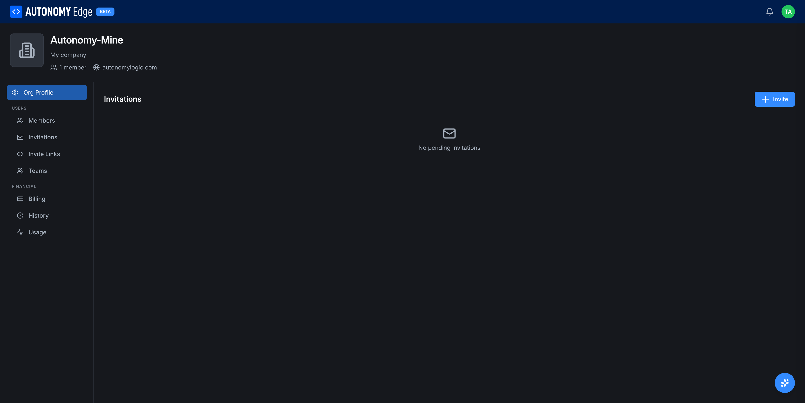
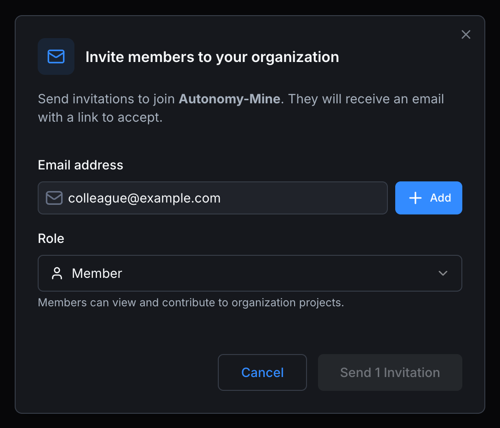

# Invitations

Invitations are one-shot, email-addressed invites to join an organization. They're the simplest way to bring in a known person.

> Requires the **Teams**, **Education**, or **Enterprise** plan. The tab is empty and read-only on Community.

URL: `edge.autonomylogic.com/organizations/{orgId}` then click **Invitations** in the side-nav.

## What an invitation does

When you invite someone:

1. The platform sends an email to the address you provided with a join link.
2. The invitation appears in the org's Invitations list, status **Pending**.
3. When the recipient clicks the link and signs in, they're added to the org with the role you chose, and the invitation moves to **Accepted**.

Invitations expire after a configurable period (typically 7 days). Expired invitations can be re-sent.

## Sending an invitation

Click **Invite** at the top right of the page. The dialog asks for the recipient's email and the role they should receive.

| Field | Required | Notes |
|---|---|---|
| **Email address** | Yes | The recipient's email. They don't need an Autonomy Edge account yet, the link prompts them to sign up if needed. |
| **Role** | Yes | The role they'll have on acceptance. **Member** is the safe default. Switch to **Admin** or **Owner** if you want them to manage the org from day one. You can also change it later from **[Members](members-and-roles)**. |

A short description under the role dropdown explains what the role can do.

You can click **+ Add** to queue multiple email addresses in a single batch. The Send button shows the count, e.g. **Send 1 invitation** or **Send 3 invitations**. Click **Cancel** to dismiss the modal.

For .edu accounts on the **Education** plan, the platform validates that recipient domains match yours. This is an Education-plan rule, not a global one.

## The invitations list

When you have pending or accepted invitations, the list shows:

- Email address.
- Role they'll receive.
- Invited by (you, or another admin).
- Status: **Pending**, **Accepted**, **Expired**, **Revoked**.
- Sent date.
- Per-row actions menu.

## Per-invitation actions

- **Resend**: sends the same invitation email again. Useful if the original got buried.
- **Copy link**: copies the join link to your clipboard, in case you want to deliver it through a different channel.
- **Revoke**: cancels the invitation. The link stops working immediately.

## Common scenarios

- **You sent the wrong role.** Revoke and re-send with the correct role. Once accepted, change role from **[Members](members-and-roles)**.
- **The invitation expired.** Resend it. The platform issues a new link with a fresh expiration.
- **The recipient already has an account on a different email.** Either accept on the invited email (they'll have two accounts) or revoke and re-invite to their primary email.

## Where to next

- **Once they're in, manage their role** → **[Members and roles](members-and-roles)**.
- **Prefer a shareable URL for cohorts** → **[Invite links](invite-links)**.
- **Organize people into sub-groups** → **[Teams](teams)**.
