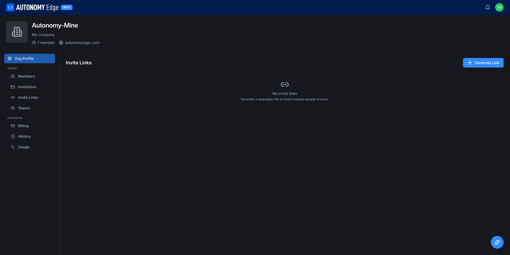
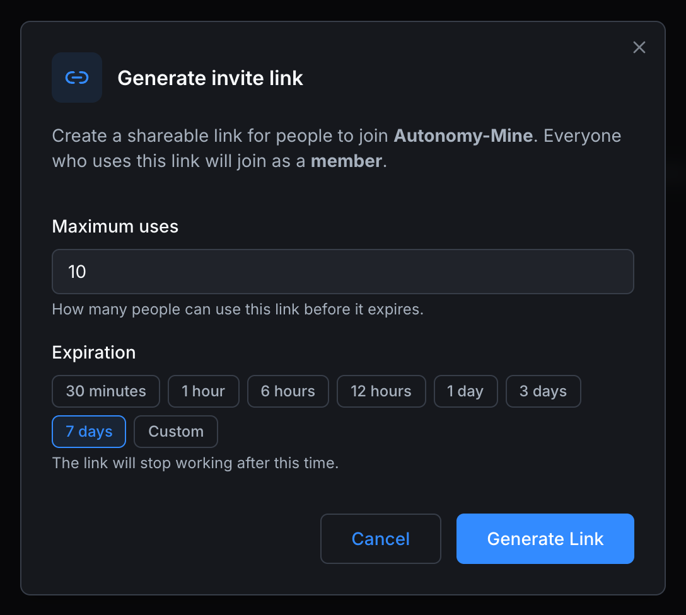

# Invite links

Invite links are reusable URLs that let anyone with the link join your organization. They're best for known cohorts (a class of students, a contractor team) where you don't want to type 30 email addresses.

> Requires the **Teams**, **Education**, or **Enterprise** plan.

URL: `edge.autonomylogic.com/organizations/{orgId}` then click **Invite Links** in the side-nav.

## How an invite link works

- You generate a link with a chosen role.
- Anyone with the URL can visit it; they're prompted to sign in (or sign up if they don't have an account yet).
- On sign-in, they're added to the org with the link's role.
- The platform records which link added each member, so you can revoke their access later by removing them or by deactivating the link.

Invite links have:

- **A maximum number of uses**: once exhausted, the link stops working.
- **An expiration window**: from 30 minutes up to 7 days, or a custom value. After expiry the link stops working.

## Generating a link

Click **Generate Link** at the top right of the page. The dialog opens.

| Field | Required | Notes |
|---|---|---|
| **Maximum uses** | Yes | Number of times the link can be used before it expires. Defaults to 10. The dialog notes the rule: *How many people can use this link before it expires.* |
| **Expiration** | Yes | Quick presets: **30 minutes**, **1 hour**, **6 hours**, **12 hours**, **1 day**, **3 days**, **7 days** (default), or **Custom** for a specific date and time. |

The role for everyone joining through the link is **Member**, as noted in the dialog description: *Everyone who uses this link will join as a member.* If you need a higher role for an individual, send a per-email **[invitation](invitations)** instead, or promote them once they've joined.

Click **Generate Link** to finalize. The dialog closes and the link is shown in the list with its short label and copy action.

## The invite-links list

When you have one or more active links, the table shows:

- Link name or short identifier.
- Role granted (always Member).
- Uses (consumed / total).
- Expiration date and time.
- Status: **Active**, **Expired**, **Exhausted**, **Revoked**.
- Created by, created on.
- Per-row actions menu.

## Per-link actions

- **Copy link**: copy the URL to your clipboard.
- **View members who joined via this link**: opens a sub-view showing every member who used this link to join.
- **Edit**: change max uses or expiration (the role is fixed at creation).
- **Revoke**: deactivates the link immediately. Members who already joined keep their seats; the link stops accepting new joins.

## Removing members who joined via a link

Use the **View members who joined via this link** action. Pick a subset of members and remove them in bulk. Their access ends immediately; their commits and posts stay attributed to them.

## Security tips

- **Don't post invite links publicly** unless you've set a low max uses and a short expiration.
- **Use one link per cohort** to keep audit trails clean. Knowing 40 people came in via "Fall 2026 class" is much more useful than 40 anonymous joins.
- **Audit periodically.** Revoke links you no longer need.

## Where to next

- **Per-email invites** → **[Invitations](invitations)**.
- **Manage existing members** → **[Members and roles](members-and-roles)**.
- **Group new members into a team** → **[Teams](teams)**.
