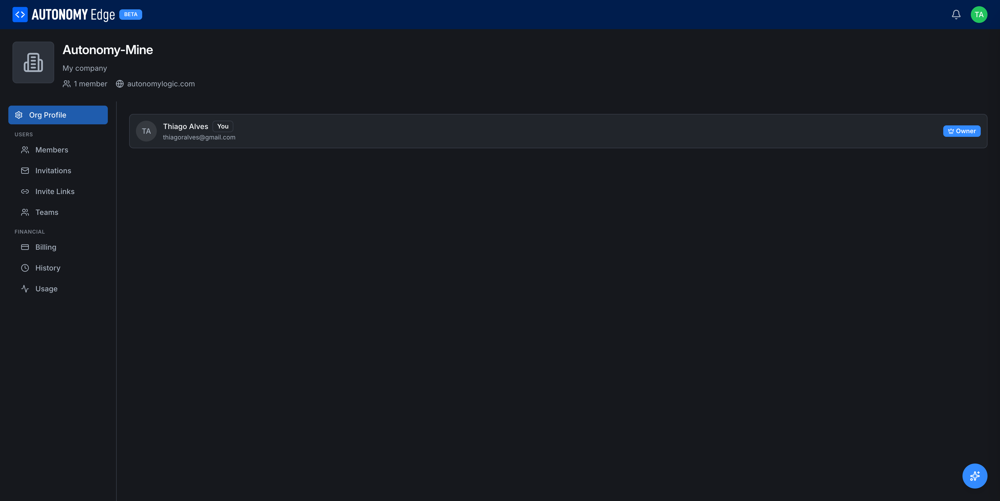

# Members and roles

The **Members** tab lists everyone in the organization and lets owners and admins manage their roles.

> Requires the **Teams**, **Education**, or **Enterprise** plan to invite anyone beyond yourself. The tab is read-only on the free Community plan.

To open it, click your avatar in the top-right → **Organizations** → select your organization → **Members** in the side-nav.

## The three roles

| Role | Read projects | Write projects | Manage members | Manage org settings | Manage billing | Delete org |
|---|---|---|---|---|---|---|
| **Owner** | ✓ | ✓ | ✓ | ✓ | ✓ | ✓ |
| **Admin** | ✓ | ✓ | ✓ | ✓ | – | – |
| **Member** | ✓ | ✓ | – | – | – | – |

There's always at least one Owner. You can have multiple Owners. Owners can promote Admins to Owner, and Members to Admin or Owner.

## What's on the page

For each member, a row shows:

- Avatar and display name (e.g. *Thiago Alves*) with a **You** badge if it's you.
- Email address (visible to admins and owners, hidden from members).
- **Role badge** on the right (Owner, Admin, Member).
- Joined date.
- Per-row actions menu (when you have permission to change it).

A toolbar at the top has a search box (filter by name or email) and quick role filters.

## Changing a member's role

1. Find the member in the list.
2. Click the **Role** badge / dropdown next to their name.
3. Pick **Owner**, **Admin**, or **Member**.

The change is immediate. The affected member gets a notification.

You cannot demote the last Owner. The platform requires at least one Owner at all times: promote someone else first, then demote yourself.

## Removing a member

From the row's actions menu pick **Remove from organization**. A confirmation dialog appears. After confirming:

- The member loses access to all org projects, orchestrators, and devices.
- Their commits and forum posts stay attributed to them.
- Their pull requests on org projects stay open (you can close them manually).

You can re-invite a removed member later from the **[Invitations](invitations)** tab.

## Self-actions

A member sees a slightly different menu:

- **Leave organization**: voluntarily exit. See **[Leaving and deleting](leaving-and-deleting)**.
- **View profile**: open their own profile.

## Audit trail

Member changes (added, removed, role changed) are recorded in the org's audit log and surface in the **[History](history)** tab once that feature ships.

## Where to next

- **Invite new members by email** → **[Invitations](invitations)**.
- **Invite via a shareable URL** → **[Invite links](invite-links)**.
- **Group members for project access** → **[Teams](teams)**.
