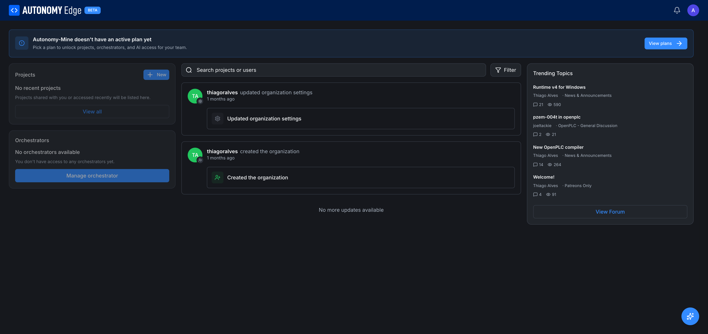

# Organization dashboard

Each organization has a dashboard that mirrors your personal dashboard layout, but scoped to the organization. URL: `edge.autonomylogic.com/{org-slug}/dashboard`.

## How to get there

- From the dashboard's **Organizations** card on the right column, click the organization's name.
- Or type the URL directly if you know the slug.

The page layout is intentionally identical to your personal dashboard so you don't have to relearn anything. The slug in the URL is the only difference.

## Top banner: "no active plan yet"

If the organization doesn't have a paid plan, a blue banner appears at the top:

> **{Org name} doesn't have an active plan yet.** Pick a plan to unlock projects, orchestrators, and AI access for your team.

A **View plans** button on the right takes you to the org's billing tab where you can pick **Teams** or **Education**.

The banner disappears once the org has an active plan. See **[Org billing](billing)**.

## Left column

Same shape as the personal dashboard:

- **Projects** card with **+ New** button: lists the org's projects (or "No recent projects" if there are none yet) and a **View all** link.
- **Orchestrators** card with **Manage orchestrator** button: lists the org's orchestrators.

Note the difference from your personal dashboard: nothing here is yours individually. Everything belongs to the org.

## Center column: activity feed

Same feed format as personal, but the activity is org-scoped. Examples:

- Org settings updated.
- New project created in the org.
- Member added or removed.
- vPLC deployed.

The **Filter** dropdown is also present, with **Recents** by default. Switching to an *Organization Feeds* entry shows feeds from other orgs you belong to, useful if you want to compare activity across multiple workspaces.

## Right column

- **Trending Topics** card with the latest forum topics. Forum is global; trending shows the same items regardless of which workspace you're in.
- **View Forum** button at the bottom.

## What is NOT here

You won't find member management on this page. Members, Invitations, Invite Links, Teams, Billing, and History all live on the organization management page at `edge.autonomylogic.com/organizations/{orgId}`. The dashboard is for day-to-day work; the management page is for governance.

The fastest route to org management is:

- Type `/{org-slug}/settings` into the URL. The platform automatically redirects you to `/organizations/{orgId}`.
- Or use the **Manage orchestrator** button as a shortcut to the org's resources, then navigate from there.

## Where to next

- **Manage members and settings** → **[Org profile](org-profile)**, **[Members and roles](members-and-roles)**.
- **Pay for a plan** → **[Org billing](billing)** and **[Pricing](../../plans-and-billing/pricing)**.
- **Create the org's first project** → **[Creating a project](../projects/creating-a-project)** with the org slug in the URL.
