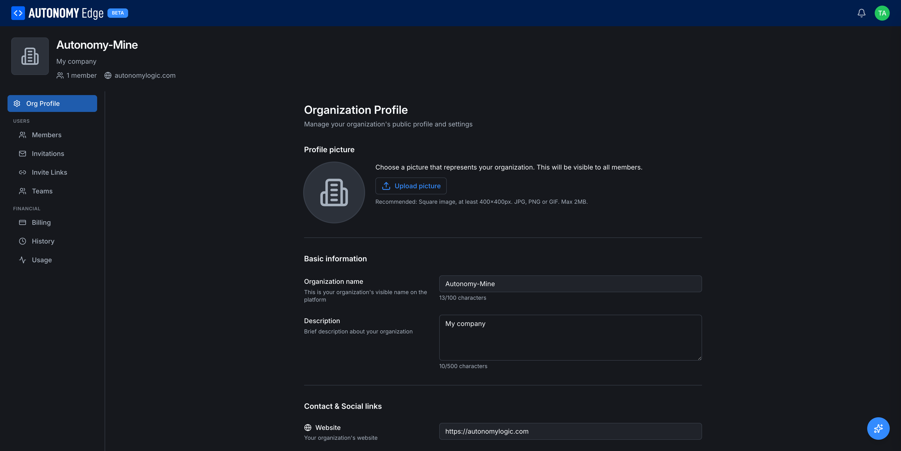

# Organization profile

The **Org Profile** tab is where you set the organization's public-facing identity: name, description, logo, and contact info.

URL: `edge.autonomylogic.com/organizations/{orgId}` (Org Profile is the default tab).

The fastest way to get here: type `/{org-slug}/settings` in the address bar, the platform redirects you to the right org management URL automatically.

## Page layout

A persistent left side-nav lists every org management section:

- **Org Profile** (selected)
- **Users**: Members, Invitations, Invite Links, Teams
- **Financial**: Billing, History

Items in the **Users** section are disabled on the free plan. Billing and History are always available.

Above the side-nav is a compact header with the org logo, name, description, member count, and website link.

## Profile picture

A square image that represents the organization across the platform, on the dashboard's Organizations card, in member lists, in activity feed entries.

To upload:

1. Click the **Upload picture** button next to the avatar placeholder.
2. Pick a file from your computer.
3. Crop if needed and confirm.

Requirements:

- **Square image, at least 400×400 px.**
- **Formats**: JPG, PNG, or GIF.
- **Max size**: 2 MB.

You can replace or remove the picture at any time.

## Basic information

| Field | Required | Notes |
|---|---|---|
| **Organization name** | Yes | Up to 100 characters. Changing this does **not** change the slug (slugs are fixed once created). |
| **Description** | No | Up to 500 characters. Shown on the org profile and in some places like the org card. |

A character counter appears below each field.

## Contact & Social links

Below the basic information section (scroll down to see them):

- **Website**: a URL. Rendered as a link on the org's public profile.
- **Location**: free-text city/country.
- **LinkedIn URL**: your org's LinkedIn page.
- **X (Twitter) URL**: your org's X account.

Leave any field blank to omit it from the profile.

## Saving changes

There's no explicit save button per field; each section has its own save action at the bottom. The platform autosaves nothing, make a change, click **Save**, and the change is persisted. If you navigate away with unsaved changes, the platform warns you.

## Who can edit

- **Owner**: full edit.
- **Admin**: full edit.
- **Member**: read-only. The form fields are visible but disabled.

## Where to next

- **Manage who's in the org** → **[Members and roles](members-and-roles)**.
- **Invite new members** → **[Invitations](invitations)**, **[Invite links](invite-links)**.
- **Set up billing** → **[Org billing](billing)**.
- **Delete the org** → **[Leaving and deleting](leaving-and-deleting)**.
