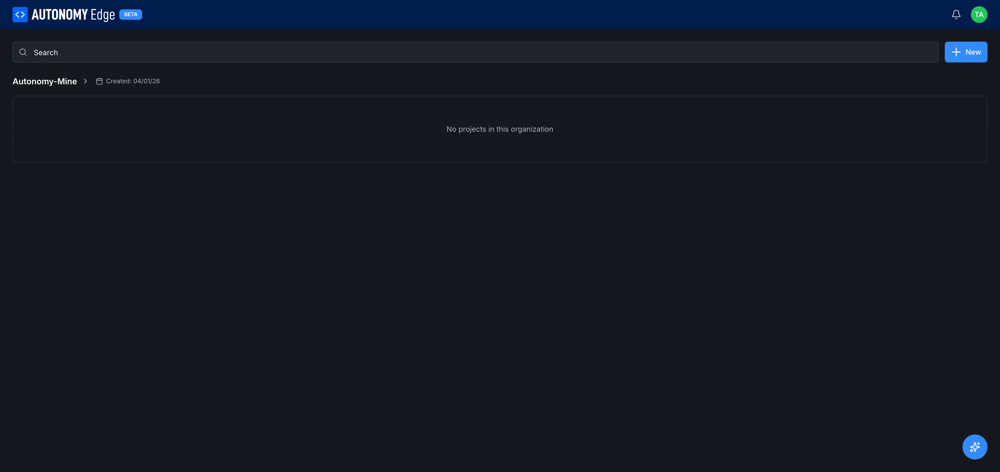

# Organizations

An **organization** is a shared workspace. Members of an organization see and work on the same projects and orchestrators. Organizations are how teams collaborate on Autonomy Edge.

## When you need one

Use an organization if:

- More than one person needs to read or edit the same projects.
- You want shared orchestrators and vPLCs.
- You need invite links, role-based permissions, or per-team scoping.
- You need centralized billing.

If you're working alone, a personal workspace is enough. You can always create an org later and move projects into it.

## Personal workspace vs organization workspace

Both use the same URL pattern (`/{slug}/...`) and the same screens. The differences:

| | Personal workspace | Organization workspace |
|---|---|---|
| Slug | Your username | The org's slug |
| Who can access | Just you | All members of the org |
| Plan | Your personal plan (Community by default) | Org plan, separate from your personal plan |
| Members tab | N/A | Members, Invitations, Invite Links, Teams |
| Created when | At signup | When someone creates an org |

See **[Workspaces and slugs](../workspaces-and-slugs)** for the URL model.

## Roles

When someone joins an organization they get a role:

- **Owner**: the creator. There can be more than one owner; an owner can promote other admins to owner. Owners can do everything, including deleting the org.
- **Admin**: can manage members, invite new ones, and edit organization settings. Cannot delete the org.
- **Member**: can read and edit projects in the org, but can't manage other members.

Specific permissions per feature are listed in **[Members and roles](members-and-roles)**.

## What you can do per plan

Organizations themselves are free to *create* on any plan. But most organization features are gated by paid plans:

| Feature | Community | Education | Pro | Teams | Enterprise |
|---|---|---|---|---|---|
| Create an org | ✓ | ✓ | ✓ | ✓ | ✓ |
| Org profile | ✓ | ✓ | ✓ | ✓ | ✓ |
| Members (beyond you) | – | ✓ (.edu only) | – | ✓ | ✓ |
| Invitations | – | ✓ | – | ✓ | ✓ |
| Invite Links | – | ✓ | – | ✓ | ✓ |
| Teams | – | – | – | ✓ | ✓ |
| Org-level billing | – | ✓ | – | ✓ | ✓ |

The Pro plan is *personal*, it doesn't unlock org features. To collaborate as a team, you want **Teams** (or **Education** for academic institutions).

See **[Pricing](../../plans-and-billing/pricing)** for the full breakdown.

## Where to next

- **Create your first organization** → **[Creating an org](creating-an-org)**.
- **Walk through what's on each tab** → **[Org dashboard](org-dashboard)**, **[Org profile](org-profile)**, **[Members and roles](members-and-roles)**, **[Invitations](invitations)**, **[Invite links](invite-links)**, **[Teams](teams)**.
- **Billing and history** → **[Org billing](billing)**, **[Org history](history)**.
- **Leave or delete an org** → **[Leaving and deleting](leaving-and-deleting)**.
