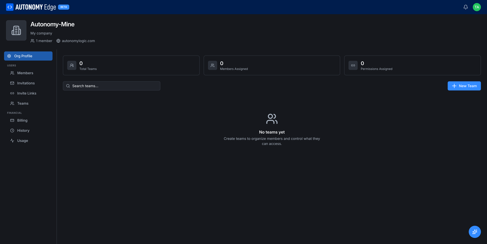
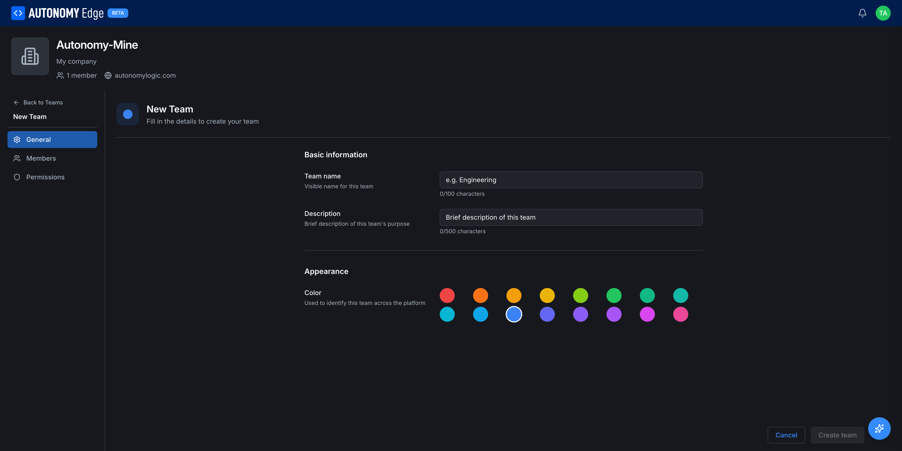

# Teams

A **team** is a sub-group within an organization. Teams let you scope access and notifications without giving everyone in the org access to everything.

> Available on **Teams** and **Enterprise** plans.

URL: `edge.autonomylogic.com/organizations/{orgId}` then click **Teams** in the side-nav.

## What teams are useful for

- **Per-project access control.** Add Team A to Project X, and Team B to Project Y. People outside the relevant team can't see the project.
- **Notification routing.** Tag a team in a PR description (`@team-name`) and everyone in that team gets notified.
- **Internal hierarchy.** Mirror your real org chart: *Controls*, *Mechanical*, *Software*, *External Contractors*.

Teams are not required. Many orgs run flat with everyone in the same pool. Use teams when you start tripping over each other.

## The teams page

Top of the page:

- Three stat cards: **Total Teams**, **Members Assigned**, **Permissions Assigned**.
- Search box (filter teams as you type).
- **+ New Team** button on the right.

Below: the list of teams, or an empty state (*No teams yet, Create teams to organize members and control what they can access.*) until you create the first one.

## Creating a team

Click **+ New Team**. The Teams sidebar item collapses and a dedicated **New Team** page opens.

A persistent left side-nav lists the team's sections: **General** (selected), **Members**, **Permissions**.

### General tab

| Field | Required | Notes |
|---|---|---|
| **Team name** | Yes | The visible name. Up to 100 characters. |
| **Description** | No | Brief purpose of the team. Up to 500 characters. |
| **Color** | Yes (default blue) | One of 16 swatches. Used to identify the team across the platform (in member lists, project badges, PR notifications). |

Click **Create team** in the bottom-right corner to save. **Cancel** in the bottom-right discards the draft and returns to the Teams list. **Back to Teams** in the top-left does the same.

### Members tab

Open after the team is created. Pick from the org's existing members to add or remove. Use the search field for large orgs.

A member can belong to multiple teams. Permissions are union, so if Team A grants Read on Project X and Team B grants Write on Project X, the member gets Write.

### Permissions tab

Grant the team access to specific projects with a per-project permission level:

- **Read**: view files, history, PRs.
- **Write**: push commits, open and merge PRs.
- **Admin**: write plus manage project-level settings (when those land).

The same project can be granted to multiple teams at different permission levels.

## Renaming, recoloring, or deleting a team

From the team's **General** tab, edit the name, description, or color and the change saves automatically (or on a Save action depending on the field type).

To delete the team, scroll to the bottom of the General tab and click **Delete team**. Confirm.

Members of the deleted team don't leave the org; only the team grouping goes away. Projects scoped to the team revert to org-wide visibility unless they were *only* visible via this team, in which case they become invisible to former team members.

## Where to next

- **Manage individual people** → **[Members and roles](members-and-roles)**.
- **Notifications via @team in a PR** → **[Pull requests](../projects/pull-requests)**.
- **Plan eligibility** → **[Pricing](../../plans-and-billing/pricing)**.
