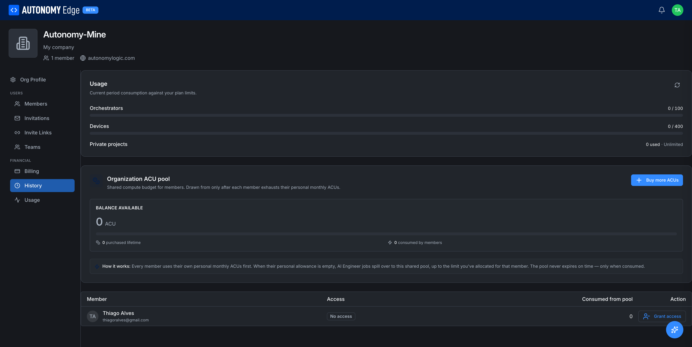

# Organization usage

The **Usage** tab is the org-level counterpart to **[Settings → Usage](../../account/settings/usage)**. It shows the org's consumption against plan quotas plus a shared **Organization ACU pool** that members can draw from when their personal AI credits run out.

> Visible on **Teams**, **Education**, and **Enterprise** plans. Owners and admins can manage member grants; members can read.

To open it, click your avatar in the top-right → **Organizations** → select your organization → **Usage** in the side-nav.

## Plan usage

Top of the page: current-period consumption against the org plan's quotas.

| Limit | Counts |
|---|---|
| **Orchestrators** | Orchestrator entries in this org (active + inactive). |
| **Devices** | vPLC entries across all the org's orchestrators. |
| **Private projects** | Org projects marked private. Public projects don't count. |

Each row shows *N used · M allowed* (or **Unlimited** on Enterprise). A bar turns red at the limit. A refresh icon at the top right of the card forces a recount.

## Organization ACU pool

A shared compute budget for AI Engineer jobs that **every member can draw from after exhausting their personal monthly ACUs**.

- **Balance available** (big number) → ACUs currently in the org pool.
- **N purchased lifetime** → total ACUs ever bought for this pool.
- **N consumed by members** → total ever spent out of this pool.
- **+ Buy more ACUs** → top up the pool. Opens the same purchase flow as personal Buy More ACUs (see **[AI Credit Units](../../plans-and-billing/ai-credit-units)**).

The card's "How it works" note explains: *Every member uses their own personal monthly ACUs first. When their personal allowance is empty, AI Engineer jobs spill over to this shared pool, up to the limit you've allocated for that member. The pool never expires on time, only when consumed.*

## Granting member access to the pool

Below the pool card is a table of org members.

| Column | Description |
|---|---|
| **Member** | Avatar, display name, email. |
| **Access** | Whether this member is allowed to draw from the org pool, and up to what cap if a cap is set. **No access** by default. |
| **Consumed from pool** | ACUs this member has already drawn from the org pool. |
| **Action** | **Grant access** for members with no access. Adjust the cap or revoke for members with access. |

Click **Grant access** to open the grant dialog. You can set a per-member cap (e.g. 5,000 ACUs/month from the pool) or grant unlimited access up to the pool's balance. Members can then run AI Engineer jobs that spill into the pool seamlessly when their personal allowance is depleted.

To revoke access, open the action and choose **Revoke**. The member's existing spend is preserved; they just can't draw new ACUs from the pool going forward.

## Why a shared pool

Without the org pool, every member needs their own paid plan to use AI Engineer. The pool lets an org pay for a large allowance once and route it to whoever needs it that month, with caps to prevent any one user from burning through the whole thing.

## Where to next

- **Personal ACUs** → **[Settings → Usage](../../account/settings/usage)**.
- **How ACUs are spent and refilled** → **[AI Credit Units](../../plans-and-billing/ai-credit-units)**.
- **Org billing** → **[Org billing](billing)**.
