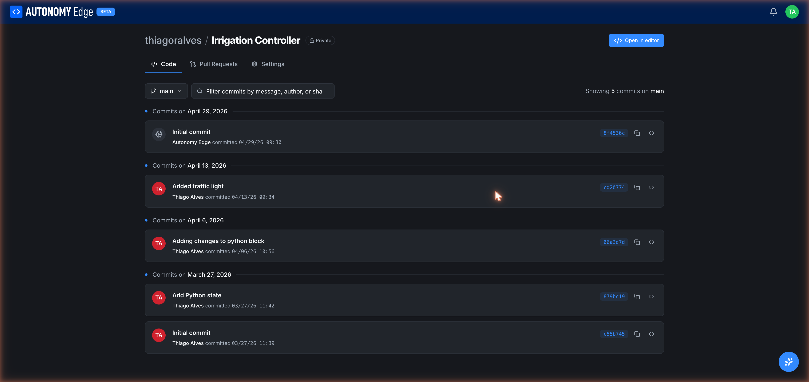

# Commits and history

Every change you make in a project becomes a **commit**. Commits are stored in the project's git repository and can be browsed, filtered, and copied.

## Opening the commit history

From the project's **Code** tab, click the **N commits** link in the commit summary bar (top right of the file tree area). The page reloads in commit-history mode.

## What you see

The history page shows commits grouped by date, newest first.

**Top toolbar:**

- **Branch dropdown** — pick which branch's history to view. Defaults to the branch you were just on.
- **Filter commits by message, author, or SHA** — search bar that narrows the list as you type.
- **Showing N commits on `branch`** (right side) — total count for the current branch.

**Each commit card** shows:

| Field | Description |
|---|---|
| Author avatar and name | Who made the commit. *Autonomy Edge* on the initial commit; you on your own commits. |
| Commit message | First line is the title; subsequent lines (if any) appear when you expand. |
| Date and time | Local time of the commit. |
| Short SHA | A 7-character hash on the right, e.g. `cd20774`. |
| Copy icon | Copies the short SHA to your clipboard. |
| Code icon | Opens the project at that commit — useful for browsing the state of files at that point in history. |

## How commits get created

You don't write a commit on the project page. Commits happen on the **editor** side:

- Every time you click **Save** in the editor, the editor stages your changes.
- When you click the **Commit** button in the editor (or the editor's CLI command equivalent), the staged changes get a message and become a commit.
- Some flows commit on your behalf: opening a brand-new project creates an *Initial commit*, and certain platform actions create system commits attributed to *Autonomy Edge*.

This means the commit list on the project page is a read-only view of history. To make a new commit, you open the project in the editor and commit from there.

## Branches

Branches let you work on a change in isolation. The branch dropdown on the project's **Code** tab shows the current branch and a list of all other branches. To create a new branch you usually use the editor's branch UI; from the platform side you can switch and view any existing branch.

Branches are essential for **[pull requests](pull-requests)** — every PR is a request to merge one branch into another.

## Common patterns

- **Spot a regression** — open commit history, find the commit where the bug appears, and use the code icon to browse the project state at that commit. Then jump back to the editor and revert or fix.
- **Hand off context** — paste a commit's short SHA into a forum thread, a direct message, or a PR description. Other contributors can click through to that exact state.
- **Audit who changed what** — filter by author to see one teammate's commits across the whole project's lifetime.

## Limits and current behavior

- Commit detail (clicking a commit hash to see the diff of files in that commit) is not yet rendered on the project page. The platform may return a 404 on direct diff URLs while this view is being built. Use the editor for diffs in the meantime — it shows file-level changes between commits.
- Force-pushes and rebases that rewrite history will be reflected on this view immediately. The platform doesn't have a separate audit log for rewritten commits today; for important branches, prefer additive commits.

## Where to next

- **Propose a merge** → **[Pull requests](pull-requests)**.
- **Read the working file tree** → **[The project page](project-page)**.
- **Open the editor to write a new commit** → **[OpenPLC Editor overview](../../openplc-editor/overview)**.
