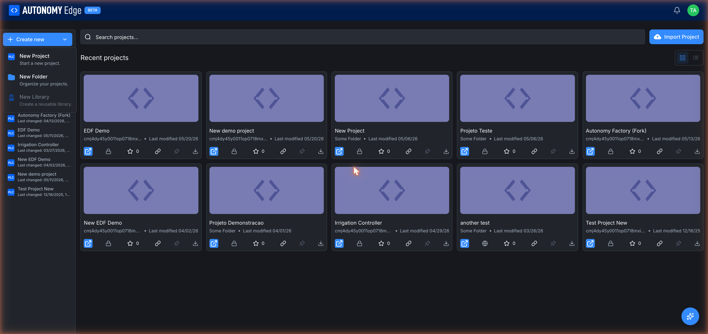
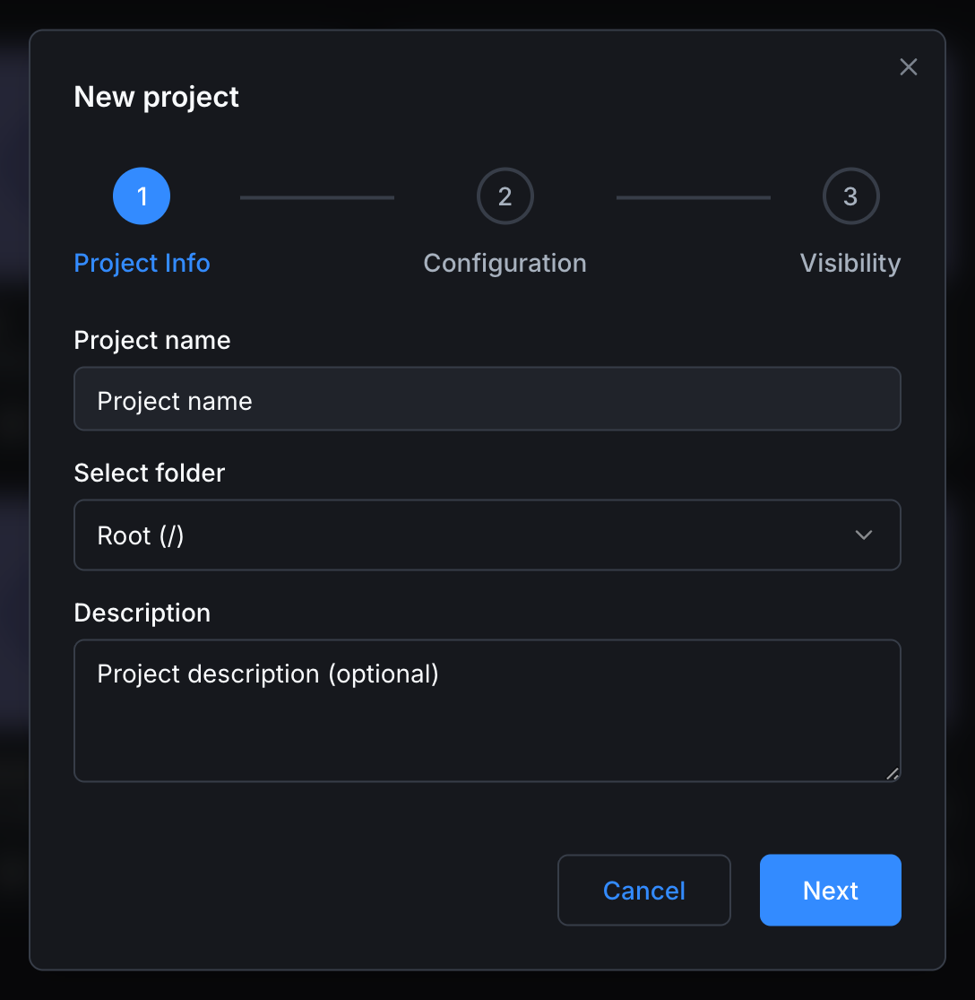
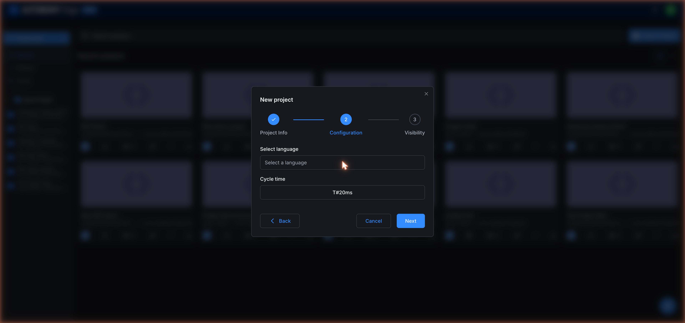
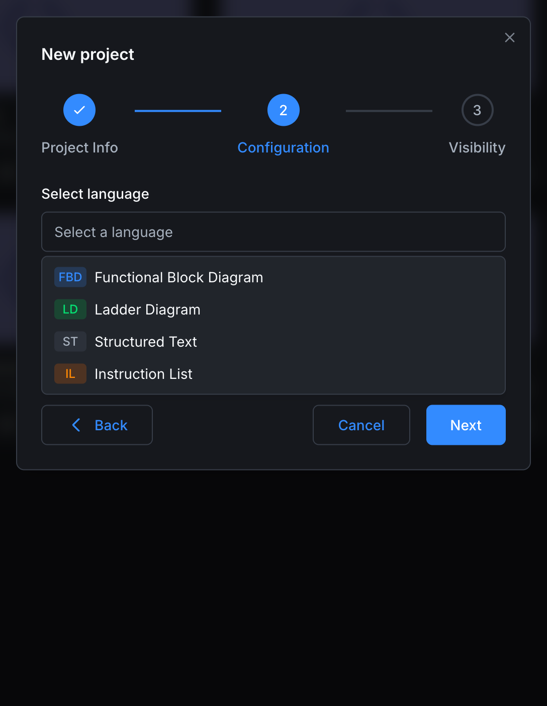
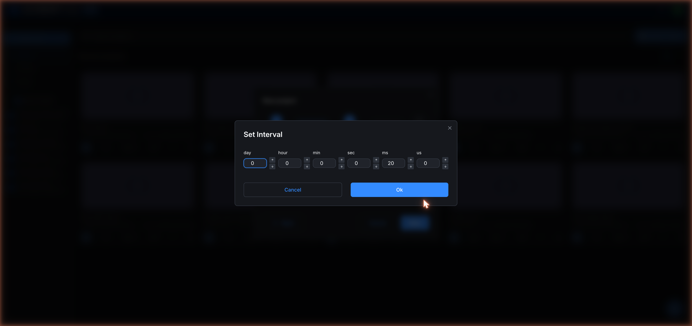
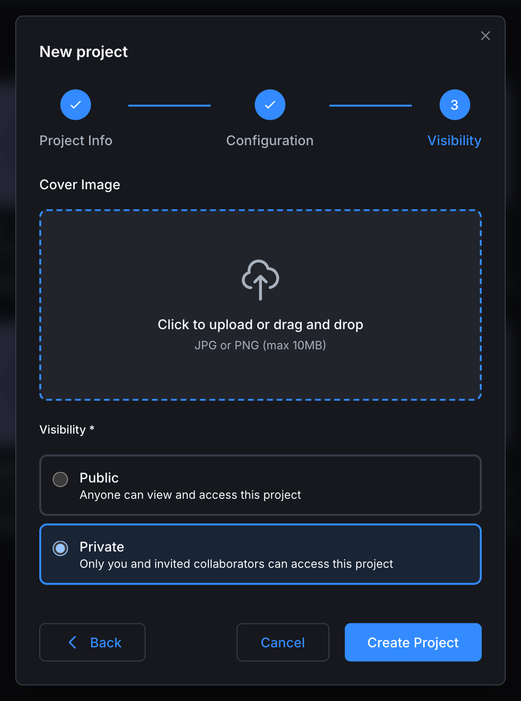

# Creating a project

New projects are created through a three-step wizard. The wizard is the same whether you start it from the dashboard's **+ New** button or from the projects list.

## Open the wizard

Two ways:

1. **From the dashboard**: the left column **Projects** card has a blue **+ New** button at the top. Click it.
2. **From the projects list**: click **+ Create new** at the top-left of the sidebar, then choose **New Project** from the dropdown.

(The dropdown also has **New Folder** for organizing projects and **New Library** for reusable code.)

## Step 1, Project info

| Field | Required | Notes |
|---|---|---|
| **Project name** | Yes | Any text. Used as the project identifier. Two projects in the same workspace can't share a name. |
| **Select folder** | No | Leave as **Root (/)** to put the project at the top level. Otherwise pick one of your existing folders. Folders are visible in the left sidebar of the projects list and help group related projects. |
| **Description** | No | Free text. Shown on the project card in the projects list and in feed activity items. You can edit it later. |

Click **Next** to continue.

## Step 2, Configuration

| Field | Required | Notes |
|---|---|---|
| **Select language** | Yes | The default programming language for new POUs. Pick from the dropdown. |
| **Cycle time** | Yes | How often the PLC runtime executes the main program. Default is `T#20ms`. Click the field to open a time picker with separate day / hour / minute / second / millisecond / microsecond inputs. |

### Available languages

Clicking the language dropdown reveals the four IEC 61131-3 languages currently supported in new projects.

- **FBD**: Functional Block Diagram.
- **LD**: Ladder Diagram.
- **ST**: Structured Text.
- **IL**: Instruction List.

You can mix languages inside a project later. This step just sets the language the editor opens with.

### Cycle time picker

A few tips on cycle time:

- Most discrete control logic is fine at 10 to 50 ms.
- Tight motion control may need 1 to 5 ms. Be aware that very short cycles increase CPU load on the vPLC.
- Slow data-collection programs can use 100 ms or longer.

You can change cycle time later through the editor (it's stored in `project.json`).

Click **Back** to revisit step 1, **Cancel** to dismiss the wizard, or **Next** to continue.

## Step 3, Visibility

The last step asks for a cover image and the project's visibility.

| Field | Required | Notes |
|---|---|---|
| **Cover Image** | No | An image shown on the project card and at the top of the project page. **JPG or PNG, max 10 MB**. Click the dashed area to upload, or drag-and-drop. Leave blank for the default placeholder. |
| **Visibility** | Yes | **Public**: anyone can view and access this project. **Private**: only you and invited collaborators can access. |

**Private** is selected by default if your plan allows private projects. On the **Community** plan, only **Public** is available.

Click **Create Project** to finish. The wizard closes, the project is created, and you land on its **Code** tab.

## What just happened in the background

The platform did the following on the server side:

1. Created an empty git repository for your project.
2. Made an **initial commit** authored by `Autonomy Edge` containing the project skeleton: `programs/`, `functions/`, `function-blocks/`, `devices/`, and `project.json` with the language and cycle time you chose.
3. Set the visibility flag.
4. Added the project to your dashboard feed (so other people see "{you} created a public project" if it's public).

If you go to the **Code** tab now you'll see the file tree pre-populated and a single commit named *Initial commit* in the commit summary bar. You're ready to open the project in the editor and start writing logic.

## Next steps

- **Open in editor and write code**: click **Open in editor** at the top right of the project page. See the **[OpenPLC Editor docs](../../openplc-editor/overview)**.
- **End-to-end first program** → **[Quick Start Guide](../../getting-started/quick-start)**.
- **Find your project later** → **[Projects list](projects-list)**.
