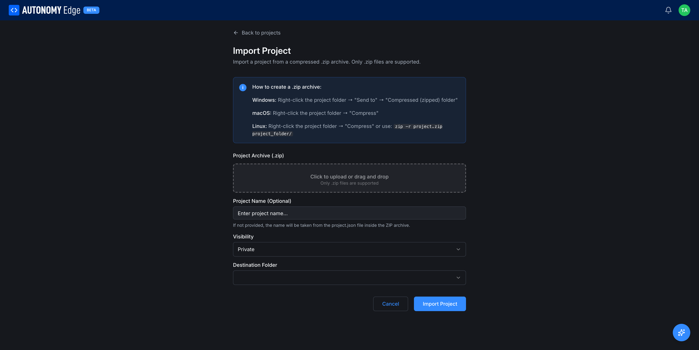

# Importing and forking

You don't always start from a blank project. Sometimes you have an existing OpenPLC project on disk, sometimes you want to build on top of someone else's public project. Autonomy Edge supports both.

## Importing an existing project

From the **[projects list](projects-list)**, click **Import Project** at the top right. The platform navigates to a dedicated **Import Project** page.

### Preparing the .zip archive

The platform accepts compressed `.zip` archives only. A short helper box at the top explains how to create one:

- **Windows**: right-click the project folder → **Send to** → **Compressed (zipped) folder**.
- **macOS**: right-click the project folder → **Compress**.
- **Linux**: right-click the project folder → **Compress**, or run `zip -r project.zip project_folder/`.

The zip should contain a project folder with the standard layout (`programs/`, `functions/`, `function-blocks/`, `devices/`, `project.json`).

### Fields

| Field | Required | Notes |
|---|---|---|
| **Project Archive (.zip)** | Yes | Click the dashed area to pick a file, or drag-and-drop. Only `.zip` is supported. |
| **Project Name (optional)** | No | Leave blank and the platform reads the name from `project.json` inside the archive. Set a name here to override. |
| **Visibility** | Yes | **Private** or **Public**, with the same rules as the **[New Project wizard](creating-a-project)**. |
| **Destination Folder** | Yes | Pick which folder in the projects list to place the import into. |

Click **Import Project** at the bottom right. The platform extracts the archive, validates the project structure, creates the git repository, and lands you on the new project's Code tab. The first commit is named *Initial commit* and is authored by *Autonomy Edge*.

Click **Cancel** to discard and return to the projects list.

### What gets carried over

- All files in the standard project folders.
- The project's `project.json` (language, cycle time, IEC settings).
- Custom function blocks, custom data types, and library references.

### What does **not** get carried over

- Any local git history. The import becomes a fresh single-commit project. (If you need to preserve history, push the original repository as a remote branch later via the editor.)
- Runtime users. These live on the vPLC, not in the project, and don't travel with the import.
- Local IDE preferences (color themes, window layout). These belong to the editor session, not the project.

## Forking a public project

A **fork** is a copy of someone else's public project that becomes yours. You can edit a fork freely without affecting the original. Forks are the standard way to build on community projects and to contribute back.

To fork:

1. Open any public project (yours or someone else's).
2. Click the **Fork** action in the project header (top of the project page).
3. Pick the workspace to fork into (your personal slug or any organization you have permission to create projects in).
4. The fork is created and you land on the fork's project page.

A forked project carries `(Fork)` in its name by default (e.g. *Autonomy Factory (Fork)*). You can rename it from the project page if you prefer.

### Sending changes back upstream

After making changes on your fork, you can propose them back to the original project via a pull request. From your fork, open **Pull Requests → + New pull request** and pick the original project as the target. See **[Pull requests](pull-requests)** for the rest of the flow.

The original project's owner reviews and decides whether to merge. If they do, your contribution is in. If they decline, you keep the change on your fork and can continue from there.

## Cloning via git

Under the hood every project is a git repository. The **download icon** on the project page downloads a zip of the current branch, but full git access (clone, push from a local checkout) is available for paid-plan workspaces. See your project's Settings tab for the clone URL once it's enabled.

## Common scenarios

- **Migrating from the OpenPLC desktop editor.** Zip the project folder, then **Import Project** in Autonomy Edge.
- **Trying out a community sample.** Find a public project on someone's profile or in the dashboard feed, click **Fork**, and tweak.
- **Sharing a private project across your two workspaces.** A private project doesn't move automatically between your personal and org slugs. Download it from the project page, then re-import under the other slug.

## Where to next

- **Open the imported/forked project** → **[The project page](project-page)**.
- **Push changes back to the original** → **[Pull requests](pull-requests)**.
- **Change who can see your fork** → **[Visibility and sharing](visibility-and-sharing)**.
