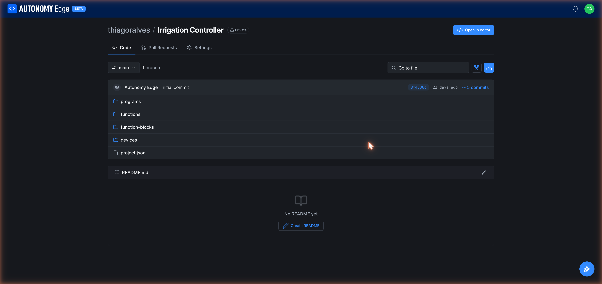

# Projects

A **project** in Autonomy Edge is a versioned IEC 61131-3 codebase backed by git. It looks and behaves a lot like a repository on GitHub: it has a default branch (`main`), commits, pull requests, branches, and a file tree. The difference is that the file tree contains PLC programs, function blocks, and device configurations instead of generic source files, and the editor that opens those files is the **[OpenPLC Editor](../../openplc-editor/overview)**.

## What lives inside a project

Every new project starts with the same skeleton:

| Item | What it is |
|---|---|
| `programs/` | The Program Organization Units (POUs) — your main programs. |
| `functions/` | Reusable IEC functions. |
| `function-blocks/` | Reusable function blocks (timers, counters, your own custom blocks). |
| `devices/` | Per-device configuration: hardware boards, communication protocols, remote I/O mappings. |
| `project.json` | Manifest. Holds the project's IEC settings — default language, cycle time, etc. |
| `README.md` | Optional. If present, it's rendered at the bottom of the Code tab. |

You don't normally edit these files by hand. You open the project in the OpenPLC Editor with the **Open in editor** button (top right of the project page) and the editor handles writing the right files in the right places.

## The three project tabs

Every project page has three tabs across the top:

1. **Code** — the file tree, latest commit, README, branch selector, commit count, file search.
2. **Pull Requests** — propose, review, and merge changes. Empty until somebody opens a PR.
3. **Settings** — visibility, collaborators, and integrations. (Currently a placeholder marked *Settings coming soon*; revisit later.)

The full anatomy of each tab is documented in **[The project page](project-page)**.

## The two visibility modes

- **Public** — anyone, even people without an account, can read your project. They can star it and fork it. They can't push to it unless you grant them access.
- **Private** — only you and people you explicitly invite can see it. Private projects require a paid plan; the Community plan can only create public projects. See **[Visibility and sharing](visibility-and-sharing)** for details.

You set visibility when you **[create the project](creating-a-project)**, and you can change it later from the Settings tab once that feature lands.

## How projects connect to vPLCs

Writing a project gets you a program. Getting that program onto running hardware involves two more concepts:

1. The **orchestrator** — the agent on your edge device. Set one up with **[Installing the agent](../orchestrators/installing-the-agent)**.
2. The **vPLC device** — the container that actually runs the OpenPLC runtime. Create one under your orchestrator following **[Creating a vPLC](../vplcs/creating-a-vplc)**.

From inside the editor, you connect to a vPLC by clicking **Devices → Orchestrators** in the left sidebar and then **Connect** on your vPLC. The first connection asks you to create a runtime user (separate from your platform account; this lives only on that vPLC). Once connected, the **Download** button compiles your project and uploads it. The full sequence is in the **[Quick Start](../../getting-started/quick-start)**.

## How many projects can I have?

- **Public projects**: the Community plan has no hard cap on public projects.
- **Private projects**: 0 on Community, varies on paid plans. See **[Plan limits](../../plans-and-billing/plan-limits)**.

If you already had private projects when your plan changed, they stay. The platform doesn't delete content retroactively; it just blocks you from creating *new* private projects above the quota until you upgrade. You can confirm your current usage in **[Settings → Usage](../../account/settings/usage)**.

## Where to next

- **Make a new project** → **[Creating a project](creating-a-project)**.
- **Find an existing project** → **[Projects list](projects-list)**.
- **Understand the project page** → **[The project page](project-page)**.
- **Branching, commits, merging** → **[Commits and history](commits-and-history)** and **[Pull requests](pull-requests)**.
- **Pin or star a project** → **[Pinning and stars](pinning-and-stars)**.
- **Make a project public or private** → **[Visibility and sharing](visibility-and-sharing)**.
- **Bring in an existing OpenPLC project** → **[Importing and forking](importing-and-forking)**.
