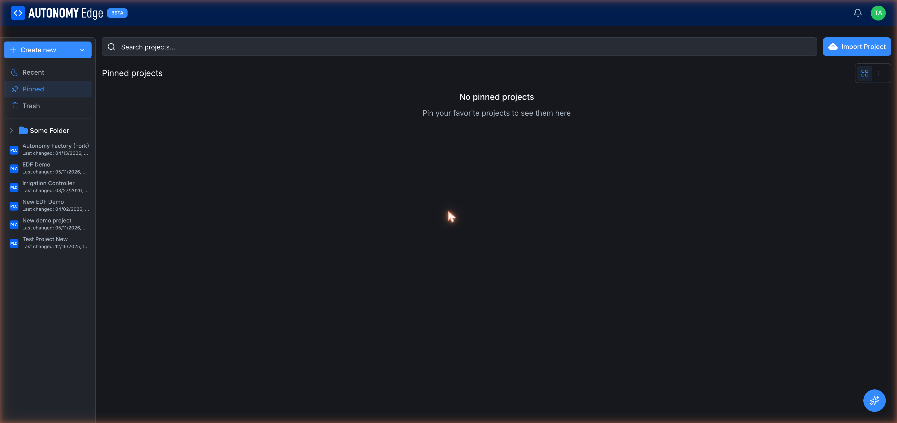

# Pinning and stars

Pins and stars are two separate concepts that both look like favoriting. Don't mix them up:

- A **pin** is private. It puts a project in *your* Pinned view so you can find it quickly. Nobody else sees it.
- A **star** is public. It's like an upvote: anyone visiting the project sees the star count. The platform uses stars to rank popular projects and to populate the *Stars* tab on user profiles.

## Pinning a project

Pinning works on any project you can see, your own, a teammate's, or someone else's public project.

**From the projects list:**

- Hover a project card and click the **pin icon** in the action row at the bottom of the card.
- The card immediately shows as pinned. The same project now appears in **Pinned** (left sidebar of the projects list).

**From the project page:**

- The same pin icon lives in the project header's action row. Clicking it has the same effect.

Click the pin icon again to unpin.

### What the Pinned view looks like

Open the **Projects** list and click **Pinned** in the left sidebar. It shows the same project cards as the Recent view, scoped to projects you've pinned.

When empty: *No pinned projects. Pin your favorite projects to see them here.*

### Practical uses for pinning

- The 2–3 projects you're actively shipping this sprint.
- A reference project you frequently copy snippets from.
- A teaching template you reuse with new hires or students.

## Starring a project

Starring is only available on **public** projects. (Private projects don't have a star count because they aren't discoverable.)

**From a project card or the project page:** click the **star icon ☆**. The icon fills in, the count increments, and the platform records that you've starred the project.

Click again to unstar.

### Where stars show up

- **On the project card** in the projects list: count next to the star icon.
- **On the project page header**: count next to the star button.
- **On your profile's Stars tab**: every project you've starred, in reverse chronological order.
- **In dashboard activity feeds**: popular projects gain visibility as they accumulate stars.

### Practical uses for starring

- Bookmarking public projects you might want to fork later.
- Showing appreciation for community work.
- Letting the platform learn your tastes for recommendations (when the *Recommended* feed filter ships).

## Pin vs star at a glance

| Action | Visible to others? | Works on private projects? | Where it shows up |
|---|---|---|---|
| **Pin** | No | Yes | Your Pinned view |
| **Star** | Yes | No | Project card, project page, your profile Stars tab |

## Where to next

- **See your pinned projects** → open **Projects** from the dashboard, then click **Pinned** in the left sidebar.
- **See your starred projects** → **[Your user profile](../../account/user-profile)** → Stars tab.
- **Make your own project public** → **[Visibility and sharing](visibility-and-sharing)**.
