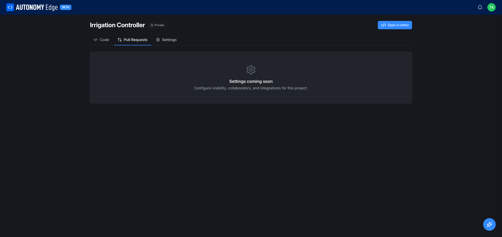

# The project page

The project page is where you see everything about a single project: its files, its commits, its open pull requests, and its settings. Open it by clicking any project card in the dashboard's **Projects** list or on the **[Projects list](projects-list)** page.

## Title row

At the very top:

- **Owner / Project name**: e.g. *thiagoralves / Irrigation Controller*. The owner part is a link to the owner's profile (your username or an organization).
- **Visibility badge**: `🔒 Private` or `🌐 Public`. See **[Visibility and sharing](visibility-and-sharing)**.
- **Open in editor** (top right, blue): launches the **[OpenPLC Editor](../../openplc-editor/overview)** scoped to this project. From the editor you can write code, browse devices, and deploy to a vPLC.

## The three tabs

### Code

The default tab. It packs a lot of information into one screen.

**Branch row** (just under the tab strip):

- **Branch dropdown** (left): `main` by default. Switching branches reloads the file tree and commit info for that branch. If the project has more than one branch, **`N branches`** is a link to the full branch list.
- **Go to file** search (middle): jump to any file in the current branch by name. Useful in larger projects.
- **Branch icon**: opens the branch list.
- **Download icon**: downloads the current branch as a zip.

**Commit summary bar**:

- Author avatar and name (e.g. *Autonomy Edge: Initial commit*).
- Latest commit message.
- Short hash (e.g. `8f4536c`), relative time ("22 days ago"), and a **N commits** link that opens the **[commit history](commits-and-history)**.

**File tree**:

- The standard skeleton (`programs/`, `functions/`, `function-blocks/`, `devices/`, `project.json`) shown as folders and files. Click any folder to expand. Click a file to view its content (read-only in the project page; use **Open in editor** to edit).

**README**:

- If the project has a `README.md`, it's rendered below the file tree.
- If not, you get a placeholder *No README yet* with a **Create README** button. Creating a README opens it for editing in the editor.

### Pull Requests

The pull requests tab lets you propose, review, and merge branch changes.

- **Subtitle**: *Propose, review and merge changes to {Project name}.*
- **New pull request** (top right): start a new PR by picking a source branch and a target branch.
- **Filter tabs**: *All*, *Open*, *Closed*, *Merged*, *Created by me*, *Awaiting my review*. Each tab shows a count.
- **List area**: shows PRs matching the current filter, or an empty-state message: *No pull requests yet, open one to start a review.*

Detailed PR lifecycle is in **[Pull requests](pull-requests)**.

### Settings

The Settings tab is a placeholder for now: *Settings coming soon. Configure visibility, collaborators, and integrations for this project.*

As soon as the platform ships project-level settings, this tab will expose visibility, collaborators, deploy keys, webhooks, and similar controls. Until then, visibility is set at **[project creation time](creating-a-project)** and is the only project-level setting you can choose.

## Star and pin from the project page

The project card actions (star, pin, copy link, download) are duplicated as buttons within the project page header area. Functionally identical to the projects list versions; see **[Pinning and stars](pinning-and-stars)**.

## Where to next

- **Read the project's history** → **[Commits and history](commits-and-history)**.
- **Open a pull request** → **[Pull requests](pull-requests)**.
- **Edit code** → **[OpenPLC Editor overview](../../openplc-editor/overview)**.
- **Change visibility** → **[Visibility and sharing](visibility-and-sharing)**.
