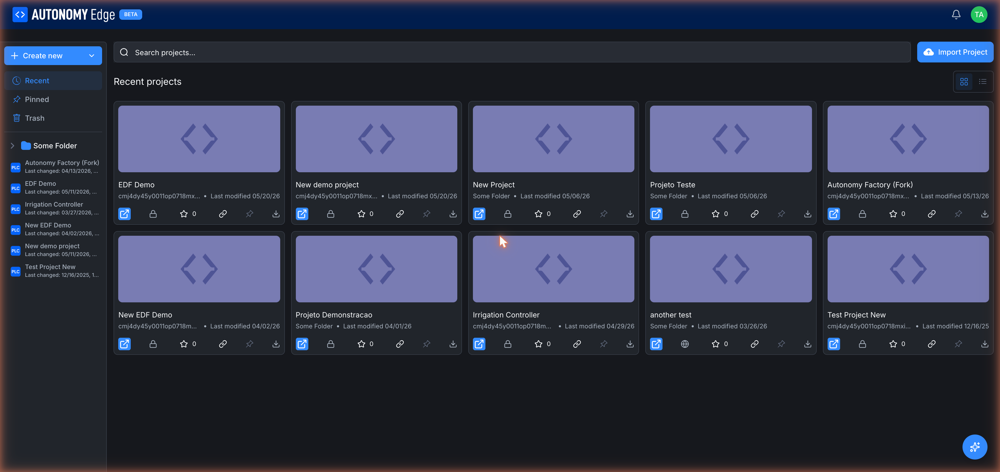
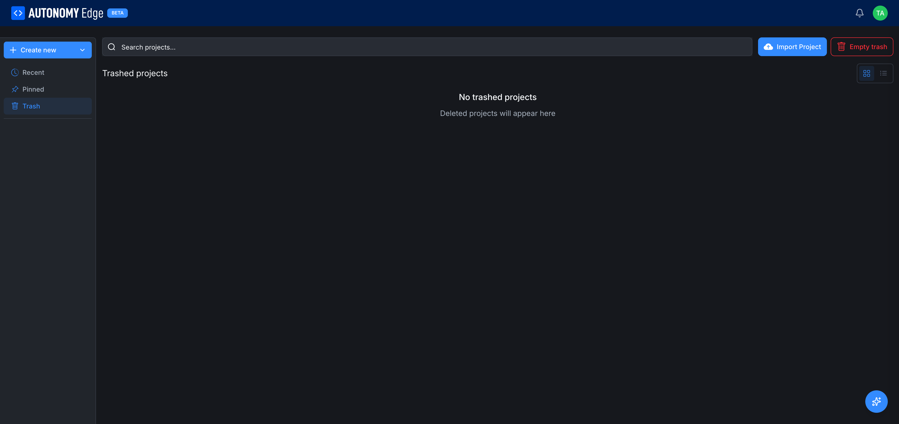

# Projects list

The projects list is where every project in a workspace lives. To open it, click **Projects** in the dashboard's left column (the **+ Manage Projects** button on the Projects card), or use the **View all** link on that same card.

## Left sidebar, views and folders

The left sidebar has two parts.

**Views** at the top:

- **Recent**: every project you have access to, sorted by last modified. The default view.
- **Pinned**: projects you've manually pinned for fast access. See **[Pinning and stars](pinning-and-stars)**.
- **Trash**: deleted projects that haven't been purged yet. Items in trash can be restored individually or wiped all at once via **Empty trash**.

**Folders** below the divider:

- Each folder you've created (via **+ Create new → New Folder**) shows up here with a chevron to expand. Inside a folder are the projects you've placed in it. Right-clicking a folder offers rename, delete, and move.
- The list of recently-changed projects sits at the bottom of the sidebar as a quick-access shortcut.

The URL keeps state. Switching views adds `?view=recent`, `?view=pinned`, or `?view=trash` to the URL, so you can bookmark a particular view.

## The Pinned view

Empty state: *No pinned projects. Pin your favorite projects to see them here.*

## The Trash view

When trash contains items, each row gets restore and permanent-delete actions, and an **Empty trash** button appears in the toolbar. Permanent delete is irreversible.

## Top toolbar

Across the top of the projects list:

- **Search projects…**: full-text search across the names and descriptions of projects in this workspace.
- **Import Project**: bring in an existing OpenPLC project from disk. See **[Importing and forking](importing-and-forking)**.
- **+ Create new**: opens the dropdown with **New Project**, **New Folder**, and **New Library**. New Project launches the wizard described in **[Creating a project](creating-a-project)**.
- **Grid / List toggle** (top right of the main area): switch the card layout. Grid is the default and best for quick visual scanning; List is denser.

## A project card

Each project card in the grid view shows:

- **Cover image / language icon** (top of the card).
- **Project name** (e.g. *EDF Demo*, *Irrigation Controller*).
- **Project ID**: short hash, useful for distinguishing projects with similar names.
- **Folder or "Some Folder"**: which folder it lives in.
- **Last modified** date.
- A row of **action icons** at the bottom of the card:

| Icon | Action |
|---|---|
| ![Open in editor] Code icon | Open the project directly in the editor. |
| Lock icon | Visibility, `🔒` for private, `🌐` for public. |
| Star ☆ with count | Star/unstar this project. |
| Link icon | Copy the project URL to clipboard. |
| Pin icon | Pin this project to your Pinned view. |
| Download icon | Download the project as a zipped archive. |

Clicking anywhere on the card body (not on an action icon) takes you to the project's **Code** tab.

## Switching workspaces

Each workspace has its own projects list. To see an organization's projects, open the dashboard's **Organizations** card on the right and click the organization's name; you'll land on that organization's dashboard, where the **Projects** card behaves the same as on your personal one.

## Where to next

- **Open a project** → **[The project page](project-page)**.
- **Make a new one** → **[Creating a project](creating-a-project)**.
- **Bring in an existing one** → **[Importing and forking](importing-and-forking)**.
- **Pin favorites** → **[Pinning and stars](pinning-and-stars)**.
