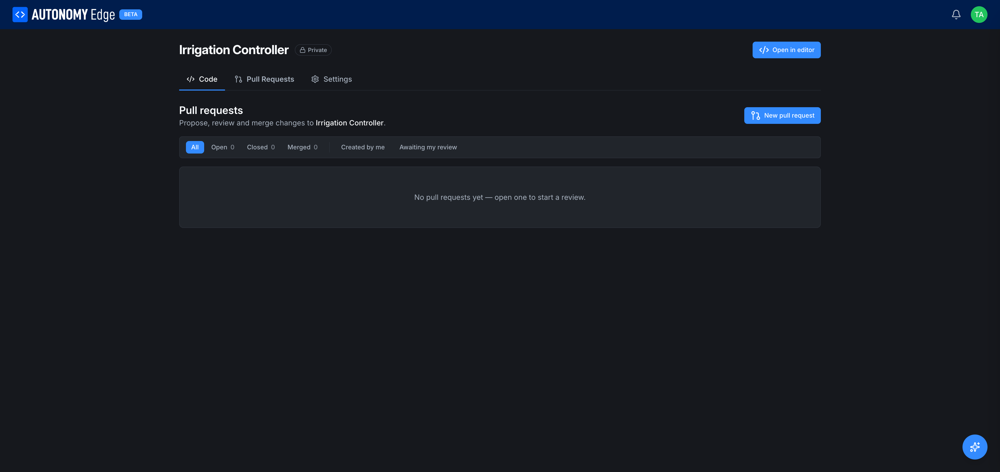

# Pull requests

A **pull request** (PR) is a proposed change to a project. You make changes on a branch, then open a PR asking to merge that branch into another (usually `main`). Other people can review the diff, comment, request changes, approve, and finally merge.

## When to use a pull request

- **Working with other people.** A PR is the unit of review in a team setting. Use one whenever a change should be looked at by someone else before going into the main branch.
- **Big changes you want to stage.** Even alone, a PR is a useful checkpoint: it gives you a place to write down why a change exists and gives you a chance to look at the full diff before committing to it.
- **Long-lived features.** Branch off `main`, ship one or more commits to the branch, then open a PR when the feature is ready.

For tiny tweaks (one-line fixes, comment updates), most people commit directly to `main` and skip the PR step.

## The pull requests tab

From any project page, switch to the **Pull Requests** tab next to the **Code** tab.

**Filter row**, six tabs across the top of the list:

- **All**: every PR in the project.
- **Open**: currently being worked on. Hasn't been merged or closed.
- **Closed**: closed without merging (rejected, abandoned, superseded).
- **Merged**: accepted into the target branch.
- **Created by me**: PRs you opened, regardless of status.
- **Awaiting my review**: PRs that have requested your review.

Each tab shows a count. Filters are reflected in the URL via `?status=` so you can bookmark them.

**+ New pull request**, top-right action that starts the PR creation flow.

## Opening a pull request

Click **+ New pull request**. The platform asks you to pick:

- **Source branch**: the branch with your changes.
- **Target branch**: where you want them merged into. Usually `main`.

The diff between the two branches loads. You enter:

- **Title**: short summary. The first line of the most recent commit on the source branch is suggested.
- **Description**: what changed and why. Markdown is supported. Link to forum threads, other PRs, or referenced commits as needed.
- **Reviewers** (optional): people you want to look at this PR. They get a notification and the PR shows up in their *Awaiting my review* filter.

Click **Create pull request**. The PR is now in the **Open** list.

## Reviewing a pull request

Open a PR to see:

- **Diff view**: file-by-file changes, additions in green, deletions in red.
- **Conversation**: comments left on specific lines or on the PR as a whole. Use the **+** icon next to a line to attach a comment to that line.
- **Activity log**: who reviewed, who pushed new commits, status changes.

As a reviewer you can:

- **Comment**: leave a note without taking a position.
- **Request changes**: block the merge until the author addresses your feedback.
- **Approve**: vote that the PR is good to merge.

## Merging

Once the PR has enough approvals and the diff still applies cleanly:

- **Merge**: squashes/merges the source branch into the target. The PR moves to **Merged** and the source branch can be deleted.
- **Close**: abandons the PR. The source branch is left intact in case you want to resume later.

After merging, the target branch's history will show your PR's commit (or commits, depending on the merge strategy). It is fine to delete the source branch once a PR is merged, the commit history is preserved on the target.

## Empty state

Until the first PR is created, the tab shows: *No pull requests yet, open one to start a review.* Click **+ New pull request** to begin.

## Notifications and PRs

You'll get notifications when:

- Someone requests your review.
- Someone comments on a PR you authored or reviewed.
- A PR you authored is merged or closed.
- A PR you reviewed is updated with new commits.

You can tune these notifications via **[Settings → Privacy](../../account/settings/privacy)**.

## Tips

- **Keep PRs small.** Three commits and 200 lines reviews faster than 30 commits and 3000 lines.
- **Lead with intent.** The PR description is where readers learn *why*. The diff already shows *what*.
- **Reference commits and threads.** Pasting a short SHA from the **[commit history](commits-and-history)** or a forum link gives the reviewer one click to context.

## Where to next

- **Explore the project as it is now** → **[The project page](project-page)**.
- **See the history of merges** → **[Commits and history](commits-and-history)**.
- **Collaborate with others** → **[Organizations](../organizations/overview)**.
