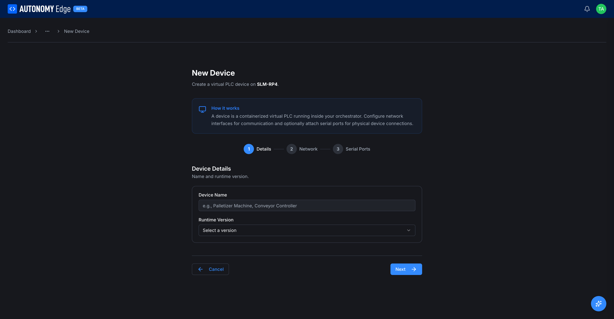
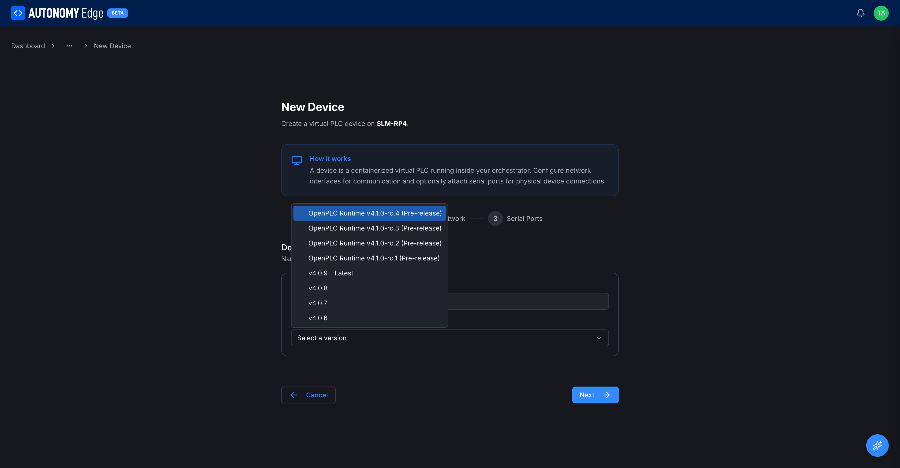
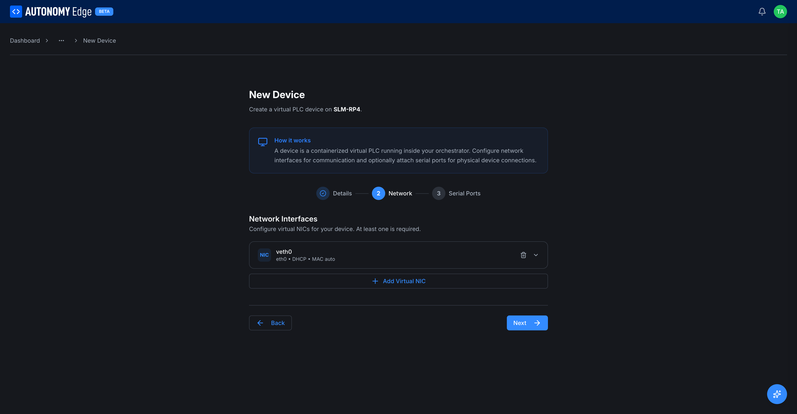
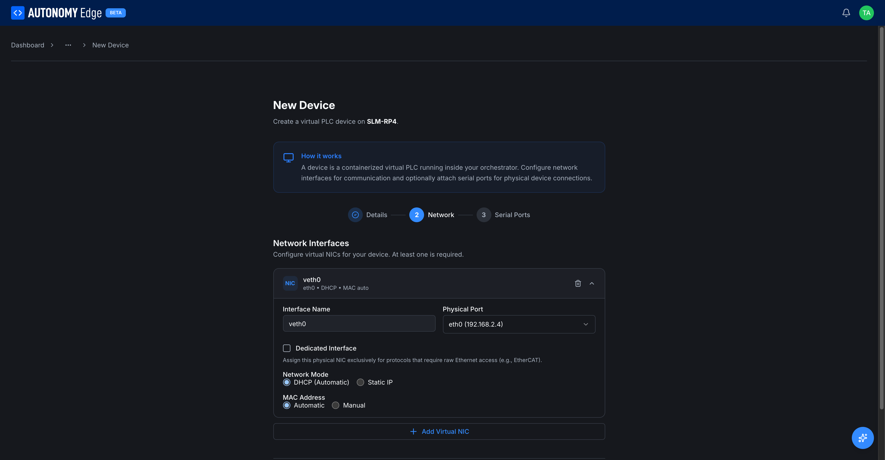
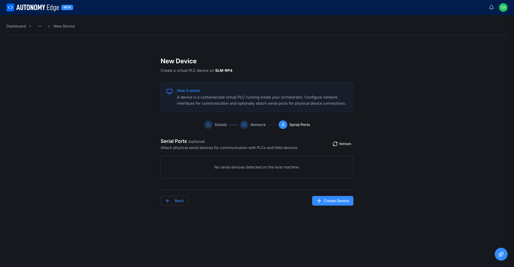

# Creating a vPLC

vPLCs are created inside an orchestrator. The flow is:

1. Open the orchestrator that should host the new vPLC.
2. Click **+ New Device**.
3. Walk through the three-step Add Device wizard.

## Step 1, Open the wizard

From the **[Orchestrators list](../orchestrators/orchestrators-list)**, click the orchestrator card. You land on **[Orchestrator detail](../orchestrators/orchestrator-detail)** with the **Devices** tab active.

The Devices tab shows your existing vPLCs as cards, plus a dashed **+ New Device** tile at the end of the grid. Click that tile.

## Step 2, Details

The wizard opens on a dedicated page. A 3-step indicator at the top shows the flow: **1. Details**, **2. Network**, **3. Serial Ports**.

| Field | Required | Notes |
|---|---|---|
| **Device Name** | Yes | A label for this vPLC. Must be unique within the orchestrator. Examples: *Palletizer Machine*, *Conveyor Controller*, *vPLC 02*. |
| **Runtime Version** | Yes | The OpenPLC v4 runtime image that this vPLC will run. Pick the version marked **Latest** unless you have a specific reason to pin an older version. |

The runtime dropdown lists every available version. The newest stable build is labeled **Latest**, with older stable builds below it and pre-release (release-candidate) builds at the top:

Each version corresponds to a specific build of the runtime container. The agent pulls and caches the image on first use, so creation of subsequent vPLCs on the same orchestrator using the same version is much faster.

Click **Next**.

## Step 3, Network

The wizard requires **at least one virtual NIC**. A NIC is what gives the vPLC its presence on your physical LAN.

A default NIC named `veth0` is added for you, configured for DHCP on the host's first interface with an auto-generated MAC. Click the NIC row to expand and edit it, click **+ Add Virtual NIC** to add more, or click the trash icon to remove one.

Expanding the row reveals every NIC option:

| Field | What it does |
|---|---|
| **Interface Name** | Logical name for the NIC inside the runtime. `veth0` is the default. |
| **Physical Port** | Which host network interface to attach to (e.g. `eth0`, `enp3s0`, `wlan0`). The dropdown shows each interface with its current IP for easier identification. |
| **Dedicated Interface** | Reserves the physical NIC for protocols that need raw Ethernet access (EtherCAT). The vPLC takes over the interface entirely. |
| **Network Mode** | **DHCP (Automatic)** (default, auto-assigned from your router) or **Static IP**. Static reveals IP / subnet / gateway / DNS fields. |
| **MAC Address** | **Automatic** (Docker generates one) or **Manual** (you type one in). Manual is useful when your DHCP server or asset tracker expects a fixed MAC. |

See **[Network modes](network-modes)** for the deeper picture on DHCP vs Static, multiple NICs, and the MACVLAN model.

Click **Next**.

## Step 4, Serial Ports (optional)

If the runtime needs access to host serial devices (USB-to-RS485 adapters, on-board UARTs, etc.), the platform lets you pass them through to the vPLC container.

- **Refresh** in the top-right re-scans the host for available serial devices.
- Each detected device shows its host path (e.g. `/dev/ttyUSB0`) and a checkbox to expose it.

If the host has no serial hardware, this step shows *No serial devices detected on the host machine.* That's fine, leave it empty and continue.

Click **Create Device** at the bottom right.

## What happens on Create

The platform sends the creation command to the agent, which:

1. Pulls the runtime image (if not cached).
2. Creates the container with the MACVLAN configuration.
3. Starts the container.

You should see the new device card appear in the Devices tab within a few seconds, with status **Running** once the runtime is alive.

## After creation

A freshly-created vPLC has no project loaded. The runtime status will be **EMPTY** when you connect from the editor. The next step is to **[connect to it from the editor](connecting-from-editor)** and deploy a project.

If the vPLC stays in **Stopped** or **Inactive** state, see **[vPLC stuck in Stopped](../../troubleshooting/vplc-stuck-stopped)**.

## Where to next

- **Connect a project to this vPLC** → **[Connecting from the editor](connecting-from-editor)**.
- **Inspect this vPLC's details** → **[vPLC detail](vplc-detail)**.
- **Understand DHCP vs static** → **[Network modes](network-modes)**.
