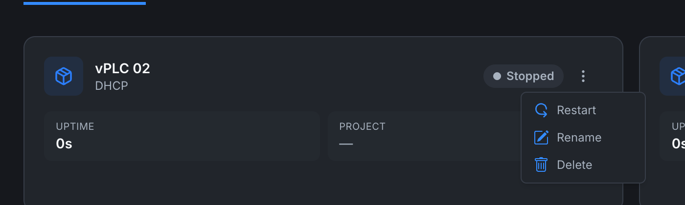

# vPLC detail

The vPLC detail page is the read-only "I want to see what this device looks like right now" view. Open it by clicking a vPLC card on an **[orchestrator's detail page](../orchestrators/orchestrator-detail)**.

## Header

- **Cube icon** and **vPLC name** at the top left.
- **Status badge** (Running / Stopped / Inactive).
- **Subtitle** with the NIC mode (DHCP / Static) and the container state (`Container running`, `Container unknown` if the agent hasn't reported yet, etc.).

The breadcrumb at the very top, **Orchestrators → {orchestrator name} → {vplc name}**, lets you jump back one step at a time.

## Stats grid

A row of read-only metrics:

| Field | Description |
|---|---|
| **UPTIME** | How long the container has been running since its last start. |
| **RESTARTS** | How many times the container has restarted. Helpful for spotting crash loops. |
| **INTERNAL IP** | The container's IP on its own Docker bridge network (not visible from your LAN). |
| **NETWORK MODE** | `DHCP` or `Static`. |
| **GATEWAY** | The default gateway the container is using internally. |
| **DNS** | DNS server. |
| **SUBNET MASK** | Subnet mask. |
| **CREATED** | The date this vPLC was created. |

Fields show `N/A` when the device hasn't reported back yet (e.g. status is Stopped or Inactive).

## Network Interfaces section

Below the stats, a panel labelled **Network Interfaces** lists every virtual NIC attached to this vPLC, with its name, IP address, MAC address, and gateway. These are the addresses other devices on your physical LAN use to reach the vPLC, this is the IP you'd point Modbus clients, HMIs, and OPC-UA clients at.

For a freshly-created or Stopped vPLC the list reads **No network interfaces found**.

## Lifecycle actions

The detail page itself doesn't have action buttons. Lifecycle actions live in the **3-dot menu** (⋮) on the device card in the orchestrator's Devices tab.

The menu options depend on the vPLC's current state:

| State | Menu options |
|---|---|
| **Running** | **Stop**, **Restart**, **Rename**, **Delete**. |
| **Stopped** | **Restart** (which becomes a Start), **Rename**, **Delete**. |
| **Inactive** (parent orchestrator offline) | **Rename**, **Delete**. Lifecycle actions are unavailable because the agent isn't reachable. |

Stopping a vPLC does not delete it. Its config and any project deployed to it are preserved, ready to resume.

## Logs and runtime details

The detail page shows network and lifecycle information. For runtime logs (scan cycles, PLC errors, communication trace) you need to connect to the vPLC from the **[OpenPLC Editor](../../openplc-editor/overview)**. Those logs live on the runtime itself, not in the platform's metric stream.

## When things look wrong

- **Status is Inactive but the orchestrator is Active** → check **[vPLC stuck in Stopped](../../troubleshooting/vplc-stuck-stopped)**.
- **Status is Running but Network Interfaces says "No network interfaces found"** → the runtime hasn't pushed an update yet. Refresh after 10 seconds. If still empty, restart the vPLC from the 3-dot menu.

## Where to next

- **Deploy a project to this vPLC** → **[Connecting from the editor](connecting-from-editor)**.
- **Change network settings** → 3-dot menu → **Rename** for the name, or delete and recreate for NIC changes. See **[Network modes](network-modes)** for what the fields mean.
- **Inspect the parent orchestrator's metrics** → **[Orchestrator detail](../orchestrators/orchestrator-detail)**.
