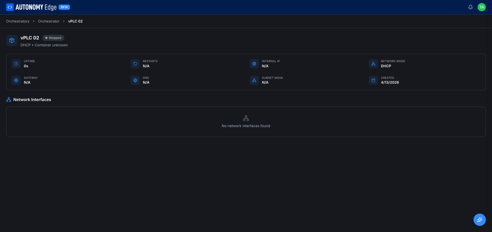

# vPLC stuck in Stopped

Symptoms:

- A vPLC card shows **Stopped** even after clicking Start.
- The vPLC detail page shows `Internal IP: N/A`, `Uptime: 0s`.



## 1. Is the parent orchestrator Active?

Open the orchestrator that owns this vPLC. Status badge should be **Active** (or **Connected**), with non-zero CPU / memory / uptime.

If the orchestrator is **Inactive**, the agent can't act on your start request. Fix the orchestrator first → **[Orchestrator not connecting](orchestrator-not-connecting)**.

## 2. Re-issue the Start command

From the orchestrator's Devices tab, click the vPLC card's **3-dot menu → Start**. Wait 10–30 seconds for the agent to pull the image (if it's a first run) and start the container.

If the status stays Stopped, look at the vPLC detail page for any error tooltip.

## 3. Check device-side logs

On the edge device:

```bash
docker ps -a | grep <device-name>
```

The container ID lets you look at logs:

```bash
docker logs --tail 100 <container-id>
```

Common log entries:

- `Cannot allocate memory`: the host doesn't have enough RAM. Stop other vPLCs or upgrade hardware.
- `address already in use`: the MAC or IP you assigned conflicts with another device. Free it up or switch to DHCP + auto MAC.
- `parent device 'eth0' is in use`: another container or process is monopolizing the interface. Restart networking on the host.
- `permission denied on /dev/ttyUSB0`: a serial port you tried to pass through isn't accessible to Docker.

## 4. Network configuration issues

Static-IP vPLCs are picky. Verify:

- The IP is in the subnet of the physical port you chose.
- The IP isn't already assigned to another device.
- The subnet mask matches your LAN.
- The gateway is reachable from the LAN.

Try toggling the NIC to DHCP and starting the container. If DHCP works but static fails, the issue is in your static config.

## 5. MAC conflicts

Two devices with the same MAC on one LAN confuse switches. If you set a manual MAC, confirm it's unique by sniffing your LAN (`arp -a` from another host, or `tcpdump -i eth0 ether host <mac>`).

For most cases, switching to **MAC mode: Auto** is the fast fix.

## 6. Image pull failure

The agent pulls `ghcr.io/autonomy-logic/openplc-runtime:<version>` on first run. Pull failures show up as `manifest unknown` or network errors in the agent log.

Test manually on the device:

```bash
docker pull ghcr.io/autonomy-logic/openplc-runtime:latest
```

If that fails, your edge device can't reach the registry. Check firewall and DNS.

## 7. Container restart loop

If RESTARTS keeps climbing on the vPLC detail page, the container is crashing repeatedly. Look at logs, there's an error preventing the runtime from initializing.

Common causes:

- A required serial device disconnected.
- Corrupted volume from a previous run. Delete the vPLC and recreate it.
- Runtime version mismatch with a stale persistent volume.

## 8. After everything else: recreate the vPLC

If you can't make the vPLC start, the fastest fix is often to delete it and recreate it:

1. 3-dot menu → **Delete**.
2. Confirm.
3. Click **+ New Device** and follow **[Creating a vPLC](../platform/vplcs/creating-a-vplc)**.

Any project you'd deployed to it will need to be deployed again from the editor.

## Where to next

- **Check the parent orchestrator** → **[Orchestrator not connecting](orchestrator-not-connecting)**.
- **Network config reference** → **[Network modes](../platform/vplcs/network-modes)**.
- **Recreate the device** → **[Creating a vPLC](../platform/vplcs/creating-a-vplc)**.
